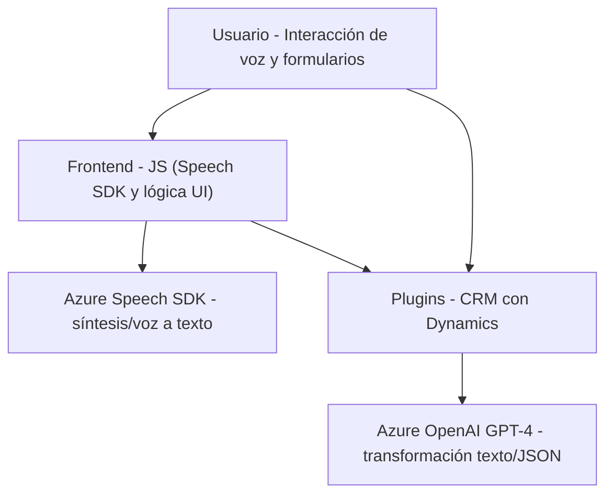

### Breve resumen técnico:

El repositorio corresponde a una solución integrada que emplea componentes de frontend, integraciones con APIs externas mediante SDKs y plugins en Microsoft Dynamics CRM. Los archivos analizados sugieren que la solución está orientada a mejorar la experiencia del usuario mediante reconocimiento y síntesis de voz, así como transformación de datos mediante IA.  

---

### Descripción de arquitectura:

La solución combina varios componentes en una arquitectura **n-capas**, donde:
1. **Frontend:** Maneja entrada/salida del usuario y lógica de interacción del formulario.
2. **Servicios externos:** Azure Speech SDK para reconocimiento de voz y síntesis de texto a voz, integrados dinámicamente en el frontend.
3. **Backend (Plugin CRM):** Vinculado a Microsoft Dynamics CRM, transformando entradas mediante Azure OpenAI GPT-4 y realizando llamadas a APIs internas.
4. **Conexión a servicios externos:** Comunicación directa con APIs como Microsoft Dynamics y Azure OpenAI.

El diseño utiliza:
- **Patrón modular:** Dividiendo funcionalidad en componentes de frontend y backend bien definidos.
- **Lazy-loading de dependencias:** SDKs y API cargados dinámicamente según el uso.
- **Uso de AI y APIs externas:** Alta dependencia de Azure Speech y GPT-4.
- **N-capas orientada a servicios:** Plugins CRM interactúan directamente con servicios backend mediante reglas predefinidas.

---

### Tecnologías usadas:

1. **Frontend (JavaScript):**
   - Base: Vanilla JavaScript.
   - Azure Speech SDK: Integración para voz.
   - Dinámica: Apoyo de `executionContext` y `formContext` (Microsoft Dynamics).

2. **Backend Plugin (C#):**
   - Microsoft Dynamics CRM SDK.
   - Azure OpenAI GPT-4.
   - Serialización: `System.Text.Json`, `Newtonsoft.Json`.
   - Manejo de HTTP: `System.Net.Http`.

3. **Servicios externos:**
   - **Azure Speech SDK:** Voz a texto y viceversa.
   - **Azure OpenAI GPT-4:** IA para transformar texto.

4. **Patrones arquitectónicos:**
   - Modularidad.
   - Separación de intereses (n-capas).
   - Integración con APIs externas.
   - Plugins basados en Dynamics CRM y programación orientada a eventos.

---

### Diagrama Mermaid válido para GitHub:

---

### Conclusión final:

La arquitectura de esta solución puede describirse como **n-capas* combinada con integración externa de servicios verificados. Las funciones JavaScript desarrolladas para el frontend están altamente acopladas con elementos de reconocimiento y síntesis de voz del SDK de Azure. Paralelamente, los plugins de Dynamics interactúan con Azure OpenAI para realizar transformaciones de texto automatizadas y personalizadas.  

Es una solución que muestra un enfoque centrado en servicios con una clara separación entre frontend, backend (CRM plugins) y servicios externos, lo cual facilita la escalabilidad y adaptabilidad en soluciones empresariales orientadas a interacción inteligente.