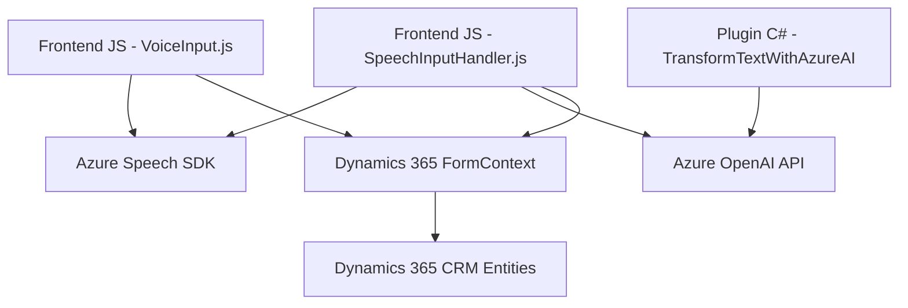

### Breve Resumen Técnico
El proyecto es una solución que integra tecnologías de reconocimiento de voz, procesamiento de lenguaje natural y manipulación de formularios en **Dynamics 365**. Usa servicios externos de Azure como **Speech SDK** para procesos de síntesis de voz y transcripción, y **OpenAI** para transformación de textos. Se adapta principalmente a entornos de CRM con funcionalidades basadas en Microsoft Dynamics y servicios en la nube.

---

### Descripción de Arquitectura
La solución está diseñada como una arquitectura **de capas integradas**:
1. **Capa de Presentación:** Los archivos JavaScript contienen lógica para interactuar con formularios de Dynamics 365.
2. **Capa de Dominios/Negocios:** Los plugins de Dynamics 365, como `TransformTextWithAzureAI`, procesan datos utilizando servicios de Azure OpenAI y realizar operaciones relacionadas con el negocio.
3. **Servicios Externos:** La comunicación con Azure Speech SDK y Azure OpenAI constituye una integración basada en API que amplia la funcionalidad básica del sistema CRM.

---

### Tecnologías y Herramientas Utilizadas
1. **JavaScript y Dynamics Framework:**
   - Interacción con formularios de Dynamics 365 (contextos y atributos).
2. **Azure Speech SDK:**
   - Utilizado para reconocimiento de voz y síntesis de texto en voz.
3. **Azure OpenAI:**
   - Procesamiento avanzado de texto.
4. **Plugins en C#:**
   - Amplían la funcionalidad del CRM integrando servicios externos con reglas específicas.
5. **Patrones:**
   - **Factory:** En la inicialización de `Azure SpeechConfig`.
   - **Arquitectura orientada a eventos:** Para responder a interacción vocal.
   - **Integración API REST:** Para realizar llamadas a Azure y OpenAI.

---

### Diagrama Mermaid

---

### Conclusión Final
- La solución está basada en una arquitectura **de n capas**, donde cada módulo juega un rol específico para extender la funcionalidad de **Dynamics 365** con capacidades de reconocimiento de voz y procesamiento de lenguaje natural.
- Las tecnologías de **Azure Speech SDK** y **Azure OpenAI** destacan, proporcionando herramientas avanzadas de **IA** y síntesis que enriquecen el sistema CRM.
- La solución muestra una integración sólida con **Dynamics 365**, diseñada para automatizar la entrada y transformación de datos en entornos corporativos, y puede crecer fácilmente en escenarios de nube y sistemas distribuidos.