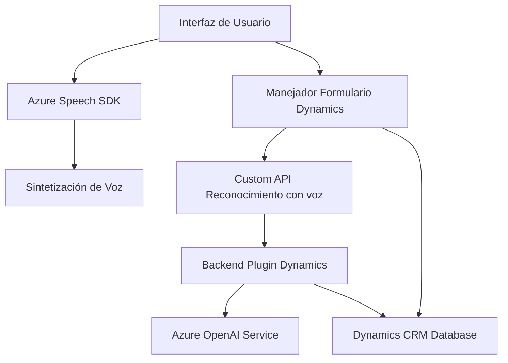

### Breve resumen técnico:

El repositorio contiene tres partes principales:
1. **Frontend (JS)**: Implementa funcionalidades de Entrada y Reconocimiento de Voz en formularios utilizando SDK de Azure Speech.
2. **Backend/Plugins**: Un plugin desarrollado en C# para Dynamics CRM que interactúa con el servicio **Azure OpenAI** para transformar texto en JSON estructurado conforme a reglas específicas.
3. **Integración con servicios en la nube**: Usa **Azure Speech SDK** para los módulos de frontend y el **Azure OpenAI Service** para la transformación avanzada de datos.

---

### Descripción de arquitectura:

La solución sigue una **arquitectura de n capas** que conecta:
1. **Capa frontal (Frontend)**: Gestiona la interacción con los usuarios y manipulación de datos de los formularios en tiempo real.
2. **Capa de negocio (Plugins)**: Procesa la lógica avanzada utilizando Dynamics CRM y Azure OpenAI.
3. **Capa externa (Servicios en la nube)**: Azure Speech SDK y Azure OpenAI como fuentes principales de procesamiento de voz y texto.

Patrones observados:
1. **Modularidad**: Las funciones y clases están separadas para mantener cohesión entre responsabilidades.
2. **Callbacks**: Uso de llamados asincrónicos para garantizar que los SDK externos (Azure Speech, OpenAI, etc.) estén cargados correctamente.
3. **Dependency Injection**: Implementado en el Plugin de Dynamics para acceder al contexto proporcionado.
4. **Factory Method**: Configuración dinámica de Speech y Audio en el frontend.
5. **Lógica basada en eventos**: Las acciones dependen de eventos en tiempo real (grabación de voz, manipulación de formularios).
6. **Plugin-based Architecture**: Backend configurado para ejecutarse dentro de Dynamics CRM como plugin.

---

### Tecnologías usadas:

1. **Frontend**:
   - **JavaScript**: Base para los scripts interactivos y modulares.
   - **Azure Speech SDK**: Reconocimiento y síntesis de voz.
   - **Browser API**: Manipulación DOM y eventos.

2. **Backend**:
   - **C#/.NET Framework**: Usado para desarrollar el plugin en Dynamics CRM.
   - **Microsoft.Xrm.Sdk**: Para integrar con Dynamics CRM.
   - **Azure OpenAI Service**: Procesamiento textual avanzado con GPT.
   - **JSON Libraries (System.Text.Json, Newtonsoft.Json)**: Serialización/deserialización de datos.
   - **HttpClient**: Integración y comunicación HTTP.

---

### Dependencias o componentes externos:

1. **Azure Speech SDK**:
   - Funcionalidad clave para síntesis y reconocimiento de voz en el frontend.
   - Incluye dinámico CDN loader: `https://aka.ms/csspeech/jsbrowserpackageraw`.

2. **Azure OpenAI Service**:
   - Procesamiento avanzado de texto en el plugin de backend.
   - Modelo basado en GPT alojado en Azure.

3. **Dynamics CRM Web API (`Xrm.WebApi`)**:
   - Acceso a datos almacenados en CRM y manipulación de atributos del formulario directamente.

4. **Custom APIs en Dynamics CRM**:
   - Lógico procesamiento de texto mediante llamada a API personalizada denominada `trial_TransformTextWithAzureAI`.

5. **HTTP Communications & JSON Processing**:
   - Uso de librerías externas como `Newtonsoft.Json` y `System.Text.Json`.

---

### Diagrama Mermaid válido:

---

### Conclusión final:

La solución presentada está diseñada alrededor de una **integración entre Dynamics CRM y servicios de Azure** mediante una arquitectura de **n capas**. Destaca por usar tecnologías modernas como SDK de Azure Speech para voz y Azure OpenAI para procesamiento avanzado de texto con inteligencia artificial, junto con un plugin centrado en una arquitectura modular capaz de manejar eventos y actualizaciones en tiempo real.

Esto lo hace adecuado para escenarios que requieren interacción directa con usuarios (Reconocimiento y síntesis de voz) y automatización avanzada mediante IA (Transformación de texto). Sin embargo, el diseño introduce una fuerte dependencia hacia servicios externos como **Azure**, por lo que puede requerir un análisis de costo-beneficio para garantizar la escalabilidad ante un gran volumen de uso.