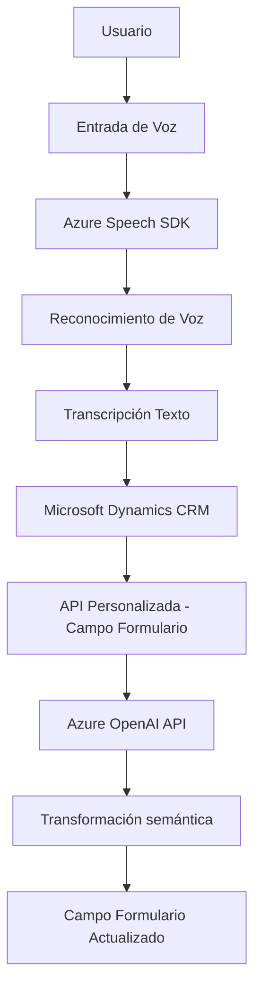

### Breve Resumen Técnico
El repositorio presenta una solución híbrida que integra **Microsoft Dynamics CRM** con procesamiento de voz (mediante **Azure Speech SDK**) y servicios de inteligencia artificial (**Azure OpenAI API**). Un conjunto de scripts de JavaScript se dedica a la gestión de entrada de voz para interacción dinámica con formularios basados en el contexto del CRM, mientras que plugins C# amplían las capacidades del sistema mediante transformaciones avanzadas de texto asistidas por inteligencia artificial.

---

### Descripción de Arquitectura
La arquitectura sigue un diseño **modular**. Cada componente tiene un propósito específico:
1. **Frontend (JS)**: Scripts en JavaScript para manejar eventos de voz y actualizar dinámicamente formularios.
   - Usa **event-driven architecture**.
   - Modularidad funcional para manejar síntesis de voz y reconocimiento de voz.
   - Comunica con APIs externas desde el lado del cliente.
   
2. **Backend (C# Plugins en Dynamics CRM)**: Implementación de reglas de negocio y procesamiento avanzado de texto usando **Azure OpenAI API**.
   - Aislamiento de lógica dentro de plugins que se ejecutan directamente en el servidor CRM.
   - Patrón basado en microservicios integrado con un API Gateway.

La arquitectura global se puede clasificar como una combinación de **n capas** y **microservicios**:
- La lógica del cliente y los plugins operan según el paradigma de capas (UI → Lógica de aplicación → Integración/Dispositivos externos).
- La conexión con servicios externos (Azure Speech SDK y OpenAI) refleja un diseño orientado a **microservicios**.

---

### Tecnologías y Frameworks Usados
- **Frontend (JavaScript):**
  - **Azure Speech SDK**: Para reconocimiento y síntesis de voz.
  - **Xrm.Page API (CRM)**: Acceso dinámico a los datos del formulario.
  - **JavaScript**: Manipulación DOM y eventos.

- **Backend (C# Plugins):**
  - **Microsoft.Xrm.Sdk**: Framework para desarrollar extensiones dentro de Dynamics CRM.
  - **Newtonsoft.Json**: Manejo JSON.
  - **System.Net.Http**: Para consumir APIs externas.
  - **Azure OpenAI API**: Procesamiento avanzado de texto mediante GPT.

---

### Dependencias o Componentes Externos
1. **Azure Speech SDK**: Para manejo de entradas de voz y conversión a texto.
2. **Azure OpenAI API**: Modelo GPT para transformaciones semánticas del texto.
3. **Microsoft Dynamics CRM**:
   - Administración de formularios dinámicos.
   - Plugins y lógica de negocio.
   - API Gateway para llamadas externas.
4. **Newtonsoft.Json**: Librería para mejora en el manejo de estructuras JSON.
5. **Servicios JavaScript Dinámicos**:
   - Carga dinámica del SDK desde un endpoint público de Azure.

---

### Diagrama Mermaid Válido para GitHub

---

### Conclusión Final
La solución integra tres capas sólidas: procesamiento de voz, lógica de aplicación en CRM, y servicios de inteligencia artificial. Con un diseño modular y una arquitectura mixta (n capas + microservicios), permite una interacción fluida entre el cliente y plataformas externas como **Azure Speech SDK** y **Azure OpenAI**. Aunque está optimizada para entornos dinámicos, podría beneficiarse de mejores configuraciones y manejo de errores respecto al uso de claves o endpoints.