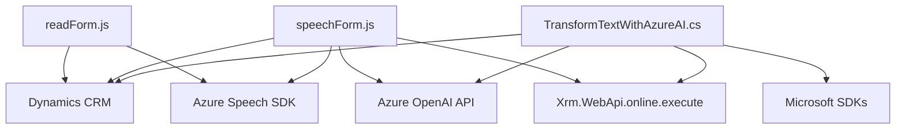

### Breve resumen técnico

El repositorio analiza el acceso a servicios externos como **Azure Speech SDK** y **Azure OpenAI API**, implementando características de reconocimiento y síntesis de voz integradas con un sistema de gestión Dynamics 365. Adicionalmente, se incluyen un plugin y scripts enfocados en la lectura, transformación y mapeo de datos hacia campos en formularios de Dynamics 365.

### Descripción de la arquitectura

La solución utiliza una arquitectura **n-capas**:
1. **Capa de Presentación**: Implementada como scripts JS (`readForm.js` y `speechForm.js`) que interactúan con formularios en Dynamics 365 y manejan procesamiento en el cliente.
2. **Capa de Aplicación**: Representada por el plugin `TransformTextWithAzureAI.cs`, que aplica reglas de negocios en el backend de Dynamics 365 y realiza peticiones a Azure OpenAI.
3. **Capa de Servicios**: Utiliza servicios externos de Azure para la transformación de datos y funciones específicas relacionadas con Speech-to-Text y Text-to-Speech.

El diseño promueve la **separación de responsabilidades**, manteniendo el procesamiento de voz y la transformación de texto fuera de los scripts del frontend.

Adicionalmente, existen características observables de patrones arquitectónicos como **integración con servicios externos** (Azure Speech SDK y OpenAI API), **modularización** (cada función tiene un propósito específico), y uso del **patrón de plugin** para extender la funcionalidad de Dynamics 365.

---

### Tecnologías usadas

1. **Frontend**: JavaScript para interacción de cliente con formularios de Dynamics CRM.
2. **Backend**:
   - Dynamics 365 Plugin Framework.
   - Azure OpenAI API.
3. **Servicios Externos**:
   - Azure Speech SDK: Para síntesis de voz y reconocimiento de texto desde audio.   
   - Azure OpenAI API: Para generación de texto transformado.
4. **Librerías .NET**:
   - Newtonsoft.Json para manejo de JSON avanzado en plugins (C#).
   - System.Net.Http para comunicación con APIs.
5. **Framework**: Microsoft Dynamics 365 para gestión de CRM.

---

### Diagrama Mermaid

---

### Conclusión final

La solución descrita es una integración funcional entre clientes de Dynamics 365 y servicios externos de Azure (Speech SDK y OpenAI API). Se organiza bajo una arquitectura **n-capas** con una separación clara de responsabilidades entre presentaciones, lógica de negocio y servicios. Los scripts JavaScript se centran en la interacción del usuario y el procesamiento en tiempo real, mientras que el plugin en C# maneja lógica más compleja, como la transformación de datos con OpenAI. Este enfoque modular brinda flexibilidad y escalabilidad al sistema, permitiendo adaptaciones futuras en procesamiento y reconocimiento de voz para formularios avanzados y transformados por IA.