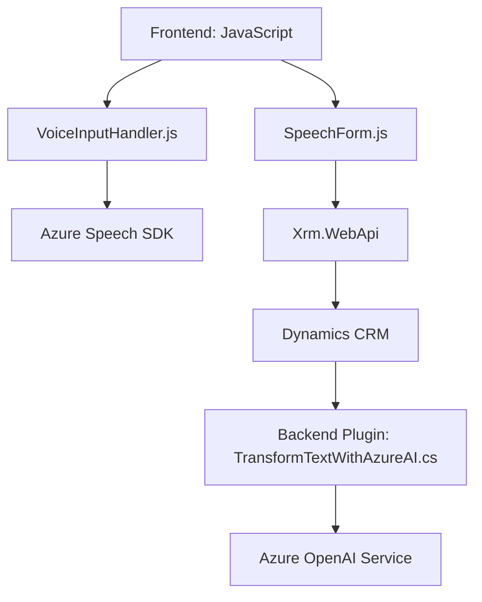

## Breve resumen técnico
Este repositorio representa una solución que integra diferentes tecnologías para manipulación y procesamiento de datos de formularios (Frontend) usando Azure Speech SDK, y complementa su funcionalidad con un Backend (plugin en Dynamics CRM) que aprovecha el servicio de Azure OpenAI. La solución usa eventos en el cliente (Frontend) y plugins en el CRM.

---

## Descripción de arquitectura
La arquitectura es de tipo **multicapa**. El Frontend es responsable de las interacciones en tiempo real con el usuario (procesamiento del formulario y entrada/salida de voz). Tiene una integración directa con Azure Speech SDK y plantea una orientación hacia eventos en tiempo real. Por otro lado, la capa de Backend, mediante plugins de Dynamics CRM, actúa como una capa de procesamiento de datos estructurados con Azure OpenAI.

- **Frontend:** Asume una arquitectura modular, orientada a eventos, donde cada módulo (archivo JS) tiene responsabilidades bien definidas para procesar entrada de datos, síntesis de voz, y transcripción.
- **Backend/Plugin:** Basado en el modelo de plugin de Dynamics CRM, sigue el patrón de cliente-API para comunicaciones externas con Azure OpenAI. Extiende funcionalidades estándar de CRM mediante lógica adicional.

---

## Tecnologías usadas
1. **Frontend:**
   - Lenguaje: JavaScript.
   - Servicios externos: Azure Speech SDK.
   - Frameworks internos: Dynamics CRM FormContext (`Xrm.WebApi` para API personalizada).
   - Patrones: Orientación a eventos, carga dinámica de scripts.

2. **Backend:**
   - Lenguaje: C# (.NET Framework).
   - Bibliotecas: `Microsoft.Xrm.Sdk`, `Newtonsoft.Json`, `System.Net.Http`.
   - Servicios externos: Azure OpenAI Service.
   - Patrones: Lógica de negocio en plugin.

3. **Servicios externos:**
   - **Azure OpenAI:** En Backend, para estructuras inteligentes basadas en texto.
   - **Azure Speech SDK:** En Frontend, para síntesis y reconocimiento de voz.

---

## Dependencias o componentes externos presentes
1. **Azure SDKs:**
   - Azure Cognitive Services (Speech).
   - Azure OpenAI API.
2. **Dynamics CRM Framework (Xrm SDK):**
   - Para definir plugins y consumir APIs internas.
3. **Librerías de trabajo con JSON:**
   - Newtonsoft.Json y System.Text.Json para manipulación JSON en datos provenientes de servicios externos.

---

## Diagrama Mermaid válido para GitHub Markdown

---

## Conclusión Final
Este repositorio representa una solución **multicapa** orientada a la integración de **Azure Cognitive Services** y **Dynamics CRM**. La combinación del procesamiento del lenguaje hablado en tiempo real, texto estructurado mediante IA, y la personalización de formularios en Dynamics CRM permite crear aplicaciones interactivas y dinámicas con conectividad conectada entre cliente y servicios externos. Aunque la arquitectura es funcional, podría beneficiarse de mejoras en la gestión de configuración segura y de un diseño orientado a la desacoplamiento de la lógica específica de negocio.