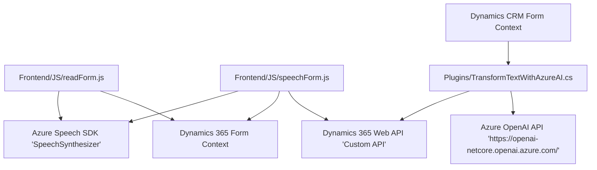

### Breve resumen técnico
El repositorio contiene múltiples archivos (JavaScript y C#) que implementan functionalities for a solution integrated with Microsoft Dynamics 365 and Azure services. Focus areas include handling form data with voice commands, converting audio input to form actions, and leveraging Azure OpenAI to structure text inputs.

### Descripción de arquitectura
La solución parece integrar tres módulos funcionales en forma de una arquitectura **n capas**. Los módulos incluyen frontend (JavaScript), backend en Dynamics CRM (C# Plugin), y servicios externos para AI (Azure Speech SDK y Azure OpenAI). Los archivos de este repositorio sugieren una arquitectura cliente-servidor dividida entre:
1. **Presentación (Frontend)**: Implementa métodos para la captura y síntesis de voz y la interacción con formularios en Dynamics 365.
2. **Negocio y acceso a datos (Backend)**: Incluye plugins y lógica de negocio en C# para el procesamiento de datos.
3. **Servicios externos**: Consume APIs de terceros (Azure Speech SDK y Azure OpenAI) que proporcionan funcionalidades avanzadas como síntesis de voz y procesamiento inteligente.

Este diseño apunta hacia una integración híbrida de servicios externos en una solución empresarial.

### Tecnologías usadas
1. **Frontend**:
   - JavaScript.
   - Dynamics 365 SDK (Xrm).
   - Azure Speech SDK (cliente).
   
2. **Backend**:
   - C# (.NET Framework).
   - Dynamics CRM SDK (Plug-in Framework).

3. **Servicios externos**:
   - Azure Cognitive Services: Speech SDK.
   - Azure OpenAI Services.

### Dependencias o componentes externos
- Azure Speech SDK para la síntesis de voz y reconocimiento.
- Azure OpenAI Services para generación y transformación inteligente de texto.
- APIs de Dynamics CRM para la manipulación de datos y llamadas a servicios personalizados.
- Librerías estándar de .NET:
    - `System.Text.Json` para manejo de JSON.
    - `System.Net.Http` para solicitudes HTTP API.

### Diagrama Mermaid válido para GitHub

### Conclusión final
La solución implementa una arquitectura **n capas** que combina frontend basado en JavaScript para interacciones con voz, backend C# para plugins de Dynamics CRM, e integra APIs externas avanzadas (Azure Speech SDK y Azure OpenAI). Este diseño modular facilita la interacción enriquecida con formularios y promueve la extensibilidad al permitir la inclusión futura de servicios adicionales en Azure o integración con otras plataformas. La solución se orienta al uso de patrones comúnmente asociados con sistemas distribuidos integrados.