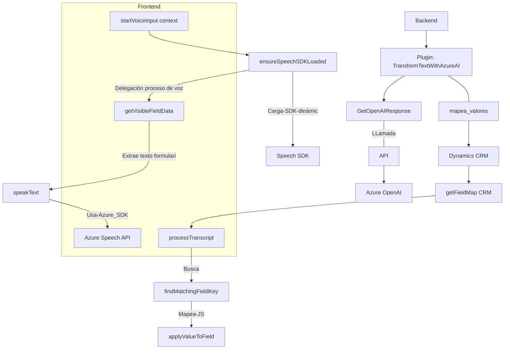

# Análisis Técnico

## Breve Resumen Técnico
El repositorio parece ser una solución integrada que combina **Frontend JavaScript** con funcionalidad avanzada de IA y servicios de texto a voz, junto con un **backend basado en Plugins** para **Dynamics CRM**. Este ecosistema está diseñado para proporcionar inteligencia procesada mediante **Azure AI** y transformar la interacción en sistemas de formularios dinámicos.

---

## Descripción de Arquitectura
El proyecto tiene varias capas claramente diferenciadas:
1. **Frontend (JS)**:
   - Interacción con formularios dinámicos.
   - Integración con **Azure Speech SDK** para entrada y salida de datos vía voz.
   - Procesamiento de datos con IA y recuperación de valores en formularios.
   - Modularidad en funciones para manejar datos específicos.

2. **Backend (Plugin en C#)**:
   - Expone funcionalidad específica como plugin en Dynamics CRM utilizando la interfaz `IPlugin`.
   - Comunicación directa con **Azure OpenAI API** mediante un enfoque API-first.
   - Manejo de entrada y salida entre los datos del usuario y las respuestas de IA estructuradas en JSON.

3. **Dependencias y Servicios Externos**:
   - Uso del SDK de Azure Speech para manejo de audio en el frontend.
   - Integración de **Azure OpenAI** para permitir transformaciones de texto avanzada en el backend.

La estructura del sistema parece implementar una **arquitectura n capas, aunque con elementos de microservicios**, ya que algunas funcionalidades se delegan a servicios externos (ej: Azure Speech y OpenAI). También se adopta un enfoque basado en **plugins** para incorporar lógica específica en Dynamics CRM.

---

## Tecnologías y Herramientas Usadas
1. **Frontend (JS)**:
   - **Azure Speech SDK**: Manejo de interacción por voz.
   - **JavaScript**: Para procesar datos en el navegador o contexto del formulario.
   - **APIs de Dynamics CRM**: `Xrm.WebApi.online.execute` para llamadas personalizadas.

2. **Backend (C#)**:
   - Librerías estándar de .NET (ej., `HttpClient`, `Newtonsoft.Json.Linq`).
   - **Dynamics CRM SDK (`IPlugin`)**: Integración como plugin.
   - **Azure OpenAI API**: Llamadas directas REST para transformación de texto.

---

## Dependencias y Componentes Externos
1. **Azure Speech SDK**: Control de audio (síntesis y reconocimiento).
2. **Azure OpenAI**: Procesamiento avanzado de texto.
3. **Dynamics CRM APIs**: Integración directa para manipulación de datos en formularios.
4. **CDN del SDK**: Carga dinámica desde el navegador para Speech SDK.
5. **Microsoft XRM SDK**: Gestión de entidades y datos del CRM.

---

## Diagrama Mermaid:

---

## Conclusión Final
La estructura del proyecto representa una integración avanzada entre frontend y backend, aprovechando herramientas modernas de Microsoft como Dynamics 365, Azure Speech, y OpenAI. Combina una **arquitectura n capas** con elementos externos para lograr una solución flexible, modular y orientada hacia la IA y las interacciones por voz. Es ideal para sistemas CRM avanzados con manejo de datos y formularios dinámicos.