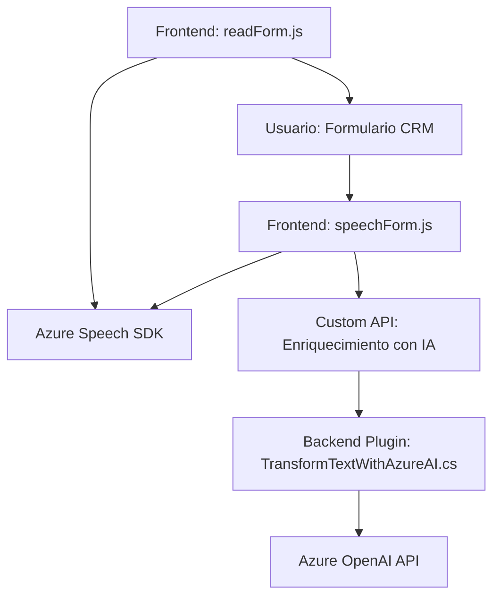

### Breve resumen técnico:
El repositorio contiene tres componentes principales:
1. **Frontend/JS**: Archivos JavaScript (`readForm.js`, `speechForm.js`) que implementan componentes para interacción con la interfaz de CRM mediante reconocimiento de voz y síntesis de texto hablado.
2. **Backend/Plugins**: Archivo C# (`TransformTextWithAzureAI.cs`) que actúa como un plugin para Dynamics CRM, integrando procesamiento inteligente con Azure OpenAI.

Estos archivos reflejan una solución híbrida basada en reconocimiento de voz, enriquecimiento de datos con IA y procesamiento de texto mediante servicios externos. Su objetivo es facilitar la interacción del usuario con formularios en CRM Dynamics.

---

### Descripción de arquitectura:
La solución combina elementos frontend y backend que interactúan principalmente con servicios de Azure. Se puede categorizar como una **arquitectura multicapa**:
- **Frontend (presentación)**: Maneja interacción de usuario y lógica para reconocimiento y síntesis de voz utilizando Azure Speech.
- **Backend (lógica de negocio)**: Provee comunicación directa con Dynamics CRM y Azure OpenAI para transformación avanzada de texto.
- **Integración de servicios externos**: La solución depende intensamente de servicios externos como Azure Speech SDK y Azure OpenAI API.

---

### Tecnologías usadas:
1. **Frontend**:
   - **JavaScript**:
     - Azure Speech SDK: Implementación para reconocimiento de voz y síntesis de texto hablado.
     - Dynamic script loading to ensure SDK availability.
   - DOM Manipulation for dynamic handling of script loading.

2. **Backend**:
   - **C#**:
     - Microsoft Dynamics CRM SDK.
     - Azure OpenAI API (via HTTP calls).
     - JSON handling with `System.Text.Json` and `Newtonsoft.Json`.

3. **Cloud platforms**:
   - **Azure Speech Services** for voice-to-text and text-to-voice operations.
   - **Azure OpenAI API** for text processing and generation using GPT models.

4. **Patterns**:
   - Modularization: Separate functions and classes for each responsibility.
   - Plugin pattern for CRM (Dynamics SDK).
   - Event-driven programming in frontend (callbacks).
   - API gateway-like logic for consuming external APIs.

---

### Diagrama Mermaid:

---

### Conclusión final:
La solución representa un ecosistema CRM extendido, diseñado para facilitar la interacción de los usuarios con formularios mediante tecnologías avanzadas como reconocimiento y síntesis de voz, enriquecimiento de datos con inteligencia artificial y generación estructurada de resultados. La arquitectura multicapa asegura modularidad y escalabilidad, mientras que la integración con servicios de Azure potencia las capacidades de la plataforma Dynamics.