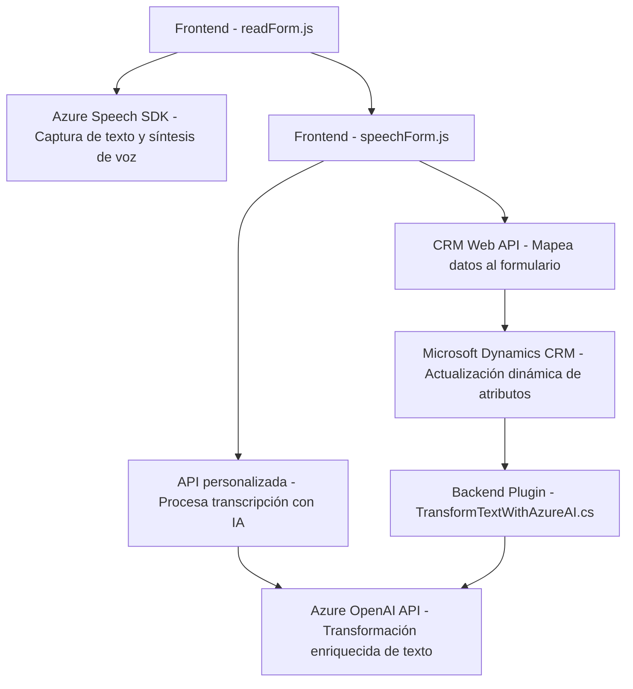

### Breve Resumen Técnico
El repositorio describe una solución híbrida que integra funcionalidades de frontend (`JS` files) en un entorno web interactivo, interactuando con Microsoft Dynamics 365 CRM y servicios de inteligencia artificial basados en Azure. También incluye un plugin de backend en C# que utiliza Azure OpenAI para ejecutar transformaciones de texto.

---

### Descripción de la Arquitectura
La arquitectura implementada corresponde a una combinación de:
1. **Microfrontend**:
   - Los módulos JavaScript (`readForm.js`, `speechForm.js`) implementan una interfaz configurable. Capturan datos de formularios, sintetizan voz y manejan transcripciones con reconocimiento y generación de voz mediante Azure Speech SDK.
   - Modularidad orientada al manejo de formularios dinámicamente.
   
2. **Plugin en Backend (Dynamics CRM)**:
   - El plugin (`TransformTextWithAzureAI.cs`) sigue la arquitectura estándar de los plugins de Dynamics CRM.
   - Consumidor directo de Azure OpenAI API para enriquecer datos con inteligencia artificial adaptándose al contexto del CRM.

---

### Tecnologías Usadas
1. **Frontend**:
   - **JavaScript ES6+**: Código modular para la ejecución de captura de datos, procesamiento de formularios y síntesis/reconocimiento de voz.
   - **Azure Speech SDK**: Integración dinámica para servicios de síntesis y reconocimiento de voz.
   - **Microsoft Dynamics API**: `Xrm.Page` y `formContext` para interacción con formularios de CRM.

2. **Backend**:
   - **C# (.NET Framework)**: Implementación del plugin server-side para Dynamics CRM.
   - **Microsoft.Xrm.Sdk**: Framework para desarrollos técnicos en Dynamics CRM.
   - **Azure OpenAI (REST API)**: Llamadas HTTP para procesamiento y transformación de texto basado en reglas.

3. **Servicios/Infraestructura**:
   - **Microservicios Azure**: Azure Speech y OpenAI como módulos de servicios externos.
   - **HTTP Client/JSON**: Manipulación y transformación de datos enviados y consumidos desde APIs externas.

---

### Diagrama Mermaid

---

### Conclusión Final
La solución combina frontend web dinámico, servicios basados en inteligencia artificial de Azure y un backend integrado a Dynamics CRM. Este diseño modular permite:
- **Escalabilidad**: Fácil integración de nuevos servicios o API relacionadas.
- **Despliegue centralizado**: Basado en Azure y Dynamics 365.
- **Interactividad avanzada**: Procesamiento de voz, enriquecimiento de datos y generación dinámica de atributos.

Es especialmente adecuado para escenarios empresariales que requieren interfaces interactivas sensibles al usuario con integración directa en sistemas CRM corporativos.