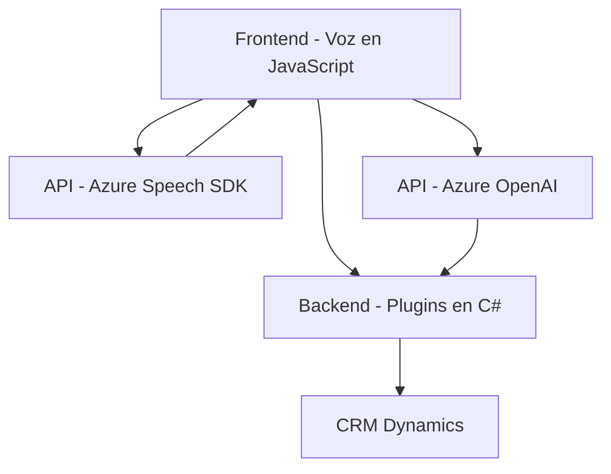

### Breve resumen técnico
Este repositorio implementa la interacción entre diferentes capas de software para integrar funcionalidades de accesibilidad (voz a texto y texto a voz) y procesamiento de datos mediante servicios basados en la nube (Azure Speech SDK y Azure OpenAI). Está organizado en componentes que manejan interacción directa con formularios y procesamiento de datos en un entorno CRM basado en Microsoft Dynamics.

### Descripción de arquitectura
La solución tiene una estructura híbrida basada en **arquitectura de n capas** y se puede clasificar como un **sistema de integración de servicios externos**. Combina los siguientes niveles:
1. **Frontend**: Scripts que controlan la interacción del usuario con formularios, traducen entradas y salidas de voz (JavaScript y SDKs de Azure).
2. **Backend**: Plugins en C# que extienden la funcionalidad de Dynamics CRM para trabajar con datos transformados mediante Azure AI.
3. **Servicios externos**: Azure Speech SDK y Azure OpenAI como componentes `SaaS` para tareas avanzadas como síntesis de voz y transformación de datos.
  
Por otro lado, hay un enfoque de modularidad con aplicaciones independientes (en frontend) que comunican datos con el backend usando APIs. En el backend, los plugins encapsulan todas las operaciones que dependen de Dynamics y los servicios externos.

### Tecnologías usadas
1. **Lenguajes**:
   - `JavaScript`: Scripts para frontend (entrada y salida de voz).
   - `C#`: Implementación de plugins en Dynamics CRM.
   
2. **Frameworks**:
   - `Microsoft Dynamics CRM SDK`: Extensión para integrar lógica de negocio personalizada.
   - `Azure Speech SDK`: Sintetizador de voz y reconocimiento de texto.
   - `Azure OpenAI APIs`: Procesamiento avanzado de texto usando modelos de IA.

3. **Patrones arquitectónicos**:
   - Cargador dinámico de SDKs.
   - Modularidad para reutilizar funciones.
   - Encapsulación en cada componente considerando la separación de responsabilidades.
   - Plugin Pattern para integrarse con Dynamics CRM.
   - Integración de servicios externos mediante APIs (sistemas de microservicios).

4. **Dependencias externas**:
   - Azure Speech SDK (`window.SpeechSDK`).
   - APIs personalizadas para integración con servicios como Azure OpenAI y el CRM.
   - Librerías como Newtonsoft.Json para manejar estructuras JSON.

### Diagrama Mermaid para GitHub

### Conclusión final
El repositorio presenta una solución implementada en una arquitectura de **n capas**, articulada con servicios externos mediante APIs de Azure. Es ideal para mejorar la accesibilidad y la automatización de tareas en un entorno basado en CRM (Dynamics) mediante el uso de entrada por voz, procesamiento IA y transformación de datos.

Se podría optimizar el manejo de dependencias como claves API y estructurar controladores para desacoplar más las responsabilidades. Recomendaciones adicionales incluyen probar un sistema más robusto para carga de SDKs y registrar logs avanzados para depurar la interacción entre sistemas.