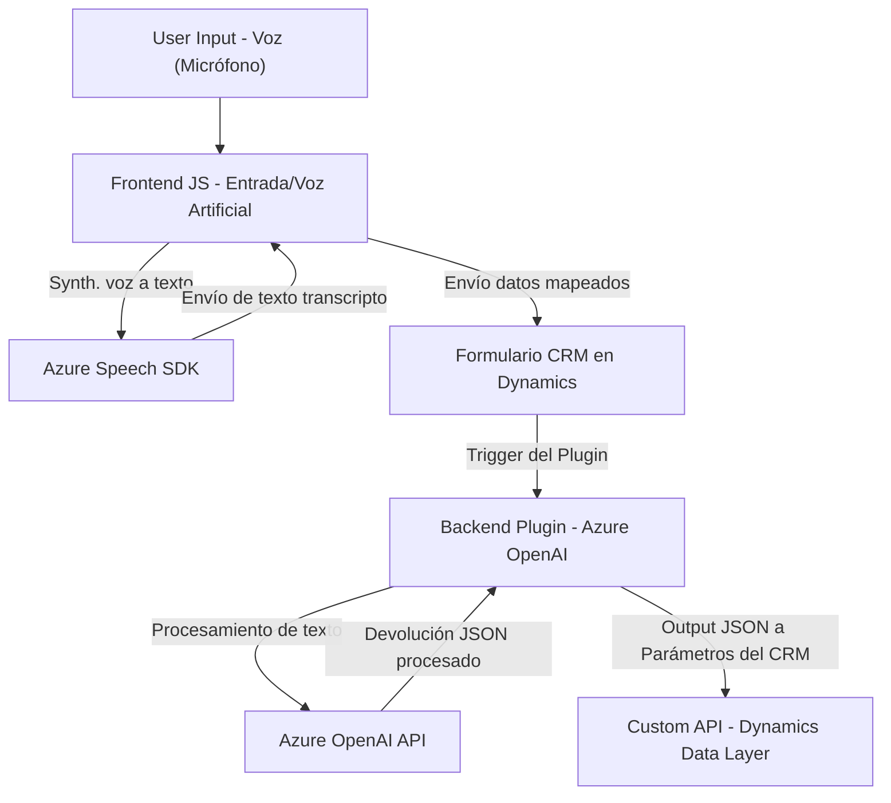

# Análisis técnico del repositorio

## Breve resumen técnico
Este repositorio integra funcionalidades de **procesamiento de voz** y **texto** en un sistema de CRM (específicamente **Dynamics 365**) utilizando servicios de **Azure Speech SDK** y **Azure OpenAI API**. Está compuesto por una combinación de frontend en **JavaScript** y backend con **C#**, diseñados bajo patrones de integración de servicios externos, modularización funcional y arquitectura basada en eventos.

El repositorio tiene tres componentes principales que trabajan en conjunto:
1. **Frontend**:
   - `readForm.js` y `speechForm.js` implementan funcionalidades para captura de entrada y salida de voz, así como interacción con un sistema CRM para procesamiento de formularios.
   - Utilizan el **Azure Speech SDK** para la síntesis y reconocimiento de voz.
   - Realizan llamadas a APIs personalizadas de Dynamics 365 para la interacción con datos del CRM.

2. **Plugin**:
   - `TransformTextWithAzureAI.cs` funciona como un **plug-in de Dynamics CRM**, interactuando con **Azure OpenAI API** para transformar texto de entrada según reglas predefinidas y devolverlo como un **JSON estructurado**.

## Descripción de la arquitectura
La solución propuesta sigue una arquitectura de **n capas** con características específicas de una **arquitectura orientada a servicios** (SOA). Estas capas principales son:
1. **Presentación (Frontend)**: Implementada con JavaScript, esta capa se encarga de las interacciones con el usuario, entrada y salida de voz (captura y síntesis), además de la invocación de servicios del backend y APIs de Dynamics CRM.
2. **Lógica de negocio (Middle Tier)**: Representada por el **plugin en C#**, que procesa texto interactuando con Azure OpenAI API para aplicar transformaciones inteligentes basadas en inteligencia artificial.
3. **Capa externa o de APIs de terceros**: Integración con servicios externos como **Azure Speech SDK** y **Azure OpenAI API** para brindar funcionalidades avanzadas de voz e inteligencia artificial al sistema.

### Flujo de arquitectura
1. El usuario interactúa con la entrada de voz y el formulario del sistema CRM a través del frontend (JavaScript) en el navegador.
2. El texto convertido o datos del formulario se procesan para generar un mapeo estructurado que es enviado como request a APIs externas y/o a un plugin de backend.
3. El plugin realiza un procesamiento adicional mediante Azure OpenAI, devolviendo respuestas procesadas al sistema CRM.
4. El sistema almacena los datos o responde al usuario según el flujo configurado.

## Tecnologías utilizadas
1. **JavaScript**:
   - Se utiliza para las funciones frontend de captura y síntesis de voz, así como la interacción con formularios y APIs dentro de un navegador web.
   - Apoyo de patrones como:
     - **Callback** y **Promesas** para manejar asincronía.
     - Modularización basada en funciones.
     - Mapeo de datos entre campos en el frontend y el backend (ej. `getFieldMap`).
2. **Azure Speech SDK**:
   - Para la captura de voz, síntesis de texto a voz y reconocimiento de voz, integrándose con JavaScript en el cliente web.
3. **C#**:
   - Implementación de un **plugin estándar de Dynamics CRM** usando el SDK de Microsoft (`IPlugin`, `IPluginExecutionContext`).
   - Procesa datos con Azure OpenAI, incluyendo seguridad diferenciada con tokens API.
   - Uso de patrones como las **Interfaces**, **dependencias externas** (loggers, JSON parsers), y **separación de responsabilidad (SRP)** a través de implementaciones ligeras.
4. **API Dynamics CRM**:
   - Uso de `Xrm.WebApi.online` para integraciones con el ecosistema Dynamics y disponibilidad de funciones nativas para gestión de datos en el CRM.
5. **Azure OpenAI**:
   - Procesa texto y transforma el contenido en JSON estructurado usando aprendizaje automático de última generación (GPT o similar).

## Dependencias o componentes externos
En función de las implementaciones descritas en los archivos, se identifican las siguientes dependencias:
1. **Tecnologías externas**:
   - **Azure Speech SDK**: Para procesar audio (reconocimiento y síntesis de voz).
   - **Azure OpenAI API**: Permite transformar texto mediante inteligencia artificial.
   - **Newtonsoft.Json.Linq** y `System.Text.Json`: Para manejar respuestas y crear inputs JSON.
   - **System.Net.Http**: Realiza las solicitudes HTTP necesarias para interactuar con las APIs de servicios externos.
2. **Frameworks/Servicios**:
   - Dynamics CRM SDK (`Microsoft.Xrm.Sdk`): Integra lógicas de plugins y solicita datos desde Dynamics CRM.
   - `Xrm.WebApi.online.execute` y otras APIs nativas de Dynamics 365.

## Diagrama **Mermaid** compatible con **GitHub Markdown**

## Conclusión final
Este repositorio define una solución basada en reconocimiento y síntesis de voz usando Azure Speech SDK, complementada por el uso de **Azure OpenAI API** para transformación inteligente de texto. Se integra satisfactoriamente con **Dynamics CRM**, utilizando tanto plugins como APIs personalizadas. La arquitectura es modular y adherente a principios de **n capas** y SOA. Aunque el código está bien diseñado, se deben abordar cuestiones relacionadas con la seguridad (como la exposición directa de credenciales de APIs en el código). Además, podría beneficiarse de pruebas automáticas y mejores prácticas en el frontend para manejo de errores.