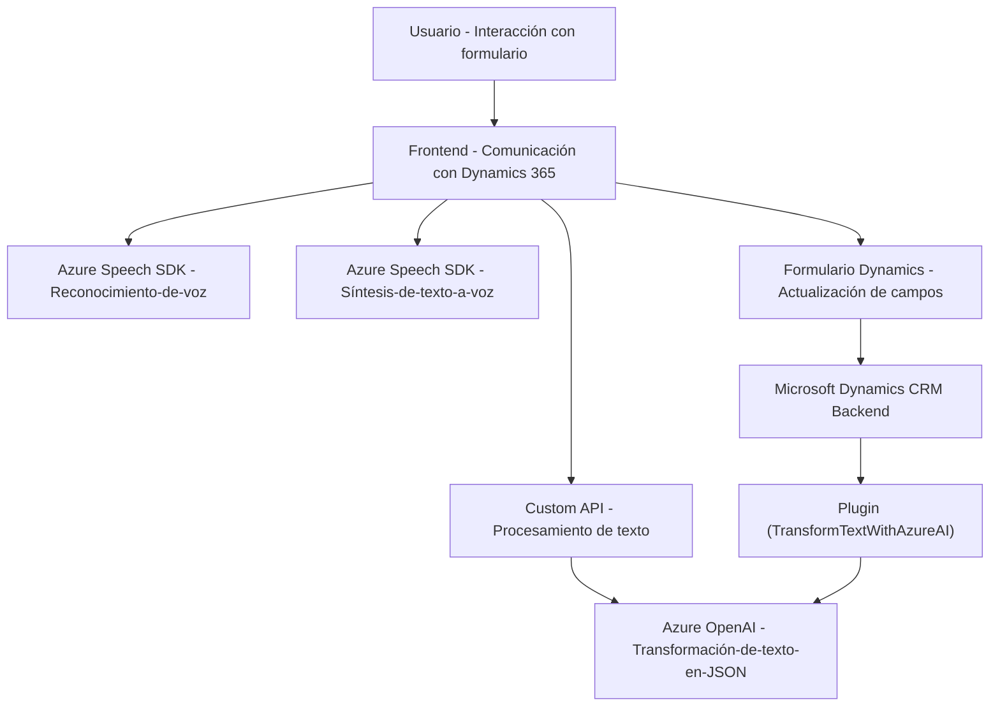

## Breve resumen técnico
El repositorio contiene múltiples archivos organizados en carpetas, lo que sugiere una solución que combina un **frontend**, **integración de SDKs** y un **backend basado en plugins** para Microsoft Dynamics CRM. Los archivos principales manejan interacción con el Azure Speech SDK para reconocimiento de voz y síntesis de texto a voz, manipulación de formularios en Dynamics 365 y procesamiento de texto mediante Azure OpenAI. La solución está orientada a facilitar la interacción usuario-sistema, especialmente en entornos empresariales.

---

## Descripción de arquitectura
La solución tiene una arquitectura híbrida que mezcla componentes frontend y backend. El frontend utiliza un enfoque modular basado en funciones y trabaja con el contexto del formulario para integración. En el backend, se implementa un plugin que sigue el patrón de extensibilidad del CRM (Dynamics Plugin) y usa servicios externos, como Azure OpenAI (para procesamiento de texto) y Azure Speech SDK (para reconocimiento y síntesis de voz). Aunque se ven principios de diseño modular y separación de responsabilidades, globalmente se aproxima más a un **n-capas**, dado el énfasis en integrar cliente, lógica API y los servicios de Dynamics 365.

---

## Tecnologías usadas
1. **Frontend con JavaScript:**
   - Azure Speech SDK: Para reconocimiento de voz y síntesis de texto a voz.
   - Microsoft Dynamics CRM: Integración con formularios CRM y APIs (ej. Xrm.WebApi).
   - Promesas y asincronía: Para operaciones no bloqueantes.
   
2. **Backend con C#:**
   - Plugin Architecture (Dynamics CRM): Clase `TransformTextWithAzureAI` implementa `IPlugin` para extender lógica del CRM.
   - Azure OpenAI: Procesamiento de texto aplicando reglas específicas.
   - System.Net.Http & Newtonsoft.Json: Para realizar solicitudes y manejar el formato JSON.
   - Microsoft.Xrm.Sdk: Para acceso a servicios e interfaces del CRM.

3. **Servicios Externos:**
   - Azure Speech SDK (`text-to-speech` y `speech-to-text`).
   - Microsoft Dynamics CRM Web API.
   - Azure OpenAI para transformación de texto.

---

## Diagrama Mermaid
A continuación, se incluye un diagrama **Mermaid** que visualiza los componentes y las relaciones. Es totalmente compatible con **GitHub Markdown**:

---

## Conclusión final
Esta solución implementa una integración bastante robusta entre el frontend, el backend y servicios externos, como Azure Speech SDK y Azure OpenAI. La arquitectura muestra características tanto de **n-capas**, con una separación clara entre frontend, lógica de negocio y servicios backend, como ciertos matices de **cliente/servidor** por el uso intensivo de APIs. Sin embargo, podría beneficiarse de una consolidación más estructurada aplicando patrones como arquitectura **hexagonal**, lo cual promovería una interacción más desacoplada entre componentes. Además, el manejo de dependencias en algunos archivos puede ser optimizado (por ejemplo, eliminación de importaciones innecesarias en el plugin). En conjunto, la solución es escalable y se alinea bien con el ecosistema de Dynamics CRM y Azure.