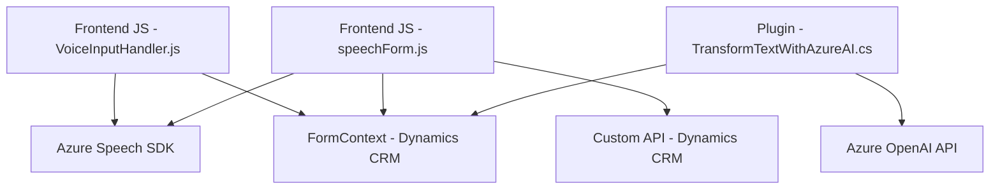

### Breve resumen técnico
El repositorio representa una solución híbrida que integra componentes del frontend (JavaScript para el cliente) y del backend (C# Plug-in) para crear una aplicación que facilita la interacción entre usuarios y formularios en un entorno **Microsoft Dynamics 365 CRM**, aprovechando la tecnología de **Azure Speech SDK** y **Azure OpenAI**. La aplicación está diseñada para mejorar la accesibilidad (lectura/síntesis de voz) y transformar datos mediante IA.

---

### Descripción de arquitectura
La arquitectura es **modular** y sigue un diseño de cliente-servidor, con interacción directa entre tres capas principales:
1. **Frontend**: La capa cliente utiliza archivos JavaScript para interactuar con formularios visibles, leer datos y convertir texto a voz. Maneja asincronía con SDK y servicios externos.  
2. **Backend**: Un plug-in en C# implementado dentro de Dynamics CRM que proporciona integración con Azure OpenAI, ejecutando transformaciones de texto avanzado.  
3. **Servicios externos**: Uso de servicios como **Azure Speech SDK** y **Azure OpenAI API** para reconocimientos de voz y transformación de datos respectivamente.

La solución tiene una arquitectura de **n capas**, donde:
- El frontend facilita interacción con el usuario.
- El backend gestiona lógica empresarial y procesamiento avanzado mediante servicios integrados.
  
También se observa el uso de patrones como:
- **Delegate pattern** en funciones JS, para delegar responsabilidades entre componentes.
- **Façade pattern** en el plug-in C#, que actúa como un puente entre Dynamics CRM y Azure OpenAI.

---

### Tecnologías usadas
1. **Frontend**:
   - **JavaScript**: Procesamiento de datos de formularios y síntesis de voz por Azure Speech SDK.
   - **Azure Speech SDK**: Para convertir texto en voz y manejar procesos de entrada por voz.
   - **Xrm.WebApi**: Integración de Dynamics CRM con APIs personalizadas.

2. **Backend**:
   - **C# Plug-ins (Dynamics 365 CRM SDK)**: Extensiones plug-in de Microsoft Dynamics CRM.
   - **Azure OpenAI API**: Uso de modelos GPT a través de HTTP para transformar texto en JSON estructurado.
   - **Newtonsoft.Json.Linq**: Manejo de JSON en C#.
   - **System.Net.Http**: Para consumir servicios web.
   - **System.Text.Json**: Manipulación de datos JSON en C#.

3. **External Dependencies**:
   - Microsoft Dynamics 365 CRM.
   - Azure Speech SDK.
   - Azure OpenAI API.
   - JSON libraries (Newtonsoft y System.Text.Json).
   - Servicios externos (API REST basadas en Azure).

---

### Diagrama Mermaid compatible con GitHub

---

### Conclusión final
La solución integra componentes del ecosistema Dynamics 365 CRM con servicios avanzados de Microsoft Azure (Speech SDK y OpenAI API). Representa un diseño claro de **n capas**, con fuerte modularidad en el código frontend y una lógica de backend basada en plug-ins. Se utiliza infraestructura inteligente para mejorar la accesibilidad y transformar datos mediante IA, permitiendo a los usuarios interactuar intuitivamente con formularios a través de voz y datos estructurados.