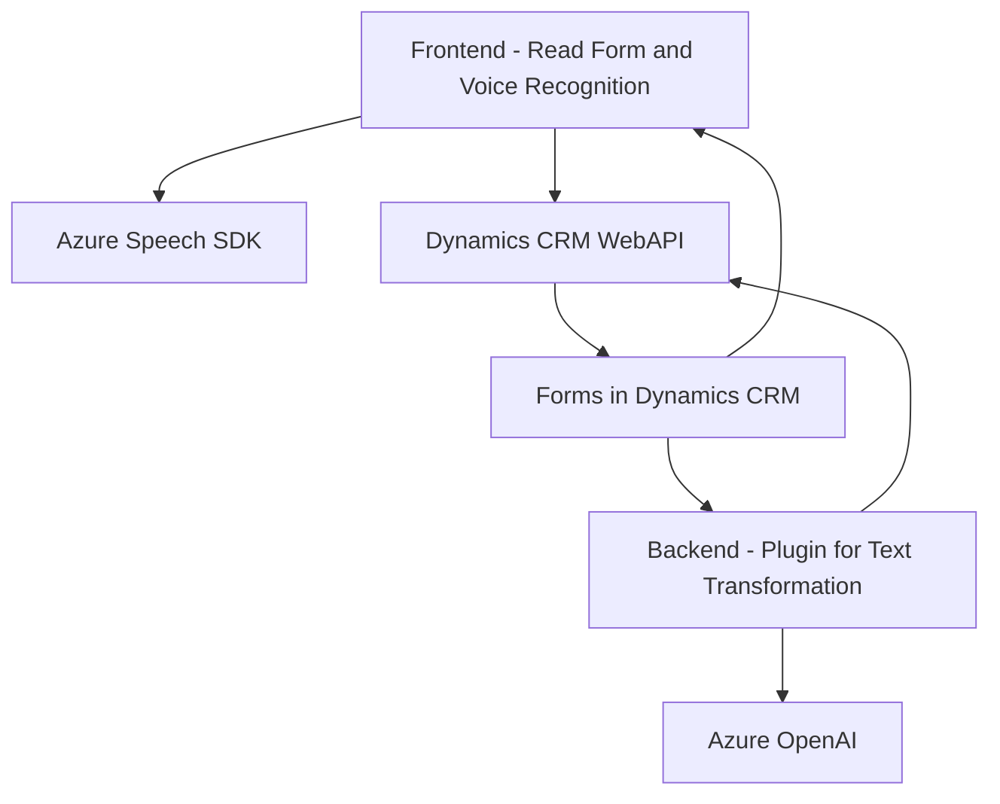

### Análisis técnico:

#### 1. Tipo de solución:
El repositorio implementa una solución híbrida orientada a la integración de servicios cognitivos de Azure en **Microsoft Dynamics CRM**. Está compuesto por tres tipos de módulos principales:
- **Frontend**: Scripts en JavaScript para interacción directa con formularios web y servicios SDK externos en Dynamics CRM.
- **Backend-Plugins**: Plugins en C# para la ejecución de lógica personalizada utilizando Azure OpenAI y funcionalidades extendidas de Dynamics CRM.
- **API**: Interfaces externas vinculadas a SDKs de Azure y el uso puntual de Dynamics Web APIs.

En conjunto, podríamos clasificar la solución como un **ecosistema integrado entre microservicios cognitivos y funcionalidad CRM**.

---

#### 2. Tecnologías, frameworks y patrones utilizados:
- **Frontend**:
  - **JavaScript**: Lenguaje principal para la lógica de frontend.
  - **Azure Speech SDK**: Para reconocimiento de voz y síntesis, con carga dinámica desde URL externa.
  - **Microsoft Dynamics CRM Web APIs**: Integración directa con los formularios y entidades propias del CRM.
  - Patrones:
    - Modularidad funcional: división de tareas específicas en funciones independientes.
    - Event-driven programming: Interacciones dinámicas basadas en eventos de usuario en el frontend.

- **Plugins Backend**:
  - **C#**: Lenguaje empleado para el desarrollo de plugins.
  - **Azure OpenAI GPT Model (gpt-4o)**: Uso de IA para transformar texto en estructuras JSON personalizadas.
  - **Microsoft Dynamics CRM SDK & Query API**: Interacciones con CRM para lectura y escritura de datos.
  - **Newtonsoft.Json**: Facilidad de manipulación y transformación de datos en formato JSON.
  - Patrones:
    - Service-Oriented Architecture (SOA): Llamadas a API externas (Azure OpenAI y SDK).
    - Plugin Pattern: Cumple con las especificaciones de extensiones en Dynamics CRM mediante el uso de `IPlugin`.

---

#### 3. Tipo de arquitectura:
La solución tiene una arquitectura **híbrida**, compuesta por los siguientes elementos:
- **Monolítica**: Para la lógica consolidada en los plugins de C# y operaciones integradas directamente con Dynamics CRM.
- **Event-driven architecture**: En el frontend, las acciones están orientadas por eventos del usuario y llamadas a SDKs externos de Azure.
- **Service-Oriented Architecture (SOA)**: Principio subyacente basado en el consumo de servicios externos desde Azure (Speech SDK y OpenAI).

En términos generales, se podría describir como una arquitectura de **n capas**:
1. **Capa de Presentación (Frontend)**: Scripts en JavaScript que interactúan directamente con formularios y usuarios.
2. **Capa de Negocios (Backend Plugins)**: Lógica extendida en C# y plugins.
3. **Capa de Servicios Externos**: Integraciones con Azure Speech SDK y Azure OpenAI.

---

#### 4. Dependencias y componentes externos:
- **Azure Speech SDK**
  - Reconocimiento y síntesis de voz.
  - Carga desde una URL dinámica: `https://aka.ms/csspeech/jsbrowserpackageraw`.
- **Azure OpenAI**:
  - Transformación de texto en estructuras JSON utilizando GPT-4o.
  - Endpoint: `https://openai-netcore.openai.azure.com`.
- **Microsoft Dynamics CRM Web APIs**:
  - Interacción con entidades CRM, ejecución de consultas y extensibilidad mediante plugins.
- **Newtonsoft.Json**:
  - Bibliotecas de manipulación de objetos JSON en C# (en el backend).

---

#### 5. Diagrama Mermaid:

---

#### Conclusión final:
La solución cumple con una arquitectura **híbrida de n capas**, que integra servicios de inteligencia artificial y funcionalidades multimedia (como síntesis y reconocimiento de voz) en un entorno de **Microsoft Dynamics CRM**. Sigue principios de modularidad en el frontend y extensibilidad en el backend mediante plugins, aprovechando servicios externos como Azure Speech SDK y OpenAI GPT. Sin embargo, mejoras en la gestión de configuraciones sensibles (como claves de API dentro del código) podrían aumentar la seguridad y escalabilidad de la solución.