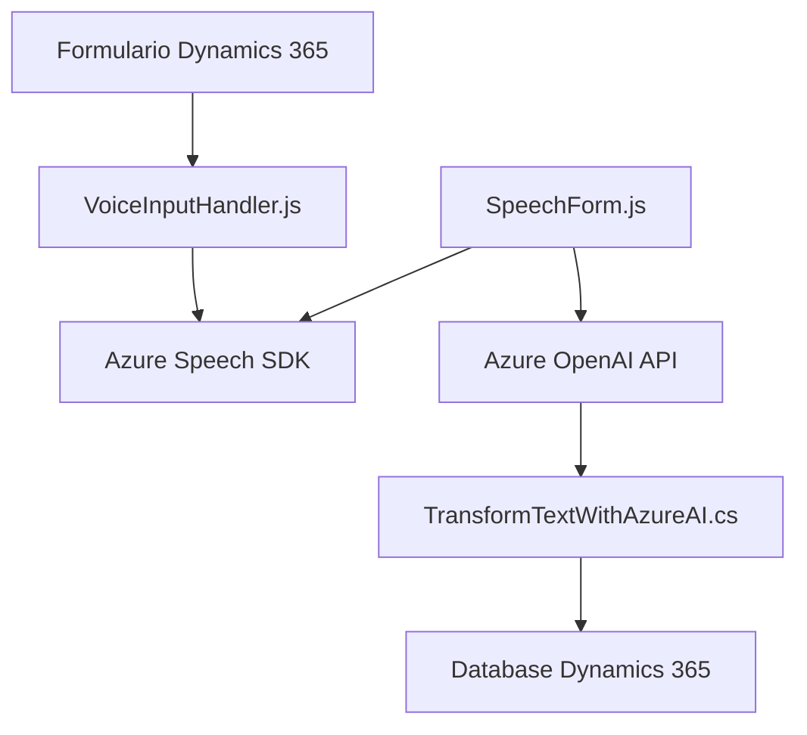

### Breve Resumen Técnico
El repositorio parece implementar una solución que se centra en integrar la funcionalidad de procesamiento y entrada de voz junto con servicios de inteligencia artificial basados en Azure Speech SDK y Azure OpenAI. La funcionalidad se utiliza principalmente en el contexto de formularios dinámicos de Microsoft Dynamics 365, lo cual sugiere que el objetivo es mejorar la interacción y automatización en aplicaciones empresariales y CRM.

### Descripción de Arquitectura
La solución posee una arquitectura híbrida. Por un lado, utiliza un modelo de composición modular con enfoque en patrones desacoplados (funciones separadas con roles específicos). Por otro lado, en el archivo del plugin de la API de OpenAI, se implementa un patrón basado en "plugins" (Dynamics 365), que extiende el comportamiento del sistema CRM. En términos generales, la arquitectura se aproxima a una aplicación **n-capas**, donde cada capa (frontend, backend, servicios) cumple roles independientes:
- **Frontend**: Proporciona la capa de interacción con los formularios (reconocimiento de voz, lectura y síntesis) mediante JavaScript.
- **Backend**: Plugin de transformación de texto que interactúa con Dynamics CRM y Azure AI.

### Tecnologías Usadas
1. **Frontend:**
   - Lenguaje: JavaScript.
   - Integración: Azure Speech SDK para síntesis y reconocimiento de voz.
   - Framework externo (dinámico): Microsoft Dynamics 365, acceso a contextos de ejecución de formularios.
2. **Backend:**
   - Lenguaje: C# (.NET framework).
   - Integración: Azure OpenAI para procesamiento de texto.
   - SDK: Dynamics CRM SDK (integración de plugins).
   - Librerías: Newtonsoft.Json y System.Text.Json.
3. **API Externa:**
   - Azure Speech SDK: Para síntesis y reconocimiento de voz.
   - Azure OpenAI: Para transformación de texto y generación de respuestas JSON a partir de texto.

### Diagrama Mermaid

### Conclusión Final
La solución implementa una arquitectura que combina módulos frontend modulares (JavaScript) con integración backend en forma de plugins de Dynamics 365 (C#). Utiliza servicios externos de Azure, específicamente Azure Speech SDK y OpenAI, alcanzando una alta escalabilidad y ampliabilidad. Sin embargo, se debe mejorar la gestión de configuraciones sensitivas, como claves de acceso API, y considerar mejores prácticas para el manejo de excepciones. La estructura n-capas permite una separación clara entre frontend, lógica de negocio y servicios externos.