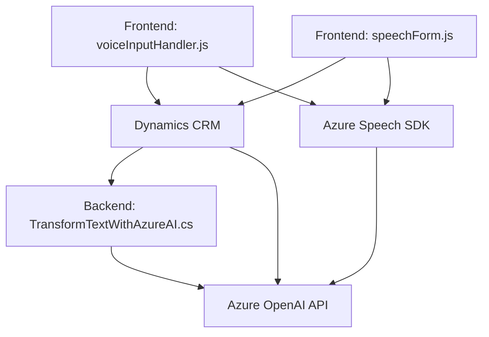

### Resumen técnico
El repositorio define una solución con capacidad de integrar reconocimiento de voz, síntesis de voz y procesamiento de textos utilizando servicios de Azure Speech y OpenAI. Se enfoca en formularios dinámicos dentro de Dynamics CRM, facilitando una integración seamless entre inputs de usuarios (voz/texto) y procesamiento automático. 

---

### Descripción de arquitectura
La solución combina elementos **frontend**, **backend**, e integración directa con **servicios de Azure**:
- **Frontend**: JavaScript se encarga del procesamiento de datos en el navegador (por ejemplo, lectura en voz alta y transcripción).
- **Backend**: Plugins en C# interactúan con Dynamics CRM y APIs de Azure (OpenAI) para realizar transformaciones.
- La arquitectura tiene un enfoque **n-capas** dado que cada segmento (frontend/backend/plugins) opera de forma aislada, comunicándose con APIs estándar.
- Usa patrones de integración específicos, como **carga dinámica de dependencias** y **intermediarios entre servicios externos y el sistema interno**.

---

### Tecnologías usadas
1. **Frontend**:
   - Lenguaje: JavaScript.
   - Dependencias: Azure Speech SDK (texto a voz y reconocimiento de voz).
   - Frameworks: Dynamics CRM integrado mediante eventos de formularios.
   - CDN: Carga dinámica del SDK de Azure desde un endpoint público.

2. **Backend/Plugins**:
   - Lenguaje: C# (.NET Framework para CRM plugins).
   - APIs externas: Azure OpenAI API (GPT-4).
   - Dependencias:
     - Newtonsoft.Json.
     - Microsoft.Xrm.Sdk para Dynamics CRM API.

3. **Servicios externos**:
   - Azure Speech SDK.
   - Azure OpenAI para procesamiento avanzado usando GPT modelos.

---

### Diagrama Mermaid válido para GitHub

---

### Conclusión final
La solución proporciona una integración robusta y avanzada utilizando **Azure servicios** para captar y procesar inputs de voz/texto en aplicaciones empresariales. Está diseñada siguiendo una arquitectura modular que permite separar responsabilidades y reducir acoplamiento entre componentes. La implementación facilita la personalización directa en aplicaciones de Dynamics CRM con soporte para procesamiento externo avanzado, asegurando que sea escalable y adaptable a futuros escenarios.