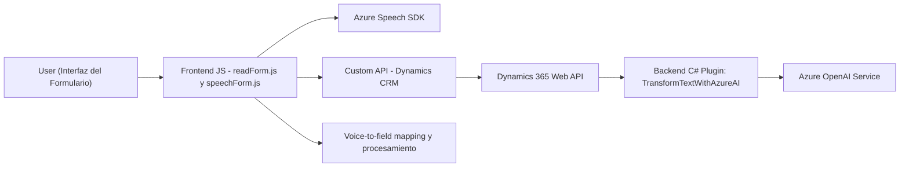

### Breve resumen técnico
La solución descrita tiene una estructura consistente en tres principales componentes:
1. **Frontend** (JavaScript): Implementa interacciones para captura de datos desde formularios y lectura/síntesis de voz mediante Azure Speech SDK en soportes navegadores.
2. **Azure-integrated Plugin** (C#): Ejecuta transformaciones de texto con reglas específicas usando el servicio Azure OpenAI dentro de un entorno Dynamics CRM.
3. **Custom API Integration**: Interactúa con dinámicas externas configuradas en Microsoft Dynamics 365.

### Descripción de arquitectura
La arquitectura parece estar orientada a una solución **n capas**, típica en entornos corporativos como Dynamics CRM. Las principales capas que se observan son:
- **Capa de presentación (Frontend):** Implementada en JavaScript, responsable de la interacción directa con el usuario.
- **Capa de lógica de negocio (Dynamics Plugin):** Integración como plugin, centraliza la lógica del procesamiento de texto y la transformación a JSON mediante IA.
- **Capa de datos/APIs externas:** A través del SDK de Dynamics (`Xrm.WebApi.online.execute`) y las llamadas HTTP directas al **Azure OpenAI Service**, se conecta con servicios externos para realizar tareas de procesamiento de datos.

### Tecnologías utilizadas
- **Frontend:**
  - **Azure Speech SDK**: Para síntesis de textos en voz, basado en la API de voz de Azure.
  - **JavaScript**: Lenguaje utilizado para interactuar con el DOM y desarrollar las funcionalidades cliente.
  - **APIs del navegador**: Para la manipulación del DOM y carga dinámica del SDK.
  - **Json**: Almacenamiento y transmisión de datos procesados.
- **Backend/Plugins:**
  - **Azure OpenAI Service**: Para transformar texto según reglas específicas (ej., con formato JSON).
  - **Microsoft Dynamics CRM SDK** (`Microsoft.Xrm.Sdk`, `Xrm.WebApi`): Para interacción y procesamiento de entidades.
  - **.NET Framework y C#**: Usado para desarrollar el plugin que se ejecuta como componente de Dynamics.
  - **Newtonsoft.Json:** Para manipulación de estructuras JSON.
  - **HTTPClient:** Para consumir servicios externos.

### Diagrama Mermaid

### Conclusión final
La solución descrita implementa funcionalidades avanzadas para integrar tecnologías de reconocimiento de voz (Azure Speech SDK) y transformación de texto (Azure OpenAI) con el modelo de datos en entornos Dynamics CRM. Aunque la arquitectura exhibe el carácter tradicional de **n capas**, combina características de diseño modular y un enfoque orientado a servicios mediante solicitudes API externas.

Algunas áreas posibles de optimización:
1. Uso de un cliente HTTP reutilizable en el plugin (actualmente parece usar uno por solicitud).
2. Mayor separación entre las capas del frontend y backend para una arquitectura más independiente.
3. El uso de patrones como **hexagonal** podría mejorar la conectividad entre ambos entornos (backend y frontend) reduciendo la acopladura.