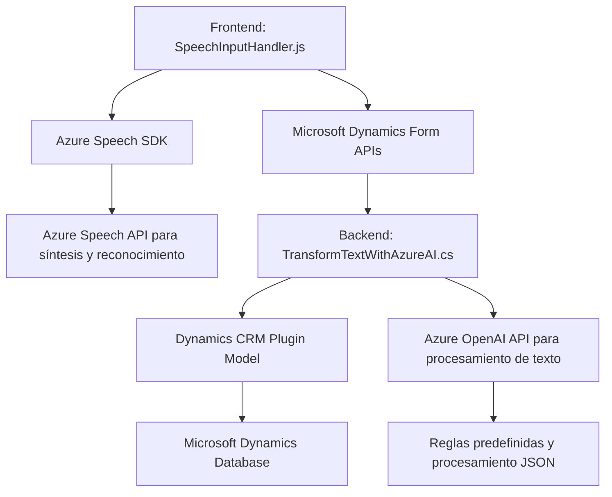

### Breve resumen técnico:
El repositorio contiene archivos que implementan funcionalidades de lectura y síntesis de voz, reconocimiento de voz y procesamiento de texto integrado con APIs externas como Azure Speech SDK y Azure OpenAI. Se centra en aplicaciones de formularios dinámicos en sistemas CRM como Microsoft Dynamics.

---

### Descripción de arquitectura:
El sistema parece seguir una arquitectura distribuida con tres componentes principales:
1. **Frontend:** Encargado de interactuar con el usuario (formulario y voz) utilizando Azure Speech SDK y lógicas de procesamiento en tiempo real.
2. **Backend con plugins:** Extensiones de Dynamics CRM que procesan texto y lo transforman según reglas definidas con servicios de IA (Azure OpenAI).
3. **Servicios externos:** El frontend y plugins dependen de APIs externas de Azure (Speech y OpenAI) para sintetizar voz, reconocimiento de habla y procesamiento de texto.

La arquitectura general se puede clasificar como **n capas**, ya que existe claramente un frontend, un capa de procesamiento (lógica), y comunicación hacia servicios externos. Sin embargo, se observan principios del **patrón hexagonal** o arquitectura basada en puertos y adaptadores al integrar APIs externas de forma desacoplada.

---

### Tecnologías usadas:
1. **Frontend (JavaScript):**
   - **Azure Speech SDK:** Para reconocimiento y síntesis de voz.
   - **Browser APIs:** Dinámicamente carga scripts y maneja eventos de formularios.

2. **Backend (C#):**
   - **Microsoft Dynamics CRM APIs:** Para manipulación avanzada de datos en formularios.
   - **Azure OpenAI API:** Para procesamiento de texto con IA.
   - **Newtonsoft.Json y System.Text.Json:** Manejo de datos JSON en C#.
   - **HTTP client de .NET:** Solicitudes REST hacia APIs externas.

---

### Diagrama Mermaid válido para GitHub:

---

### Conclusión final:
El sistema está diseñado para optimizar la interacción de usuarios con formularios dinámicos en sistemas CRM mediante capacidades avanzadas de voz e inteligencia artificial. Hace uso de servicios y herramientas tecnológicas modernas como Azure Speech y OpenAI, manteniendo una clara separación de responsabilidades en un esquema de arquitectura n capas. Es ideal para implementaciones que requieren automatización de entrada de datos, procesamiento inteligente y robustez en servicios externos.