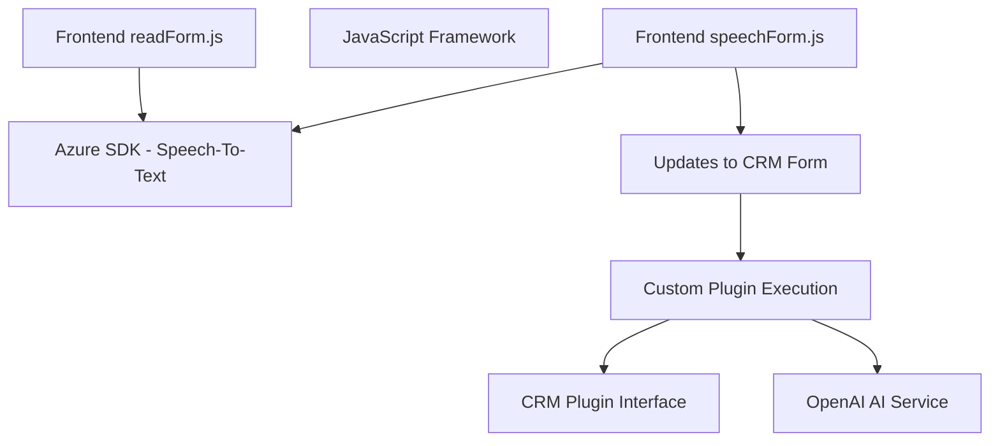

### Breve resumen técnico
El repositorio contiene tres componentes principales, cada uno jugando un rol específico dentro de la solución:
1. **Frontend/JS (readForm.js & speechForm.js)**: Scripts en JavaScript que integran funciones para leer, procesar y convertir texto en voz, utilizando el SDK de Azure Speech. También posee funcionalidades de reconocimiento de voz y mapeo con formularios de Dynamics CRM. Esto forma parte de un sistema de frontend.
2. **Plugin (TransformTextWithAzureAI.cs)**: Plugin diseñado para un entorno Dynamics CRM, cuyo propósito es manipular texto utilizando Azure OpenAI, transformándolo en un objeto JSON estructurado basado en reglas personalizadas. Este archivo es el backend específico para CRM.
3. La solución utiliza los SDKs de Microsoft Azure y Dynamics CRM para integrar capacidades avanzadas de inteligencia artificial y manipulación de datos empresariales.

---

### Descripción de arquitectura
La arquitectura general es **Cliente-Servidor**, al estar dividida entre un frontend que interactúa con formularios y un backend en forma de plugin que ejecuta procesos especializados. Sin llegar a ser completamente microservicios, el sistema sigue una aproximación de **arquitectura en capas**:
- **Capa presentación**: En el frontend, se accede a los formularios y se integran las funciones de voz.
- **Capa lógica**: En el CRM, mediante plugins que ejecutan procesos transformacionales.
- **Capa de servicios externos**: Integración con SDKs de Azure para voz y AI.

---

### Tecnologías usadas
1. **Frontend**:
   - **JavaScript**: Desarrollo del cliente con funciones específicas.
   - **Azure Speech SDK**: Síntesis de voz y reconocimiento speech-to-text.
   - **Dynamics CRM Web API**: Para insertar/modificar datos en los formularios.
2. **Backend (Plugin)**:
   - **C# y .NET**: Para desarrollar el plugin que interactúa con Dynamics CRM.
   - **Microsoft.Xrm.Sdk**: Funcionalidad nativa para crear plugins en CRM.
   - **Azure OpenAI API**: Para realizar transformaciones de texto.
   - **Newtonsoft.Json.Linq & System.Text.Json**: Manejo de JSON en C#.
   - **System.Net.Http**: Realizar solicitudes API al servicio externo (Azure OpenAI).

---

### Diagrama Mermaid (GitHub Markdown compatible)

---

### Conclusión final
La solución está diseñada como una **Cliente-Servidor arquitectural con enfoque en capas**. La capa cliente (frontend) se ocupa de la interacción de voz con formularios, que luego puede integrarse con un backend específico diseñado como un plugin para Dynamics CRM. El plugin aporta capacidades de transformación avanzada mediante **Azure OpenAI**, lo que posiciona la solución como una integración de tecnologías innovadoras con sistemas empresariales tradicionales. Aunque no implementa una arquitectura totalmente separada como un sistema de microservicios independiente, la reutilización de los SDKs de Azure y la API de CRM es ejemplar para extender su funcionalidad.