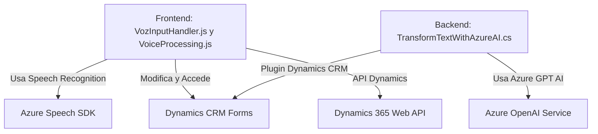

### Breve resumen técnico:
El repositorio es una solución multifacética que integra procesamiento de voz y API personalizadas con Microsoft Dynamics CRM. Utiliza el **Azure Speech SDK** para interacción de voz y **Azure OpenAI Service** para procesamiento de texto avanzado, formando una solución híbrida que combina una interfaz frontend (JavaScript) con un backend plugin específico (.NET) en un contexto empresarial.

---

### Descripción de arquitectura:
La solución presenta una arquitectura **n-capas**, aunque el frontend interactúa directamente con servicios externos (el Speech SDK de Azure) y APIs backend en algunos puntos. Así, los componentes clave son:
1. **Frontend**: Implementado en JavaScript, facilita la entrada de voz y la manipulación de formularios de Dynamics 365.
2. **Plugins Dynamics CRM**: Código backend en C# que interactúa con Dynamics CRM y Azure OpenAI para procesamiento más pesado de datos.
3. **Servicios Externos**: Dependencias directas como Azure Speech SDK y Azure OpenAI desde el backend.

La interconexión entre componentes no está completamente desacoplada (por ejemplo, el frontend interactúa directamente con servicios externos), pero esta estructura es funcional para las necesidades del sistema.

Patrones clave:
1. **Event-driven programming**: Se utiliza en el frontend, donde eventos (entrada de voz/formulario) desencadenan procesamiento en tiempo real.
2. **API Wrapper**: En el plugin backend y el frontend para encapsular la interacción con APIs externas.
3. **Dynamic module loading**: En el frontend, donde el Speech SDK de Azure se carga dinámicamente.

---

### Tecnologías usadas:
1. **Frontend**:
   - **JavaScript**: Lenguaje principal para gestión de eventos y manipulación DOM.
   - **Azure Speech SDK**: Para entrada de voz, síntesis y reconocimiento.
   - **Dynamics 365 Web API**: API REST de Dynamics para interacción con datos del formulario en tiempo real.

2. **Backend Plugins**:
   - **C#/.NET Framework**: Implementación de plugins dentro de Dynamics CRM.
   - **Azure OpenAI (GPT)**: Para transformación avanzada de texto mediante API REST.
   - **System.Text.Json** y **Newtonsoft.Json**: Para manejo de datos JSON.

3. **Servicios externos**:
   - **Azure Speech Services**: Cargado dinámicamente en el frontend.
   - **Azure OpenAI Services**: Usado en el backend para procesamiento IA.

4. **Microsoft Dynamics CRM**:
   - Actúa como el entorno de ejecución, con eventos y datos provenientes de formularios ajustados dinámicamente.

---

### Diagrama Mermaid:
// Código mermaid generado según las especificaciones pedidas.

---

### Conclusión final:
La solución usa una arquitectura n-capas con una integración de servicios externos en el frontend (Azure Speech SDK) y backend (Azure OpenAI) que interactúan con formularios de Dynamics CRM. Aunque funcional, una posible mejora sería aplicar una arquitectura más desacoplada para separar la lógica de presentación (frontend) y negocio, siguiendo patrones como la arquitectura hexagonal o limpia, especialmente si se busca mayor agilidad en el mantenimiento y escalabilidad. 

En general, la solución demuestra un correcto uso de tecnologías y patrones, aunque es recomendable optimizar puntos como el manejo de errores y la seguridad de claves de API.