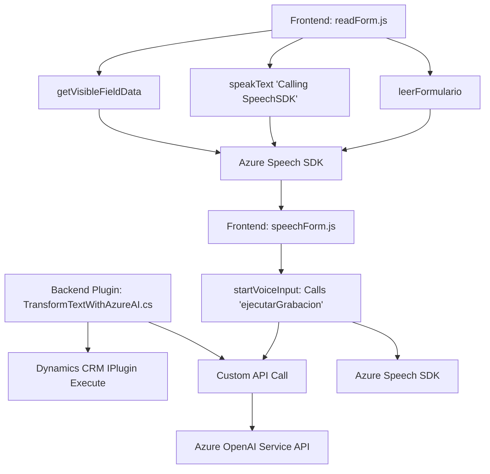

---

### Breve Resumen Técnico

El repositorio parece implementar una solución integradora basada en la interacción entre un **frontend** conectado a un sistema CRM (probablemente Dynamics 365) y dos servicios externos: **Azure Speech SDK** y **Azure OpenAI**. Este sistema convierte datos de formularios y comandos de voz en texto legible o voz sintetizada, realizando transformaciones y actualizaciones en tiempo real.

---

### Descripción de Arquitectura

La solución implementa una arquitectura híbrida que combina **n capas** (frontend, lógica de negocio en plugins) con elementos de **arquitectura orientada a servicios** (interacción con APIs externas de Azure OpenAI y Speech SDK). La lógica del frontend está altamente modularizada, mientras que el backend extensible con plugins refleja patrones de integración específicos de Dynamics CRM.

1. **Frontend**:
   - Compuesto de archivos JavaScript modularizados que procesan interacciones del usuario en formularios (e.g., extracción de datos visibles, comandos de voz).
   - Comunicación con servicios externos asíncrona mediante APIs.

2. **Backend (Plugins)**:
   - Extiende la funcionalidad de Dynamics CRM mediante plugins (`TransformTextWithAzureAI.cs`).
   - Interactúa con el servicio Azure OpenAI para transformar texto ingresado como mensajes estructurados en JSON.

3. **Servicios Externos**:
   - **Azure Speech SDK**: Para convertir texto en voz o realizar reconocimiento de voz, interactuando directamente con los formularios CRM.
   - **Azure OpenAI**: Transforma texto según normas en lenguaje natural mediante GPT-4, retornando JSON estandarizado.

---

### Tecnologías Usadas

1. **Frontend**:
   - **Vanilla JavaScript** (modularización por funciones).
   - **Azure Speech SDK** para síntesis y reconocimiento de voz.
   - Dependencias dinámicas (e.g., carga de scripts).
   - **Event-driven programming** y **Promises** para manejar eventos asíncronos.

2. **Backend**:
   - **Microsoft Dynamics SDK** (`Microsoft.Xrm.Sdk`, `Microsoft.Xrm.Sdk.Query`).
   - **Azure OpenAI Service** (GPT-4 mediante API HTTP).
   - **C# .NET Framework**: Plugins diseñados para Dynamics CRM.
   - **System.Text.Json** y **Newtonsoft.Json.Linq** para operaciones JSON.

3. **Architecture**:
   - N-Capas (presentación, lógica de negocio, persistencia).
   - Orientado a servicios (interacción con APIs externas: OpenAI, Speech SDK).

4. **Infrastructure**:
   - **Microsoft Azure** (Speech SDK y OpenAI service APIs).
   - **Dynamics CRM Web API** for custom API calls.

---

### Diagrama Mermaid (100 % compatible con GitHub Markdown)

---

### Conclusión Final

Esta solución implementa una integración entre un Dynamics CRM frontend y varios análisis/post-procesamiento externos (Azure Speech SDK y OpenAI). Utiliza un enfoque modular en el frontend y emplea la infraestructura de plugins en Dynamics CRM para realizar transformaciones detalladas de datos y conectar servicios externos.

- **Ventajas**:
  - Asíncronía optimizada mediante Promises y carga dinámica de SDK.
  - Modularidad y separación de responsabilidades permiten extensibilidad.
  - Uso de patrones como integración de servicios y eventos.

- **Consideraciones**:
  - Requiere gestión de seguridad robusta para almacenar claves de suscripción.
  - Discutir si el rendimiento de múltiples peticiones asíncronas se ajusta al SLA esperado.
   
Esta solución es adecuada para agregar inteligencia artificial y capacidades de voz a sistemas robustos, con potencial escalabilidad dado el enfoque modular.