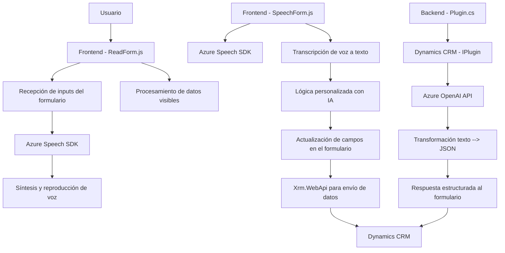

### Breve resumen técnico:
El repositorio analiza una solución integrada que conecta la plataforma Dynamics 365 CRM con el Azure Speech SDK y el servicio Azure OpenAI. La funcionalidad principal incluye reconocimiento de voz, síntesis de texto en voz y transformación de texto en formatos estructurados mediante procesamiento de IA.

---

### Descripción de arquitectura:
**Tipo de solución:**  
La solución describe una arquitectura híbrida que combina una aplicación frontend basada en JavaScript para la interacción de usuarios y un backend de plugin C# con Dynamics 365 integrado.  
1. **Frontend:** Utiliza JavaScript para habilitar entrada y salida de voz en formularios de Dynamics 365, además de implementar lógica para gestionar datos visibles y transcripciones procesadas.  
2. **Backend:** Configurado como un plugin de Dynamics CRM (implementa `IPlugin` en C#) donde las solicitudes a Azure OpenAI procesan texto para transformarlo en objetos JSON según normas predeterminadas.

**Tipo de arquitectura:**   
- **Capas interconectadas:** El análisis evidencia una arquitectura que permite la comunicación directa entre un frontend y un backend dentro del ecosistema Dynamics CRM, implementando paradigmas **n capas** con una subdivisión lógica para procesamiento de datos.
- **Microservicios:** El uso de servicios independientes de terceros (Azure Speech y OpenAI) recalca un patrón de arquitectura basado en **microservicios externos** para las operaciones de voz y texto.

---

### Tecnologías usadas:
1. **Frontend:**
   - Lenguaje & Framework:
     - **JavaScript** para operaciones del navegador.
     - **Dynamics 365 SDK** para manipulación de formularios y contextos.
   - API:
     - **Azure Speech SDK** para entrada y síntesis de voz con asincronía.
   - Integración:
     - APIs HTTP dinámicas como `document.createElement` y `Xrm.WebApi` (Dynamics).

2. **Backend:**
   - Lenguaje & Framework:
     - **C#** integrado con Dynamics CRM mediante **Microsoft.Xrm.Sdk**.
   - API:
     - **Azure OpenAI API** para procesar y estructurar texto.
   - Dependencias:
     - `System.Net.Http` para solicitudes HTTP.
     - `System.Text.Json` para serialización/deserialización de JSON.

3. **Patrones identificados:**
   - **Service-oriented architecture (SOA):** Segmentación de funcionalidades específicas como reconocimiento de voz, procesamiento de texto IA y manipulación de datos con Dynamics.
   - **Asincronía:** Estilo dependiente de promesas y callbacks en funciones JavaScript y operaciones HTTP en el plugin C#.

---

### Diagrama Mermaid válido para GitHub:

---

### Conclusión final:
El repositorio solicita interacción entre múltiples capas para construir una solución orientada a servicios. Utiliza capacidades avanzadas de IA y servicios de voz de Azure combinados con la extensibilidad de Dynamics 365 CRM. El frontend, basado en JavaScript, se comunica directamente con formularios de Dynamics, mientras que el plugin backend en C# gestiona procesamiento de texto estructurado.  
Esta arquitectura destaca por su modularidad y su integración con servicios externos como el Azure Speech SDK y Azure OpenAI. La utilización de asincronía y principios de responsabilidad única garantiza una base sólida para escalar la funcionalidad en futuros desarrollos.