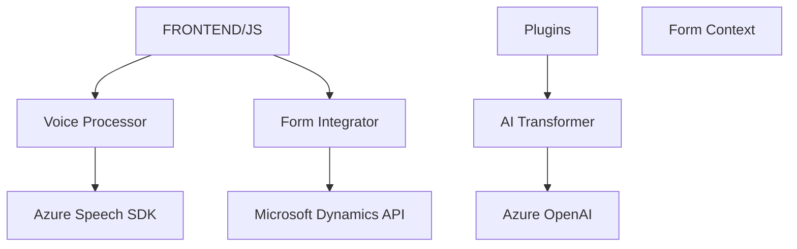

### Breve Resumen Técnico
El repositorio contiene tres archivos con diferentes objetivos relacionados con la integración y procesamiento de formularios usando voz, inteligencia artificial, y servicios externos como Azure Speech SDK y Azure OpenAI. La solución combina dos módulos frontend (procesamiento de voz y entrada de datos dinámicos en formularios) y un plugin backend para Microsoft Dynamics CRM que transforma texto usando la API de Azure OpenAI.

---

### Descripción de Arquitectura
La solución sigue una arquitectura distribuida que mezcla un **modelo de n-capas** y un **modelo de arquitectura en servicios**:

1. **Frontend Layer**: Gestión de la entrada y salida de datos mediante voz, donde cada archivo implementa funciones específicas:
    - `readForm.js` y `speechForm.js` manejan la interacción con formularios mediante síntesis y entrada de voz.
    - Las responsabilidades están divididas en funciones reutilizables para obtener datos, manipularlos, y comunicarse con Azure Speech y con una API personalizada.

2. **Backend Layer**: Plugins de Dynamics CRM con integración a servicios de Azure OpenAI. Utiliza el patrón **Plugin** de Dynamics CRM para añadir capacidades extensibles mediante componentes de IA, lo que permite transformar texto en JSON estructurado.

3. **Servicios Externos**: Uso de Azure Speech SDK para voz y Azure OpenAI para inteligencia artificial.

---

### Tecnologías Usadas
1. **Frontend**
    - **Javascript**: Programación de funcionalidad UI/UX para formularios dinámicos.
    - **Azure Speech SDK**: Reconocimiento y síntesis de voz.
    - **Custom Dynamics API**: Comunicación con backend remoto para procesar datos provenientes de formularios.
    - **Microsoft Dynamics**: Conectividad a formularios dinámicos de CRM.
    - Diseño modular con funciones individuales que cumplen una responsabilidad específica.
    
2. **Backend**
    - **Microsoft Dynamics CRM SDK**: Desarrollo de plugins para interacciones backend.
    - **Azure OpenAI API**: Servicios de inteligencia artificial para transformar texto.
    - **C#**: Lenguaje de programación de plugins.
    - **Newtonsoft.Json & System.Text.Json**: Manejo de datos JSON.
    - **HTTP cliente**: Comunicación REST con servicios externos.

---

### Diagrama Mermaid válido para GitHub

---

### Conclusión Final
La solución aborda un flujo completo que combina **procesamiento de voz**, **automatización de formularios dinámicos**, y el uso de **inteligencia artificial** para transformar datos en el contexto de **Microsoft Dynamics CRM**. Su arquitectura está en capas (n-capas) con componentes bien separados según sus responsabilidades: gestión de UI/UX en el frontend y lógica especializada en el backend, con integración de servicios distribuidos como Azure Speech y Azure AI.

Esta solución es modular, extensible, y adecuada para escenarios donde la precisión del procesamiento de voz y el análisis estructurado de datos relacionados con IA son esenciales.