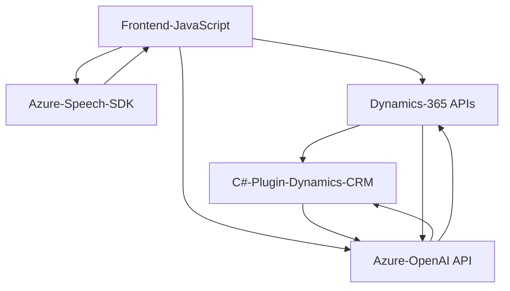

# Análisis técnico del repositorio:

### **Breve resumen técnico:**
El repositorio está diseñado para gestionar una solución que combina funcionalidades de reconocimiento de voz y síntesis de voz, en interacción con formularios de Dynamics 365, utilizando servicios externos como Azure Speech SDK y Azure OpenAI API. La solución incluye tres niveles: un frontend de JavaScript para la interacción con formularios y gestión de eventos de voz, un plugin CRM en C# para la transformación de datos textualizados, y la integración con servicios en la nube, que sugieren un enfoque hacia una arquitectura híbrida.

---

### **Descripción de arquitectura:**
La solución implementa una arquitectura modular que combina:
1. **Plug-in Architecture (Dynamics 365):** El plugin está diseñado para interactuar con eventos generados en el sistema CRM y aplicar lógica según especificación del usuario. Este diseño utiliza el concepto de una **pipeline secuencial** para manejar la interacción entre datos del CRM, procesamiento en la nube, y salida hacia el usuario.
2. **N capas:** El sistema separa lógicamente sus componentes según la capa de presentación (Frontend JS), capa de negocio y lógica (plugin Dynamics 365 y servicios del SDK de Azure Speech), y capa de datos (Dynamics y API externas como OpenAI).
3. **Dependencia externa:** Integra SDKs y APIs de servicios en la nube con un enfoque de integración de servicios externos como el Azure Speech SDK y el Azure OpenAI para procesamiento y generación de texto/voz con IA. Esto sugiere el uso de un modelo de arquitectura **extendida con microservicios**.

En términos operacionales, las funciones JS se despliegan con trazabilidad y modularidad que permite adaptaciones. El plugin es específico al ambiente de Dynamics CRM y extiende su funcionalidad mediante eventos desencadenados en el contexto CRM.

---

### **Tecnologías usadas:**
1. **Frontend:**
   - **JavaScript**: Para manipular datos del formulario y acciones relacionadas a eventos de entrada y salida de voz.
   - **Azure Speech SDK**: Reconocimiento y síntesis de voz a través de servicios de Azure.
   - **HTML DOM**: Interactuar dinámicamente con el documento HTML.
   - **Dynamics 365**: API del contexto de formularios (`formContext`).

2. **Plugin Backend:**
   - **C#**: Implementación del plugin siguiendo el modelo de Microsoft Dynamics CRM.
   - **Microsoft Xrm SDK**: API para interactuar con entidades y atributos del CRM.
   - **Azure OpenAI API**: Generación automática de texto transformado utilizando herramientas de IA.
   - **Newtonsoft.Json** & **System.Text.Json**: Manejo y transformación de datos en JSON.

3. **Servicios Externos:**
   - **Azure Cloud**: Integración con APIs de inteligencia artificial, como Azure Speech SDK y Azure OpenAI GPT.

---

### **Diagrama Mermaid válido:**

---

### **Conclusión final:**
La solución combina procesamiento de voz, normalización textual mediante IA, y integración con formularios de Dynamics 365, creando un flujo de trabajo eficiente para entradas/salidas vocales. La arquitectura es un híbrido entre n capas y microservicios, ya que integra diversas tecnologías externas (Azure Speech SDK, Azure OpenAI API) con un sistema interno (Dynamics CRM y frontend). Es escalable gracias al uso de servicios en la nube, aunque depende de configuraciones específicas como credenciales de Azure. El diseño muestra modularidad en las funciones y clases, siendo fácil de extender o adaptar en entornos similares.

