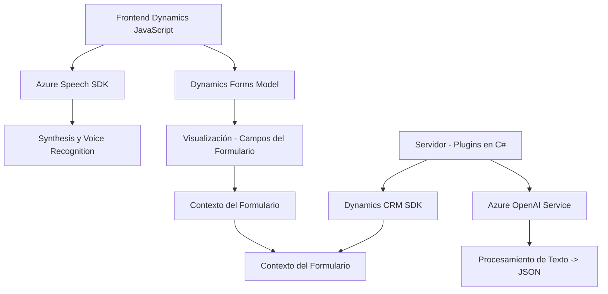

# Análisis Técnico y Arquitectural del Repositorio

### Breve Resumen Técnico
El repositorio incluye tres componentes principales relacionados con Dynamics 365:
1. Integración de **Azure Speech SDK** para síntesis de voz y reconocimiento de voz.
2. Plugins personalizados para la plataforma Dynamics CRM que procesan y transforman datos usando **Azure OpenAI**.
3. Frontend desarrollado en JavaScript que interactúa con formularios de Dynamics 365 para leer y actualizar valores.

Los tres archivos interactúan con servicios externos como Azure Speech y OpenAI y están diseñados alrededor del ecosistema Dynamics CRM.

---

### Descripción de la Arquitectura
La solución combina una arquitectura **híbrida**, con diferentes capas que incluyen:
- **Frontend**: Código JavaScript para interactuar con formularios en Dynamics 365. Sigue un acercamiento modular con funciones claras y cargado dinámico de dependencias.
- **Backend plugins**: Implementaciones utilizando Dynamics CRM SDK en código C#. Los plugins funcionan como componentes de **arquitectura basada en eventos**, ejecutándose en respuesta a acciones en el CRM.
- **Integración con Azure**:
  - Azure Speech SDK es usado en el cliente para reconocimiento y síntesis de voz.
  - Azure OpenAI Service se integra en el backend para el procesamiento avanzado de texto.

Esto apunta a una arquitectura **n-capas** donde cada componente es responsable de una capa de procesamiento de datos específica: front-end (JavaScript), lógica del negocio (Dynamics plugins) y servicios externos (Azure).

---

### Tecnologías y Frameworks Usados
1. **Frontend**:
   - Lenguaje: JavaScript.
   - Framework: Dynamics 365 Form API (`formContext`).
   - SDK externo: **Azure Speech SDK**.

2. **Backend Plugins**:
   - Lenguaje: C#.
   - Framework usado: Dynamics CRM SDK (`IPlugin`, `IOrganizationService`, etc.).
   - API externa: **Azure OpenAI Service** para procesamiento avanzado.

3. **Servicios Externos**:
   - **Azure Speech SDK**: Synthesis y reconocimiento de voz en tiempo real.
   - **Azure OpenAI Service**: Procesamiento de texto y generación de JSON estructurado utilizando GPT.

---

### Dependencias o Componentes Externos Potenciales
1. **Internos al ecosistema Dynamics CRM**:
   - `formContext.data.*` para acceder y manipular el modelo de datos de Dynamics CRM directamente desde el front-end.
   - SDK de plugins en C# para interacción con entidades y eventos del CRM.

2. **Externos**:
   - **Azure Speech SDK**: Para síntesis y reconocimiento de voz.
   - **Azure OpenAI Service**: Para procesamiento de texto avanzado.
   - **Xrm.WebApi.online**: Para invocar APIs personalizadas dentro de Dynamics.

3. **De terceros (potenciales)**:
   - `Newtonsoft.Json.Linq` u `System.Text.Json` para manejo de JSON estructurado.

---

### Diagrama **Mermaid**

---

### Conclusión Final
Lo analizado revela una solución híbrida basada en la plataforma Dynamics CRM con una arquitectura **n-capas**:
- El **frontend** (JavaScript) se conecta directamente con la API del modelo de datos de Dynamics y aprovecha **Azure Speech SDK** para integrar capacidades de voz.
- Los **plugins backend** implementados en C# interactúan con entidades de Dynamics y utilizan **Azure OpenAI** para procesamiento avanzado.

La integración con servicios externos como Azure impulsa la escalabilidad y la inteligencia de los componentes del sistema. Aunque probablemente dependiente de Dynamics, la solución está diseñada modularmente con separación de responsabilidades clara.