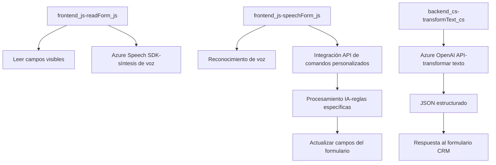

### Breve resumen técnico

La solución presentada en los archivos del repositorio está orientada a mejorar la interacción y accesibilidad en formularios de Dynamics 365 mediante tecnologías de reconocimiento de voz (**Azure Speech SDK**) y procesamiento avanzado de texto mediante inteligencia artificial (**Azure OpenAI API**). Contempla tanto la síntesis de voz como el reconocimiento y transformación de comandos.

### Descripción de arquitectura

La arquitectura general se puede clasificar como una integración modular con patrones orientados a servicios externos (SDK y APIs). Los módulos de los archivos están organizados para ejecutar funcionalidades específicas:
- **Frontend**: Scripts JavaScript que interactúan directamente con los formularios y gestionan la comunicación con Azure Speech SDK.
- **Plugins Backend**: Código C# que actúa como extensiones para Dynamics CRM, conectándose a servicios como Azure OpenAI API en tareas específicas.

Esta solución tiene características propias de una **arquitectura n-capas**, donde:
1. **Frontend (Capa de presentación)**: Los archivos `readForm.js` y `speechForm.js` gestionan la interacción del usuario con el formulario.
2. **Backend/Capa lógica de negocio**: El plugin `TransformTextWithAzureAI.cs` ejecuta lógica avanzada mediante interacción con servicios AI como Azure OpenAI.
3. **Servicios externos (Capa de integración)**: Azure Speech SDK y OpenAI son los componentes externos clave integrados.

### Tecnologías y patrones usados

1. **Tecnologías**:
   - **Frontend**: JavaScript, Azure Speech SDK, Dynamics 365 Web API (`Xrm.WebApi`).
   - **Backend**: C#, Dynamics CRM SDK (`Microsoft.Xrm.Sdk`), Azure OpenAI API.
   - **Servicios externos**: Azure Speech para síntesis de voz y OpenAI para análisis/transcripción avanzada.
2. **Patrones**:
   - **Separación de responsabilidades**: Cada archivo/módulo cumple una función específica (lectura, síntesis, actualización de datos o procesamiento).
   - **DTO (Data Transfer Object)**: Uso de JSON para transferir datos estructurados entre el plugin, API y servicios.
   - **Carga dinámica de dependencias**: El SDK de Azure Speech se carga dinámicamente en el frontend.

### Dependencias o componentes externos presentes

- **Azure SDK**:
  - `SpeechSDK` para síntesis y reconocimiento de voz.
- **API de Azure OpenAI**:
  - Procesamiento de texto basado en `GPT-4o`.
- **Microsoft Dynamics 365 WebApi SDK**:
  - `Xrm.WebApi` y `Microsoft.Xrm.Sdk` para manipular datos en formularios y CRM.
- **Librerías para JSON**:
  - `Newtonsoft.Json.Linq` para manejar datos JSON.
  - `System.Text.Json`.

### Diagrama Mermaid

### Conclusión final

La solución presentada es una integración extendida y modular para Dynamics CRM enfocada en mejorar accesibilidad y gestión mediante comandos de voz e inteligencia artificial. Su arquitectura se organiza bajo principios de **n-capas**, utilizando una capa de presentación en **frontend** basada en JavaScript y una capa de lógica en **backend** basada en C#. Los servicios externos (Azure Speech SDK y OpenAI API) amplifican la funcionalidad, haciéndola compatible con aplicaciones modernas y accesibles. Sin embargo, para aumentar la seguridad y escalabilidad, es recomendable mover las claves de API y configuraciones sensibles a un entorno seguro y agregar cache para reducir la carga en servicios externos.