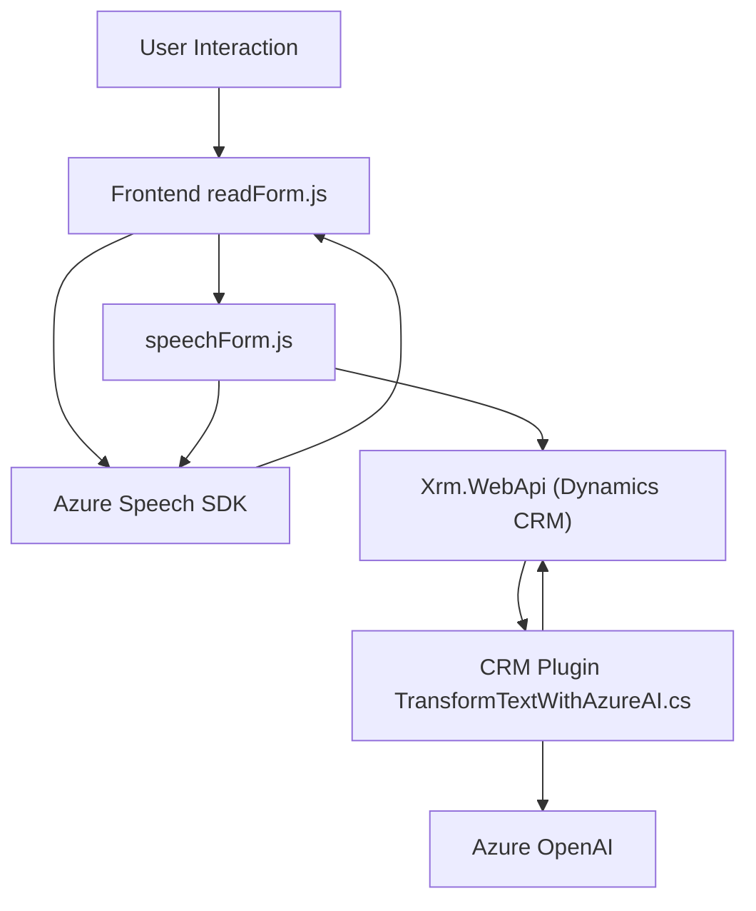

### Breve resumen técnico
La solución del repositorio es un sistema híbrido que integra **interacción entre formularios crudos, procesamiento de voz con Azure Speech SDK**, y manipulación de datos a través de un plugin en el **Microsoft Dynamics CRM**. Se incluyen herramientas para lectura/formularios, síntesis de texto-a-voz, reconocimiento de voz y transformación de textos utilizando **Azure OpenAI**.

---

### Descripción de arquitectura
#### **Tipo de arquitectura**: 
- **Capas modulares híbridas**:
  - **Frontend**: Funciones JS que procesan voz y datos en el lado del cliente. Utilizan dependencias externas como el Azure Speech SDK para generación de voz y análisis dinámico.
  - **Backend (Plugin)**: Integra servicios de Dynamics CRM a través de su arquitectura de análisis y procesamiento utilizando API externas (Azure OpenAI para transformación de texto).

#### **Patrones notables**:
1. **Patrón Repository en el backend**: Las clases del plugin gestionan abstracción de datos a través de métodos específicos para integrar solicitudes HTTP y manipulación de datos con un CRM.
2. **Aislamiento de dependencias**: Carga dinámica de servicios como el Azure Speech SDK, reduciendo la inicialización global.
3. **Callback y Promesas**: Uso extensivo de programación asincrónica, especialmente en el frontend.

4. **Service-Oriented Architecture (SOA)**: El sistema facilita que la lógica sea delegada a servicios externos (Azure Speech SDK y Azure AI). Aunque no es estrictamente microservicios, la descentralización es notable.

---

### Tecnologías, frameworks y patrones usados
1. **Frontend**:
   - **JavaScript**: Implementación de funciones modulares.
   - **Azure Speech SDK**: Para síntesis de voz y reconocimiento natural.
   - **Xrm.WebApi** (Dynamics CRM): Para interacción con entidades y datos CRM.
   
2. **Backend**:
   - **Microsoft Dynamics CRM Plugin (`IPlugin`)**: Permite ejecutar lógica personalizada en procesos de CRM.
   - **Azure OpenAI Service**: Procesa y transforma texto a través de inteligencia artificial de modo definido.

3. **Patrones y abstracciones**:
   - **Facades (SDK abstractions)**: El SDK de Azure Speech actúa como una fachada para la síntesis de texto-a-voz y reconocimiento.
   - **Command architecture (Plugins)**: El método `Execute` de los plugins utiliza un patrón basado en comandos.

---

### Dependencias o componentes externos presentes
- **Azure Speech SDK**: Tecnología para generación de voz y reconocimiento de voz en tiempo real.
- **Azure OpenAI Service**: API REST para transformar texto en estructuras JSON.
- **Dynamics CRM SDK**: Plugin y extensiones para administración y manipulación de datos corporativos.
- **HTTP/JSON**: Usado para llamadas a Azure OpenAI y manejo estructurado de datos.

---

### Diagrama Mermaid

---

### Conclusión final
El repositorio implementa un sistema escalable y modular que integra funciones de accesibilidad (voz y lectura de formularios) con manipulación dinámica de datos en un **entorno CRM complejo**. Tiene una arquitectura de **capas modulares con integración de servicios externos** (Azure Speech y OpenAI). Las herramientas ofrecidas facilitan que los datos sean interactivos y auditivos, mientras mantienen una robusta conexión al ecosistema CRM.

La implementación es adecuada para soluciones corporativas que necesitan interacción entre usuarios, datos internos (BD CRM) y servicios externos (Azure). Sin embargo, mejorar los patrones de gestión de dependencias y enrutado dinámico podría ser útil para fomentar una arquitectura orientada 100 % a microservicios.