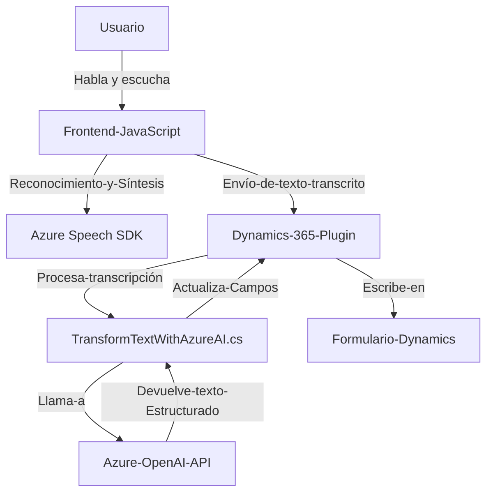

### Breve resumen técnico

El repositorio es parte de una solución que integra reconocimiento de voz, síntesis de voz y procesamiento de texto inteligente en un entorno de Dynamics 365. Combina un frontend en JavaScript, plugins de Dynamics 365 en C#, y servicios de Azure para procesamiento cognitivo. Se enfoca en mejorar la interacción del usuario mediante capacidades de entrada y salida de voz integradas con formularios dinámicos.

---

### Descripción de arquitectura

#### Tipo de arquitectura:
- **N capas**: Incluye una capa de presentación (JavaScript para frontend), una capa de negocio (plugins en C# para Dynamics 365), y una capa de servicio (APIs externas como Azure Speech y OpenAI).
- **Modularidad**: Las responsabilidades se dividen claramente entre módulos del frontend, plugins de backend y servicios externos.

#### Componentes clave:
1. **Frontend (JavaScript)**:
   - Maneja interacción con el usuario, incorporando reconocimiento y síntesis de voz mediante Azure Speech SDK.
   - Proporciona funciones estructuradas para extraer y procesar datos en tiempo real desde formularios HTML.
   - Hace llamadas a APIs externas para aplicar procesamiento avanzado con IA.
   
2. **Plugins de Dynamics 365 (C#)**:
   - Plugins desarrollados para Dynamics 365 realizan tareas de conversión avanzada y manipulación de datos en la plataforma CRM.
   - Llaman a servicios de Azure OpenAI para transformar texto bajo reglas específicas.

3. **APIs de Azure:**
   - **Azure Speech SDK** para la síntesis y reconocimiento de voz.
   - **Azure OpenAI API** para procesar texto transcrito y estructurarlo en formato JSON específico.

#### Interacciones:
- El flujo inicia en el frontend, donde el usuario interactúa mediante entrada de voz y escucha respuestas sintetizadas.
- El backend en Dynamics 365 recibe los datos de entrada, los transforma en una forma adecuada, y realiza llamados a APIs de Azure.
- Los servicios de Azure devuelven datos procesados, que son incorporados en tiempo real a los formularios o almacenados en el CRM.

---

### Tecnologías usadas

1. **Frontend:**
   - **JavaScript**: Lenguaje base para el código en el navegador.
   - **Azure Speech SDK**: Para entrada/salida de voz.
   - **DOM API**: Manipulación dinámica de contenido HTML.
   
2. **Backend (Dynamics 365):**
   - **C#**: Lenguaje usado en los plugins del CRM.
   - **Dynamics 365 SDK**: Para gestión de formularios y datos dinámicamente.
   - **System.Net.Http**: Para consumir APIs externas.
   - **Newtonsoft.Json**: Gestión de datos JSON.

3. **Servicios externos:**
   - **Azure Speech**: Reconocimiento y síntesis de voz.
   - **Azure OpenAI API**: Procesamiento del texto generado.

4. **Patrones de diseño**:
   - **Facade**: Interfaz unificada sobre servicios como el Speech SDK.
   - **Modularización**: Divisiones claras entre funcionalidades del frontend y backend.
   - **API-Driven Development**: Interacción continua con servicios de Azure mediante APIs.

---

### Diagrama Mermaid válido para GitHub

---

### Conclusión final

Este repositorio implementa una solución diseñada específicamente para integrar reconocimiento y síntesis de voz en trabajos con Dynamics 365, utilizando tecnologías modernas de Azure. Su arquitectura modular y basada en APIs garantiza una integración eficiente entre las distintas capas y servicios. Aunque funcional, hay margen para mejorar la seguridad y la configuración del sistema, como abordar la dependencia de claves API y URLs hardcodeadas, trasladándolas a archivos de configuración o variables de entorno. Esto proporciona flexibilidad y escalabilidad para su uso en diferentes escenarios.