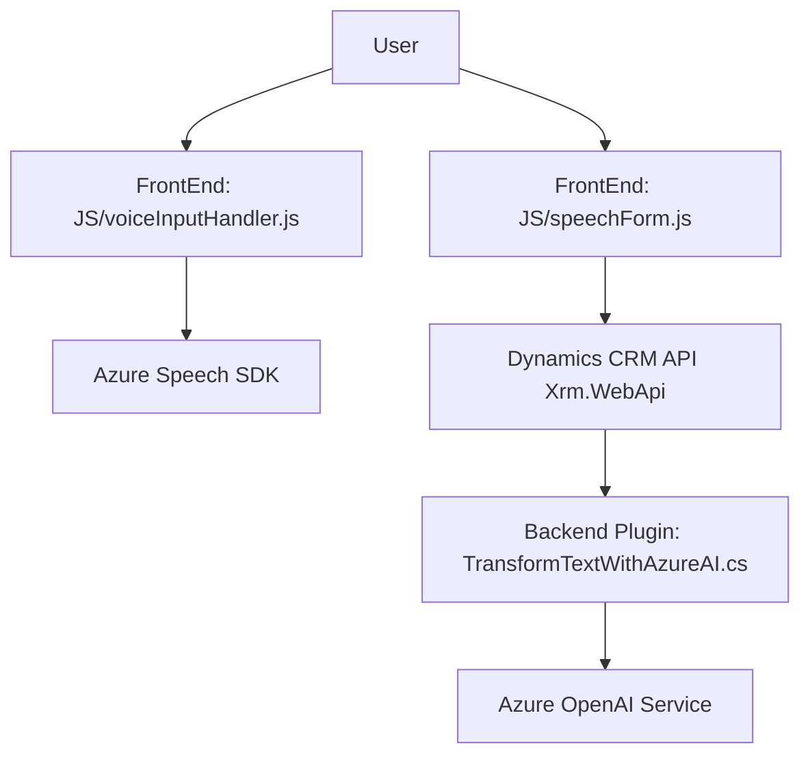

## Análisis del repositorio

### **Resumen técnico**
El repositorio contiene archivos que pertenecen a una solución enfocada en la interacción con formularios de Dynamics 365 CRM, utilizando la síntesis y transcripción de voz mediante el Azure Speech SDK, además de un plugin que integra funcionalidades de procesamiento de texto con el servicio Azure OpenAI. Es un sistema orientado hacia la accesibilidad y la automatización de procesos empresariales para minimizar tareas manuales relacionadas con datos en formularios.

---

### **Descripción de arquitectura**
La solución tiene un enfoque **modular**, con componentes organizados en distintas capas que interactúan entre sí:
1. **Frontend:** JavaScript (carga dinámica del SDK y procesamiento de datos de formularios).
2. **Backend Plugin:** Una extensión orientada al servicio de Dynamics CRM, mediante la implementación de la interfaz `IPlugin` de Microsoft.
3. **Externa (Third-party APIs):** Conexiones y dependencias hacia servicios de Azure Speech SDK y Azure OpenAI.

El sistema presenta un enfoque arquitectónico basado en **n capas**:
- **Capa de integración:** Los scripts de frontend interactúan directamente con la API de Dynamics CRM para la modificación de datos en el formulario.
- **Capa de procesamiento backend:** Plugins para Dynamics CRM encargados de los procesos más pesados, como manipulación e integración de datos con Azure AI.
- **Capa externa:** Dependencias de servicios externos para la síntesis y transcripción de voz, así como transformación inteligente de texto.

Se observa una combinación de **patrón funcional** (JavaScript frontend) y **service layer/adapter** (plugin de backend).

---

### **Tecnologías, frameworks y patrones utilizados**
#### **Frontend**
- **JavaScript:** Para la lógica de interacción con el usuario y los formularios. Se utilizan funciones modulares con un enfoque funcional.
- **Azure Speech SDK:** Cargado dinámicamente mediante CDN, usado para síntesis y transcripción de voz.
- **Dynamics CRM SDK (Xrm.WebApi):** Interfaz para la manipulación y actualización de datos.
- **Patrones:** 
  - Funciones independientes: principio de responsabilidad única.
  - Carga dinámica de recursos.
  - Interfaz de mapeo de datos de entrada y salida.

#### **Backend Plugin**
- **C#:** Implementación del plugin como extensión de Dynamics CRM.
- **Azure OpenAI Service:** Integración con el modelo GPT para la transformación de texto.
- **Dynamics CRM SDK:** Interacción directa con formularios y módulos del CRM.
- **Patrones:**
  - Plugin (extensión): Base para la personalización del CRM.
  - Service layer/adapter: Permite la integración entre Dynamics CRM y el servicio de Azure AI mediante solicitudes HTTP.

---

### **Dependencias o componentes externos**
1. **Azure Speech SDK:** Funcionalidad de síntesis y transcripción de voz.
2. **Dynamics CRM API (Xrm.WebApi):** Interfaz para manipulación de datos en formularios CRM.
3. **Azure OpenAI Service:** Tecnología para el procesamiento inteligente de texto mediante un modelo GPT.
4. **Librerías estándar .NET:** Utilizadas para manipulación de JSON, HTTP, y procesos internos en el plugin backend.
5. **Newtonsoft.Json**: Librería para el manejo de JSON en aplicaciones .NET.

---

### **Diagrama Mermaid**

---

### **Conclusión final**
El repositorio presenta una solución diseñada para mejorar la accesibilidad y automatización de procesos empresariales mediante interacciones con formularios de Dynamics 365 CRM. Utiliza tecnologías modernas como Azure Speech SDK y Azure OpenAI para proveer funcionalidades avanzadas, como síntesis de voz y transformación inteligente de texto.

La arquitectura modular basada en capas, con una fuerte dependencia en servicios externos, le otorga flexibilidad y escalabilidad a la solución, haciendo que sea adecuada para escenarios corporativos con necesidades de personalización y automatización.