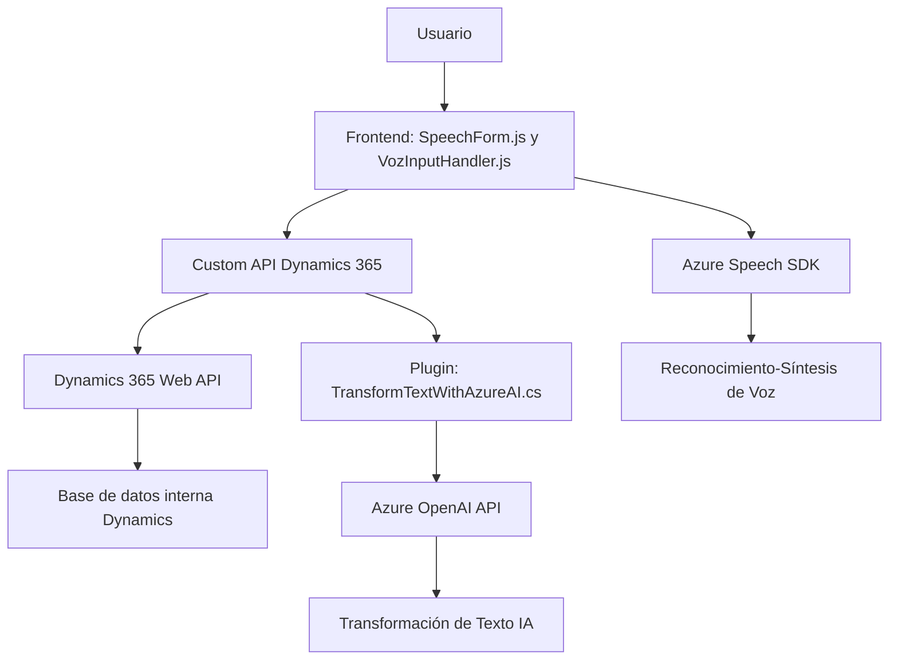

### Breve Resumen Técnico
El repositorio contiene un sistema orientado a la interacción entre frontend y backend para automatización de formularios basado en voz e inteligencia artificial. Utilizando Azure Speech SDK para síntesis de voz y reconocimiento de voz, y un plugin Dynamics 365 con integración a Azure OpenAI, la solución permite transformar texto de entrada, reconocer comandos y mapear datos en formularios de la plataforma Dynamics 365.

---

### Descripción de Arquitectura
La arquitectura del sistema es de tipo **híbrido** entre **cliente-servidor** y **event-driven**:
1. El frontend utiliza JavaScript para interactuar con formularios de Dynamics 365 y tecnologías de reconocimiento de voz (Azure Speech SDK).
2. El backend extiende Dynamics 365 con un plugin que consume **Azure OpenAI API**, transformando texto de manera personalizada.
3. Se aplica patrón de **n-capas**:
   - Capa de presentación en frontend para interacción de usuarios.
   - Capa de lógica en plugins.
   - Capa de datos proveniente de Dynamics 365 y servicios de Azure.

---

### Tecnologías Usadas
1. **Frontend:**
   - **JavaScript**: Para captura de voz, interacción con formularios, síntesis y mapeo.
   - **Azure Speech SDK**: Reconocimiento y síntesis de voz, cargado dinámicamente.
   - **Dynamics 365 context (executionContext)**: Controles de formulario.
   - **Custom API**: Migrar información a través de servicios en Dynamics 365.
   
2. **Backend:**
   - **Microsoft Dynamics 365 SDK**: Extensión de sistema CRM con plugins.
   - **Azure OpenAI API (GPT)**: Procesamiento y transformación de texto.
   - **Newtonsoft.Json y System.Text.Json**: Manejo estructurado de JSON desde la API.
   - **System.Net.Http**: Realiza peticiones HTTP.

---

### Diagrama Mermaid

---

### Conclusión Final
Esta solución implementa una arquitectura modular integrando herramientas de Microsoft Dynamics 365, Azure Speech SDK y OpenAI GPT. Está diseñada para automatizar la captura de datos mediante reconocimiento de voz y procesamiento textual avanzado. Su diseño utiliza un patrón de **n-capas**, con alta modularidad y extensibilidad hacia IA. Es eficaz para entornos donde la interacción usuario-formulario es clave, como aplicaciones CRM dinámicas.