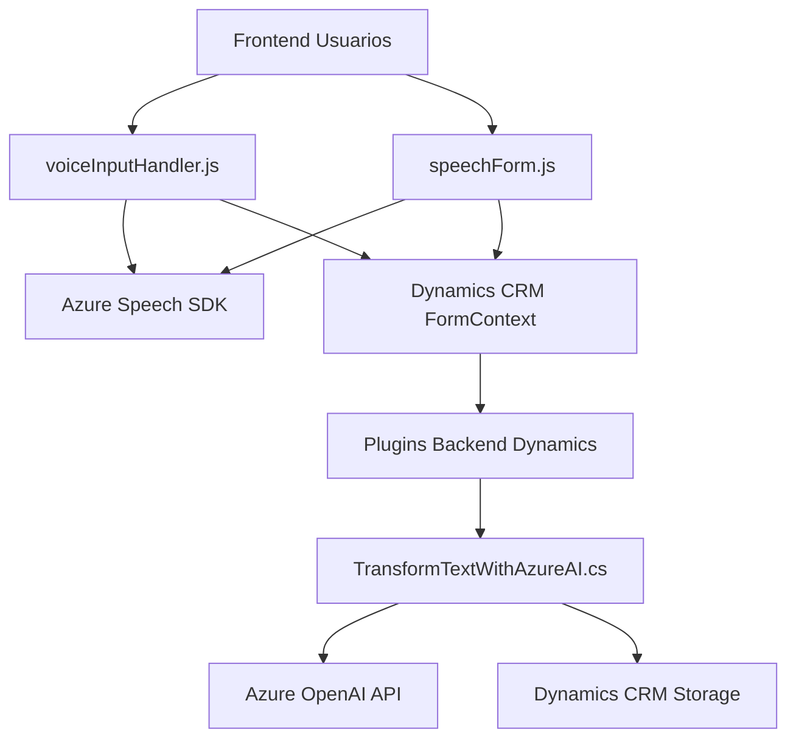

## **Análisis Técnico**

### Breve Resumen Técnico
El repositorio presentado incluye tres archivos con funcionalidades orientadas al desarrollo de soluciones integradas con Microsoft Dynamics CRM junto a servicios externos de Azure, como Azure Speech SDK y Azure OpenAI. Estas funcionalidades están diseñadas para ofrecer una experiencia interactiva basada en síntesis de voz, transcripción de audio y procesamiento inteligente de datos mediante inteligencia artificial.

---

### **Descripción de Arquitectura**

1. **Tipo de solución:**
   - La solución es una **integración a Microsoft Dynamics CRM** que utiliza **Azure Speech SDK** y **Azure OpenAI API** para brindar funcionalidades avanzadas de voz y procesamiento de texto dentro del contexto de los formularios CRM.
   - La solución tiene características tanto de un plugin de Dynamics CRM (C#) como de un frontend basado en JavaScript.

2. **Arquitectura:**
   - **Híbrida**: Combina componentes frontend con integración backend mediante plugins en Dynamics CRM.
   - **Orientación a servicios**: Aprovecha servicios externos de Azure (Speech SDK y OpenAI API) para delegar operaciones avanzadas.
   - **Separación funcional por capas**:
     - **Frontend** (JavaScript): Maneja interacción con usuarios, visualización de formularios y lógica dinámica en el navegador.
     - **Backend** (C#): Define un plugin de Dynamics CRM para ejecutar operaciones en el servidor y conectar con Azure OpenAI.
   - De forma general, la solución sigue el **patrón de arquitectura n-capas**, dividiendo responsabilidades en presentación, servicio y lógica de negocio.

---

### **Tecnologías, Frameworks y Patrones**

1. **Tecnologías y Frameworks:**
   - **Frontend (JavaScript):**
     - Dinámico con interacción DOM para formularios en Dynamics CRM.
     - **Azure Speech SDK**: Sintetización y transcripción de voz.
   - **Backend (C#.NET):**
     - **Dynamics CRM SDK**: Interfaces y servicios para gestión interna de plugins.
     - **Azure OpenAI API**: Endpoint para transformación de texto basado en inteligencia artificial.
   - **HTTP/REST**: Solicitudes HTTP externas para integración con Azure.

2. **Patrones:**
   - **Modularidad funcional:** Separación de funciones según su propósito específico (lectura de formularios, síntesis de voz, transcripción, procesamiento de texto).
   - **Plugin Pattern:** El archivo C# implementa un plugin específico de Dynamics CRM.
   - **External Service Integration:** Uso de servicios externos (Azure) para delegar tareas especializadas.
   - **Callback-centric design:** Garantiza el flujo lógico asíncrono en el frontend para operaciones dependientes de servicios externos.
   - **Delegation Architecture:** Delegación de tareas a agencias especializadas como Azure OpenAI (procesamiento de texto) y Azure Speech SDK (síntesis de voz).

---

### **Dependencias o Componentes Externos**

1. **Dependencias Externas:**
   - **Azure Speech SDK**: Manejo de síntesis de voz y transcripción.
   - **Azure OpenAI API**: Modelos GPT para procesamiento de texto.
   - **Microsoft Dynamics CRM Remote API**: Integración nativa para manipulación de datos CRM.

2. **Dependencias Frontend:**
   - APIs para interacción con `formContext` de Dynamics CRM (manipulación de formularios).
   - Carga dinámica de SDK de Azure Speech utilizando URLs públicas.

3. **Dependencias Backend:**
   - Paquetes .NET esenciales (`System.Net.Http`, `System.Text.Json`) para funcionar como cliente HTTP hacia Azure OpenAI.
   - Dynamics CRM SDK (`Microsoft.Xrm.Sdk`) para integrar el plugin.

---

### **Diagrama Mermaid**

---

### **Conclusión Final**

El análisis muestra que esta solución es un conjunto integrado de componentes frontend y backend diseñados para transformar la interacción con un sistema como Microsoft Dynamics CRM al incorporar capacidades de síntesis de voz, transcripción y procesamiento avanzado de datos mediante inteligencia artificial. La arquitectura híbrida basada en **n-capas** combina una interfaz dinámica con interacción de APIs externas en Azure y almacenamiento/inteligencia gestionada en Dynamics CRM. La modularidad del diseño asegura una fácil escalabilidad e integración con otros sistemas.