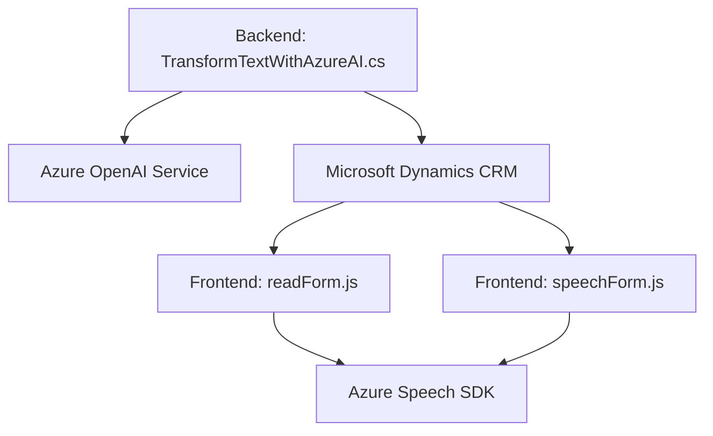

# Análisis y Diseño Técnico

## Resumen técnico
El repositorio presenta una solución que integra las capacidades del reconocimiento de voz, síntesis de texto a voz y procesamiento basado en IA mediante la tecnología Azure, orientada a la interacción con campos y formularios de CRM (Customer Relationship Management). La arquitectura parece enfocarse en mejorar la fluidez entre los usuarios y los formularios del sistema mediante comandos de voz y transformaciones de datos mediante IA.

---

## Descripción de la Arquitectura
### Tipo de solución
La solución presenta una **integración a un sistema CRM mediante una combinación de Frontend y Plugins**. Es una arquitectura híbrida que utiliza:
1. Archivos JS (`readForm.js` y `speechForm.js`) que interactúan con APIs externas (Azure Speech SDK y Dynamics CRM Web API). 
2. Un plugin en C# (`TransformTextWithAzureAI.cs`) que extiende Dynamics CRM mediante **Azure OpenAI Services** para procesamiento avanzado de datos.  

### Tipo de arquitectura
La solución implementa una arquitectura **n-capas híbrida** debido a la división de responsabilidades:
1. **Frontend Layer:** Implementaciones de reconocimiento y síntesis de voz (JS) vinculadas a Dynamics CRM.
2. **Backend Layer:** Plugins de Dynamics CRM para computación más avanzada con **Azure OpenAI**.
3. **API Layer:** Integración directa con APIs externas, como Azure Speech SDK y OpenAI.

Se utiliza un **Service-Oriented Architecture (SOA)** con integración a Azure, además de un enfoque modular en la organización del código que sigue principios de separación y desacoplamiento.

---

## Tecnologías Usadas
### Frontend:
- **JavaScript:** Con interacción directa con el DOM y funciones basadas en objetos.
- **Azure Speech SDK:** Para reconocimiento de voz y síntesis de texto a voz.
- **Dynamics CRM Web API (`Xrm.WebApi`)**: Para la interacción con formularios y registros de un sistema CRM.

### Backend (Plugin):
- **C#:** Utilizando el framework de Microsoft Dynamics CRM.
- **Microsoft.Xrm.Sdk:** Biblioteca estándar para desarrollo de plugins de Dynamics CRM.
- **Azure OpenAI Service:** Basado en modelos GPT para el procesamiento avanzado de texto.
- **Newtonsoft.Json:** Manipulación de datos JSON.

### Otros:
- **Patterns utilizados:**
  - **Lazy Initialization:** Para cargar y verificar dependencias (ejemplo: SDK de Azure Speech).
  - **Event-driven architecture:** En el reconocimiento de voz.
  - **Plugin-based architecture:** En el backend de Dynamics CRM.
  - **Driver API pattern:** Para conectar Azure Speech SDK con la solución.
  - **Repository pattern:** Gestión estructurada de campos, valores y etiquetas en el CRM.

---

## Dependencias o componentes externos presentes
1. **Azure Speech SDK:** Utilizado en los archivos frontend para reconocimiento y síntesis de voz.
2. **Azure OpenAI Service:** En el plugin para transformar texto en JSON mediante el modelo GPT.
3. **Microsoft Dynamics CRM SDK:** Proporciona la interacción de alto nivel con formularios y registros de CRM.
4. **Librerías estándar de .NET:** `HttpClient`, `Text.Json`, `RegularExpressions` y otras para manejo HTTP y JSON.

---

## Diagrama Mermaid

---

## Conclusión final
La solución es altamente integrada y está orientada a maximizar la interacción natural entre los usuarios y un sistema CRM utilizando comandos de voz y capacidades de inteligencia artificial de Azure. Combina tecnologías frontend y backend para llevar a cabo tareas específicas como transformación de texto, interacción con formularios y síntesis de voz.

La arquitectura propuesta es **modular y extensible**, lo que permite fácilmente integrar nuevos servicios y adaptar funcionalidades. Aunque carece de microservicios, la división entre frontend (JavaScript) y backend (C# Plugins) maneja bien la separación de responsabilidades en una arquitectura n-capas. Este tipo de diseño es adecuado para sistemas CRM que necesitan interacción avanzada y procesamiento basado en AI.