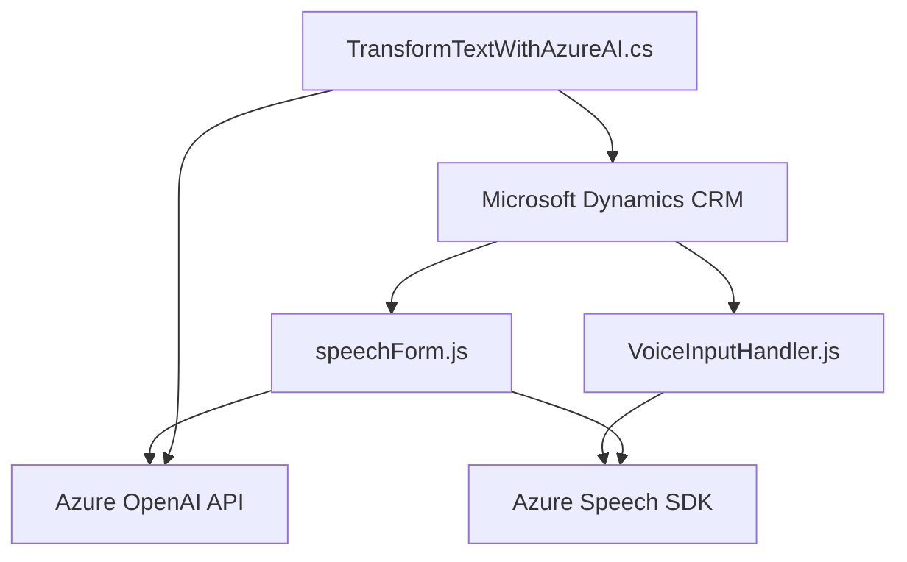

### Breve resumen técnico

Este repositorio está compuesto por tres componentes fundamentales: un **frontend JavaScript**, un **backend plugin en C#** para Microsoft Dynamics CRM, y una arquitectura **orientada a servicios** que interactúa intensamente con **Azure Speech SDK** y **Azure OpenAI API**. La solución facilita la captura, procesamiento y síntesis de datos, combinando funcionalidades de entrada de voz, análisis de texto e integración inteligente con Dynamics CRM.

### Descripción de la arquitectura

La arquitectura sigue una aproximación **orientada a servicios (SOA)**.  
1. El **frontend** en JavaScript actúa como la interfaz de interacción del usuario. Recibe datos de voz, los procesa y utiliza servicios externos como Azure Speech SDK.
2. El **backend plugin (TransformTextWithAzureAI.cs)** funciona como un integrador de servicios. Este se conecta con la API de Azure OpenAI para realizar transformaciones en los datos de texto y enviar respuestas estructuradas al sistema CRM.
3. Los servicios de Azure (Speech SDK y OpenAI) constituyen la capa de servicios externos, que permiten la transcripción de voz y procesamiento avanzado con IA.

### Tecnologías usadas

1. **Frontend (JavaScript):**
   - **SDKs y APIs**:
     - Microsoft Dynamics CRM SDK (formContext, Xrm.WebApi)
     - Azure Cognitive Services (Speech SDK)
   - **Patrones**:
     - Modularización funcional: Separación clara por responsabilidades en funciones como lectura, síntesis de voz y asignación de datos.
     - Ejecución condicional: Métodos para garantizar la disponibilidad de SDK necesario.
     - Integración de servicios externos (Azure Speech y OpenAI).

2. **Backend (C# Plugin):**
   - Microsoft Dynamics CRM API.
   - Azure OpenAI SDK (para GPT-models).
   - Dependency injection mediante `IPlugin`, `IServiceProvider`.
   - JSON handling tools (`Newtonsoft.Json.Linq` y `System.Text.Json`).
   - Patrones: Plugin Pattern, SOA, Function Composition.

### Dependencias o componentes externos

1. **Dependencias externas:**
   - Azure Speech SDK para procesamiento de reconocimiento y síntesis de voz.
   - Azure OpenAI API para manipulación avanzada de texto y modelos IA (GPT).
   - Microsoft Dynamics CRM SDK para interacción y manipulación de formularios.

2. **Dependencias internas:**
   - Capacidades de manipulación de formularios (`formContext`, `Xrm.WebApi`).
   - Validaciones de datos y estructuras en plugins CRM.

### Diagrama Mermaid 

### Conclusión Final

El repositorio implementa una solución **orientada a servicios**, diseñada como un complemento para Microsoft Dynamics CRM que permite interactuar con usuarios mediante entrada de voz y procesamiento de datos basado en IA. Su arquitectura destaca por la integración de componentes distribuidos, y utiliza servicios de Microsoft Azure como Speech SDK y OpenAI para proveer las funcionalidades de reconocimiento de voz y procesamiento inteligente. Esto lo hace ideal para sistemas empresariales que buscan mejorar la accesibilidad y automatizar la gestión de datos en CRM.