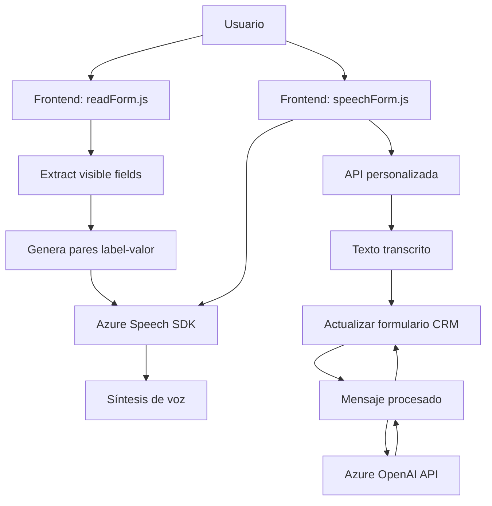

# Breve resumen técnico

El repositorio contiene una solución que integra voz, inteligencia artificial, y capacidades de transformación de texto en formularios de CRM (Customer Relationship Management). Combina un frontend basado en JavaScript con componentes backend (como plugins en C#) y servicios externos (Azure Speech SDK y OpenAI API) para generar una experiencia de usuario enriquecida en la interacción con formularios.

---

# Descripción de arquitectura

La arquitectura puede describirse como híbrida:
1. **Frontend**: Segregado, basado en JavaScript, diseñado para interactuar con formularios visibles (DOM).
2. **Backend**: Un plugin desarrollado en C# (`TransformTextWithAzureAI.cs`) que aplica reglas a textos procesados, interactuando con Dynamics CRM y Azure OpenAI.
3. **Dependencia de Microservicios**: Usa servicios externos (Azure Speech SDK y Azure OpenAI API) para tareas específicas como síntesis de voz y procesamiento de texto.

El diseño incluye patrones como:
- **Arquitectura orientada a servicios (SOA)**: Por consumir microservicios externos como Azure Speech y OpenAI para funcionalidades específicas.
- **Patrón intermediario**: Plugins de Dynamics CRM actúan como mediadores para interpretaciones y modificaciones sobre datos provenientes del frontend.

---

# Tecnologías usadas

1. **Frontend:**
   - **JavaScript** para manejo dinámico de DOM y eventos de formularios.
   - **Azure Speech SDK** para sintetizar y transcribir voz.
   - **API personalizada** para el procesamiento adicional.

2. **Backend:**
   - **C# (.NET Framework)** para desarrollo de funcionalidades de integración de CRM.
   - **Newtonsoft.Json y System.Text.Json** para serialización/deserialización.
   - **Azure OpenAI API (GPT)** utilizada para transformar las entradas del usuario.

3. **Externas y dependencias técnicas:**
   - Integración dinámica mediante SDKs y carga de scripts (`ensureSpeechSDKLoaded`).
   - Microsoft CRM Web APIs (Xrm) para manipulación de formularios y registros.

---

# Diagrama Mermaid válido para GitHub Markdown

---

# Conclusión final

La solución representa una integración avanzada de múltiples tecnologías (Azure Speech SDK, OpenAI, plugins CRM), diseñada para transformar la experiencia del usuario al trabajar con formularios mediante voz y texto. ¿Las características clave?
- La combinación del manejo dinámico de campos en el frontend y procesamiento avanzado en el backend lo convierte en una infraestructura **modular, extensible y altamente interoperable**.
- La elección de **microservicios externos** asegura escalabilidad y confiabilidad, eliminando la sobrecarga del repositorio sobre estas operaciones complejas.

Por su diseño, puede evolucionar para incluir mayor personalización según contextos específicos (e.g., idiomas, dominios). Su arquitectura está alineada con prácticas modernas de desarrollo centradas en API y modularidad.