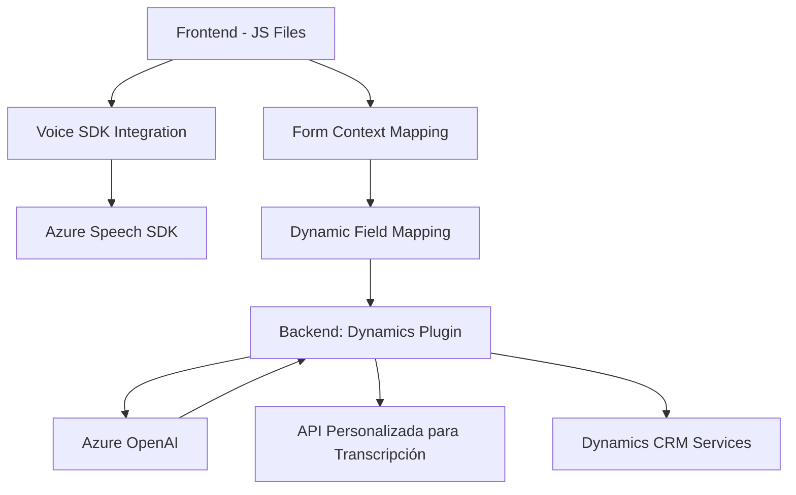

## Breve Resumen Técnico

El repositorio contiene el desarrollo de una solución basada en la interacción por voz y el procesamiento de formularios dinámicos en el contexto de una integración con Microsoft Dynamics CRM. Está apoyada principalmente en el uso de APIs externas (Azure Speech SDK, Azure OpenAI API) y plugins personalizados para entity mapping y procesamiento de texto.

---

## Descripción de Arquitectura

Esta solución está diseñada bajo una arquitectura **modular distribuida en capas**:
1. **Interfaz de Usuario (Frontend)**:
   - Gestiona la entrada de voz del usuario y la conversión de datos de formularios visibles a síntesis de texto hablado mediante el Azure Speech SDK.
   - Captura y transcribe el audio, transformando la entrada de voz en texto que luego es asociado con datos del formulario.
2. **Lógica de Negocio (Middle Tier)**:
   - Procesa datos extraídos de los formularios mediante reglas específicas.
   - Llama a una API personalizada o servicios externos (Azure OpenAI API) para normalizar y transformar el texto.
3. **Capa de Servicios y Backend**:
   - Usa plugins en Dynamics CRM para realizar transformaciones más detalladas con IA y generar un JSON estructurado con los formularios procesados.
   - Usa Microsoft.Xrm.Sdk para actualizar entidades dentro de Dynamics CRM.

Patrón notable: Integración con servicios externos para tareas críticas como síntesis de voz y procesamiento de lenguaje natural. Modularidad en la organización del código que separa claramente las responsabilidades.

---

## Tecnologías Usadas

1. **Azure Speech SDK**:
   - Procesamiento de voz a texto y síntesis de voz.
   - Uso de callback para carga dinámica del SDK.

2. **Azure OpenAI API**:
   - Interacción con modelos GPT para transformar texto bajo reglas específicas y generar JSON estructurado.

3. **Microsoft Dynamics 365 SDK**:
   - Plugins personalizados que se ejecutan como funciones extendidas del CRM.
   - Uso de `IPlugin` para la creación e implementación.

4. **Libraries**:
   - `Newtonsoft.Json`: Para manipulación simplificada de objetos JSON (en el backend).
   - `System.Text.Json`: Uso alternativo para serialización/deserialización de objetos JSON.

5. **HTML+JavaScript**:
   - Implementación de lógica de procesamiento de voz en el frontend.
   - Uso de promesas y métodos DOM estándar.

6. **Patrones de arquitectura**:
   - **Modularidad**: Código altamente desacoplado y dividido en paquetes/librerías específicas para cada funcionalidad.
   - **Carga dinámica de SDKs**: Evita dependencias rígidas y prepara la solución para escalabilidad y mantenimiento.
   - **Callback y Promesas**: Utilizados en operaciones asíncronas como carga de SDK y ejecución de APIs.

---

## Diagrama Mermaid **(100 % compatible con GitHub)**

---

## Conclusión Final

Este repositorio implementa una solución híbrida **Frontend-Backend** diseñada para integrar capacidades de interacción por voz con formularios dinámicos dentro del contexto de Microsoft Dynamics CRM. Utiliza una combinación de servicios y APIs de Microsoft Azure (Speech SDK, OpenAI API) junto con plugins en Dynamics CRM, implementando un modelo de arquitectura de **capas modulares** con servicios externos. La solución presenta una robusta separación de responsabilidades, lo cual es ideal para sistemas empresariales donde la extensibilidad y el mantenimiento a largo plazo son prioridades. Además, el uso de SDKs externos y servicios basados en IA garantiza una gran flexibilidad y capacidad de respuesta ante nuevas funcionalidades.