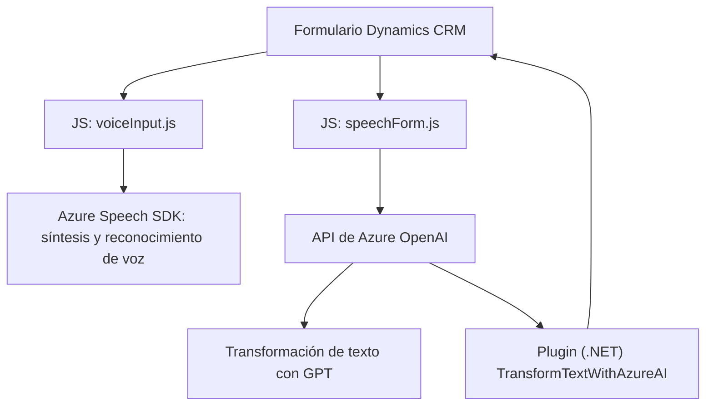

### Breve resumen técnico

El repositorio contiene código que integra funcionalidades de entrada por voz, síntesis de texto a voz, y transformación de texto mediante inteligencia artificial usando **Azure Speech SDK** y **Azure OpenAI**. Está diseñado para un entorno de Microsoft Dynamics CRM, y facilita la extracción de datos de formularios, su procesamiento mediante inteligencia artificial, y la lectura en voz alta usando APIs de Microsoft Azure.

---

### Descripción de arquitectura

La arquitectura de esta solución es **modular con enfoque de microservicio**, diseñada para interactuar con Microsoft Dynamics CRM y extender sus capacidades mediante plugins y scripts personalizados que usan servicios externos de Microsoft Azure. 

Principalmente, se basa en dos componentes:
1. **Frontend (JavaScript)**: Código modular que interactúa con la interfaz del usuario (formularios), utiliza **Azure Speech SDK** para síntesis y reconocimiento de voz, y realiza llamadas asíncronas a un API externo para expandir las capacidades de interpretación de texto con la inteligencia artificial de **Azure OpenAI**.
2. **Backend (Plugins en C#)**: Plugins para realización de transformaciones inteligentes de texto mediante llamadas a servicios de la API REST de **Azure OpenAI**, utilizando patrones de diseño orientados a servicios y adaptadores.

---

### Tecnologías usadas

#### Lenguajes:
- **JavaScript (Frontend)**: Utilizado para el manejo dinámico de formularios y la integración con Azure Speech SDK.
- **C# (Backend)**: Implementa un plugin para Microsoft Dynamics CRM.

#### Frameworks y Herramientas:
- **Microsoft Dynamics CRM SDK**: Para manejar los contextos del formulario y la lógica personalizada dentro de la plataforma.
- **Azure Speech SDK**: Usado para funcionalidades de síntesis y reconocimiento de voz.
- **Azure OpenAI API**: Usado para transformar texto mediante modelos de inteligencia artificial.
- **Newtonsoft.Json**: Utilizado en el backend para gestionar objetos JSON generados por la API.
- **System.Net.Http**: Para solicitudes HTTP al servicio REST de Azure.

#### Patrones: 
- **Event-Driven Architecture**: Basado en la activación y manejo de eventos (grabación de voz, transcripción, carga de SDK dinámico, ejecución de plugins en Dynamics CRM, etc.).
- **Adaptor Pattern**: Para normalización y conversión de datos entre el formulario, el SDK y el servicio de Azure AI.
- **Microservicios**: Utilización de servicios externos para tareas específicas (voz y AI) desacoplados de la solución central.

---

### Diagrama Mermaid válido para GitHub

---

### Conclusión final

Este repositorio muestra una solución diseñada para operar en un entorno de **Microsoft Dynamics CRM**, utilizando **JavaScript**, **C#**, y APIs de **Microsoft Azure** para implementar funcionalidades avanzadas de reconocimiento y síntesis de voz, así como transformación de texto con inteligencia artificial. La arquitectura sigue un enfoque modular, orientado a eventos y microservicios, con integraciones externas para mayor flexibilidad y escalabilidad. El uso de los SDKs y APIs de Azure asegura aprovechamiento de herramientas líderes en inteligencia artificial, combinándolo con la automatización de procesos en un sistema CRM.