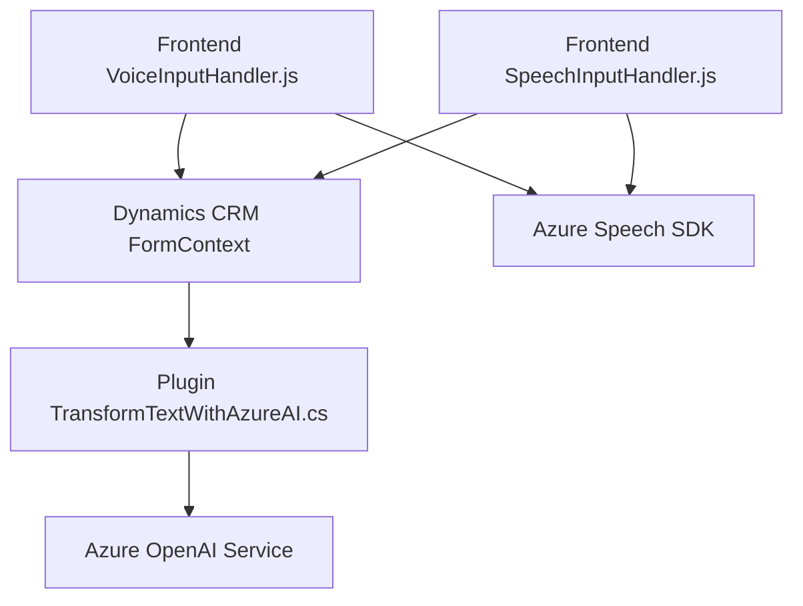

### Resumen técnico
La solución analizada consiste en una combinación de funcionalidades de generación de síntesis de voz a partir de datos de formularios, entrada de voz para el llenado de los formularios y procesamiento avanzado de texto mediante servicios externos de IA. El código está estructurado en tres componentes principales:
1. **Frontend dinámico para interacción con formularios.**
2. **Plugins y extensiones para Dynamics CRM.**
3. **Integración con servicios de Azure (Speech SDK y OpenAI).**

### Descripción de la arquitectura
La arquitectura utiliza un enfoque **modular extendido** basado en integraciones entre los componentes de Dynamics CRM y servicios externos. Aunque no es estrictamente un modelo de microservicios, se observa mucha lógica delegada en SDKs y servicios externos de Azure.

La interacción detallada de los componentes sugiere una arquitectura en **n capas**:
- **Presentación**: Código frontend (JavaScript) que interactúa con formularios.
- **Lógica de negocio**: Plugins .NET en Dynamics CRM que aplican reglas específicas (como transformación de texto).
- **Acceso a datos**: Formulario CRM con atributos que son manejados vía `formContext` en el frontend y el contexto del plugin en el backend.
- **Servicios externos**: Azure Speech SDK y Azure OpenAI Service utilizados para síntesis y procesamiento de texto.

### Tecnologías, frameworks y patrones usados
1. **Lenguajes y frameworks:**
   - **JavaScript**: Para frontend dinámico.
   - **C# (.NET)**: Implementación de plugins para Dynamics CRM.
   - **Azure SDKs**: Speech SDK y OpenAI.

2. **Patrones específicos:**
   - **Delegación**: Flujo delegado entre funciones para cargar SDK dinámicamente y procesar datos.
   - **Factory de tipos**: Procesar diferentes tipos de atributos en formularios (como `lookup` y numéricos).
   - **Plugin Design Pattern**: Define la logística dentro de Dynamics CRM.
   - **API Wrapper Pattern**: Simplifica la integración con Azure OpenAI Service y Speech SDK.
   - **MVC influenciado**: Separación implícita entre Vista (formulario), Modelo (atributos/labels) y Controlador (procesamiento de datos y comunicación con servicios externos).

3. **Servicios externos:**
   - **Azure Speech SDK**: Síntesis y reconocimiento de voz.
   - **Azure OpenAI Service**: Procesamiento avanzado de texto basado en IA.

### Diagrama Mermaid válido para GitHub

### Conclusión final
La solución presentada es un sistema modular orientado a mejorar la accesibilidad y la automatización del trabajo en entornos empresariales basados en Dynamics CRM. Usa una arquitectura en n capas con extensiones frontend y plugins backend para gestionar formularios mediante síntesis y entrada de voz, además de procesar texto avanzado vía Azure OpenAI Service. La elección de tecnologías (Azure y Dynamics CRM) la hace ideal para organizaciones que buscan escalar funcionalidades en un entorno corporativo existente.