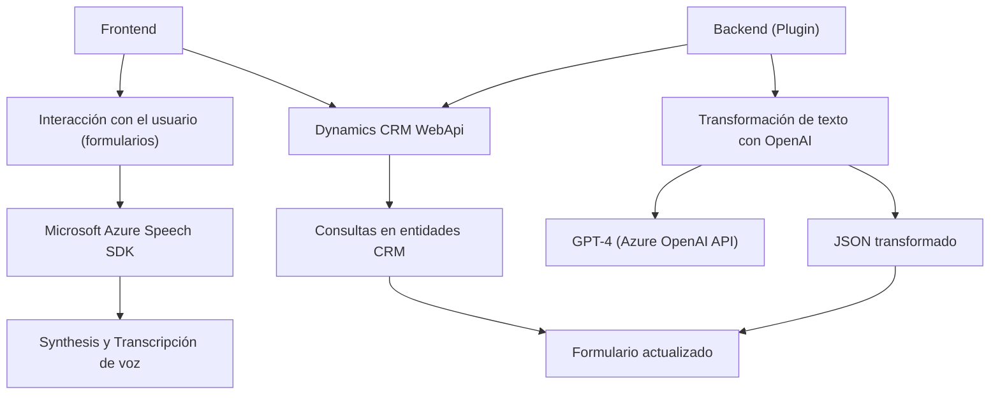

### Breve resumen técnico:
El repositorio define una solución que integra servicios de Microsoft Azure (Speech SDK y OpenAI) con una plataforma de CRM (Dynamics CRM), con el objetivo de procesar formularios y comandos hablados. Incluye un frontend basado en JavaScript para la interacción del usuario y un backend sobre plugins del CRM desarrollado en C#. El frontend aplica control de formularios, síntesis de voz y transcripción; mientras que el backend utiliza servicios de transformación de texto con OpenAI.

---

### Descripción de arquitectura:

1. **Tipo de solución:**  
   La solución tiene un enfoque híbrido con características de aplicación web interactiva (frontend) que consume servicios externos como Microsoft Azure Speech y OpenAI. Además, incluye una integración de backend orientada a eventos, típica de los plugins de Dynamics CRM.

2. **Arquitectura:**  
   La solución combina dos arquitecturas principales:  
   - **Frontend de cliente:** Modular, estructurada en funciones reutilizables, y con integración directa de servicios de Azure (SDK).
   - **Backend basado en plugins:** Orientado a eventos y acoplado a Dynamics CRM, con lógica encapsulada en una clase alojada en el servidor.

3. **Patrones utilizados:**  
   - **Carga condicional/lazy loading:** El SDK de Azure Speech se carga dinámicamente en el frontend solo cuando es necesario.
   - **Pipeline de procesamiento:** Flujo bien definido en el frontend y backend para extraer datos del formulario, transcribirlos o sintetizarlos, transformarlos con IA y aplicar resultados.
   - **SOA (Service-Oriented Architecture):** Uso de APIs externas como servicios de Azure para síntesis y procesamiento de texto.
   - **Dependency Injection:** Implementado en el backend para desacoplar dependencias en Dynamics CRM.

---

### Tecnologías usadas:
1. **Frontend:**  
   - **JavaScript:** Idioma principal, estructurado en funciones para manejar el SDK de Azure Speech.  
   - **Azure Speech SDK:** Transcripción de voz y síntesis de texto.
   - **Dynamics CRM WebApi:** Integración con el formulario CRM para lectura y modificación de campos.

2. **Backend:**  
   - **C# (.NET):** Desarrollo de plugins para integración con Dynamics CRM.  
   - **Azure OpenAI:** Utilizado en el método del plugin para aplicar inteligencia artificial al procesamiento de texto.
   - **Newtonsoft.Json:** Procesamiento JSON en el backend.

3. **Servicios externos:**  
   - Microsoft Azure Speech SDK.  
   - Microsoft Dynamics SDK y APIs.  
   - Azure OpenAI.

---

### Diagrama Mermaid válido para GitHub:

---

### Conclusión final:

La solución combina un frontend modular en JavaScript, que integra el SDK de Azure Speech para reconocimiento y síntesis de voz, con un backend en .NET orientado al procesamiento de texto mediante Azure OpenAI. La arquitectura es híbrida, con componentes colaborativos que respetan la modularidad y los principios de reutilización de código. El diseño está optimizado para su aplicación dentro de un entorno CRM como Microsoft Dynamics, consolidando una experiencia fluida e inteligente para el usuario final al gestionar entradas de voz y datos enriquecidos.