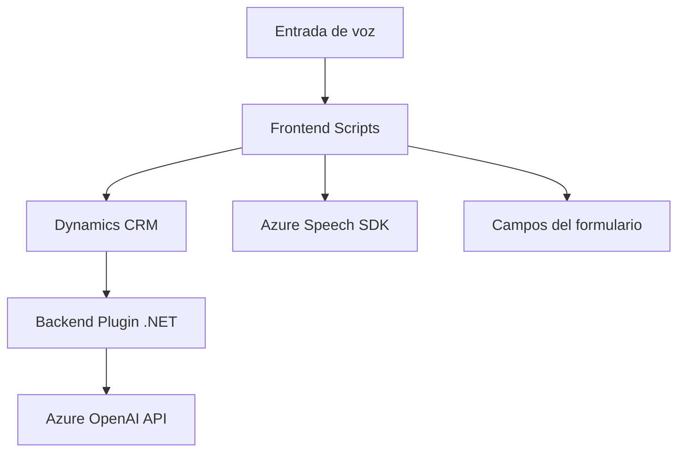

### Breve resumen técnico:

El repositorio representa una solución orientada a la interacción entre formularios, voz y procesamiento avanzado mediante servicios de IA, como Azure Speech SDK y Azure OpenAI. Estas capacidades están diseñadas para integrarse a sistemas CRM (Dynamics 365), permitiendo una interacción avanzada con usuarios a través del reconocimiento de voz, síntesis de voz y procesamiento de texto.

---

### Descripción de arquitectura:

La solución tiene tres componentes principales:
1. **Frontend basado en voz y formularios**:
   - Implementado con scripts de JavaScript que integran la entrada por voz con transcripción dinámica hacia los campos de formularios en Dynamics 365.
   - Usa el Azure Speech SDK para reconocimiento de voz y síntesis.
   
2. **Plugin de procesamiento avanzado**:
   - Una extensión escrita en .NET para Dynamics 365.
   - Invoca servicios de Azure OpenAI para procesar y transformar texto recibido en formato JSON, siguiendo reglas específicas.

### Tipo de arquitectura:
- **N Capas con integración de servicios externos**: 
  - La lógica del procesamiento de voz (frontend), manipulación de datos (backend/CRM), y servicio de IA están separadas.
  - El plugin utiliza una **arquitectura de integración por eventos** porque se activa según acciones en Dynamics 365.

---

### Tecnologías usadas:

1. **Frontend**:
   - **JavaScript**: Implementa la lógica de captura y síntesis de voz junto con dinámica de formularios.
   - **Azure Speech SDK**: Para reconocimiento/comandos de voz y síntesis.
   - **Xrm.WebApi**: Para interacciones directas con Dynamics CRM (solo para scripts integrados en el ambiente Dynamics).

2. **Backend**:
   - **C#**: Usado en el plugin para procesamiento de texto y comunicación directa con un middleware de Azure OpenAI.
   - **Azure OpenAI**: Entorno para transformar texto utilizando modelos avanzados (GPT-4).

3. **Patrones**:
   - **Inyección de dependencias** en los servicios (`IServiceProvider` en el plugin).
   - **Modularidad**: Separación de responsabilidades en funciones independientes.
   - **Adapter Pattern**: Los datos recibidos desde servicios externos se normalizan en formato útil para sistema CRM.

---

### Dependencias o componentes externos presentes:
1. **Azure Speech SDK**: Para facilitar entrada y salida de voz.
2. **Azure OpenAI**: Utilizado por el plugin C# para la transformación de texto.
3. **Xrm.WebApi**: Interacción con los datos del formulario en Dynamics.
4. **Bibliotecas de C#**:
   - `Newtonsoft.Json`: Para manipulación JSON.
   - `System.Net.Http`: Para realizar requests al servicio Azure OpenAI.
5. Servicios del entorno Dynamics CRM (`Microsoft.Xrm.Sdk`) para el plugin.

---

### Diagrama Mermaid:

#### Diagrama general de la solución:

---

### Conclusión final:

La solución está diseñada para escenarios empresariales interactivos. Con una arquitectura basada en **Frontend + Backend** modular e integrada en sistemas CRM, permite procesar formularios por voz y aprovechar capacidades avanzadas de IA para transformar y manipular datos. A nivel técnico, utiliza las capacidades de Azure Speech SDK y Azure OpenAI como pilares para entrada por voz e inteligencia artificial.

El diseño sigue principios de modularidad y desacoplamiento, facilitando futuras extensiones para integración con otros servicios y tecnologías. Esta estructura es ideal para aplicaciones empresariales centradas en experiencia del usuario y automatización inteligente.