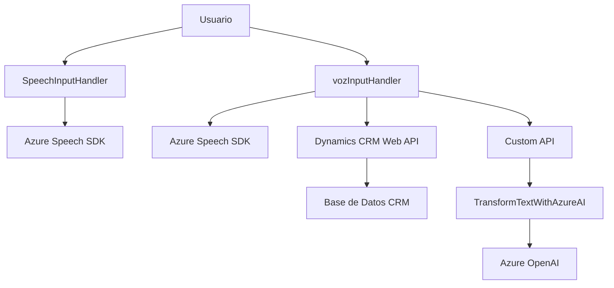

### Breve resumen técnico
El repositorio contiene múltiples archivos que implementan una solución orientada a entrada por voz y procesamiento de texto dinámico en un contexto empresarial (Dynamics CRM). Utiliza tecnologías como Azure Speech SDK para reconocimiento y síntesis de voz, Azure OpenAI para procesamiento avanzado de texto, y plugins en Dynamics CRM para transformar datos en tiempo real.

---

### Descripción de arquitectura
**Tipo de solución**: La solución es un _multi-componente híbrido_ que integra funcionalidades frontend y backend para habilitar la interacción mediante voz y procesamiento de texto en aplicaciones empresariales como Dynamics CRM.

1. **Frontend**: Implementación en JavaScript para la entrada por voz y síntesis de texto con Azure Speech SDK. Detecta los datos visibles del formulario y permite actualizarlos por comandos de voz, reglas predefinidas o IA.
2. **Backend**: Plugin escrito en .NET/C# para integrar directamente con Dynamics CRM, procesar texto mediante Azure OpenAI, y devolver resultados estructurados en JSON.
   
**Arquitectura**:
La solución sigue el enfoque de **arquitectura n-capas** con los siguientes elementos:
- **Presentación (Frontend)**: Los archivos JavaScript (`SpeechInputHandler.js` y `vozInputHandler.js`) se encargan de la interacción usuario-sistema, procesando eventos en tiempo real y conectándose con APIs externas.
- **Negocio (Plugins)**: El archivo backend (`TransformTextWithAzureAI.cs`) actúa como capa de lógica de negocio, transformando los datos según reglas específicas y conectándose con servicios externos como Azure OpenAI.
- **Datos (CRM y APIs)**: La capa de datos está compuesta por objetos relacionados con Dynamics CRM (formContext) y Azure Speech/OpenAI APIs para procesamiento externo.

**Patrones observados**:
- _Modularización_: Cada archivo tiene funciones específicas que encapsulan una responsabilidad clara (sintetizar voz, transformar texto, gestionar APIs).
- _Service-Oriented Architecture (SOA)_: Uso extensivo de servicios externos como Azure Speech SDK y OpenAI API.
- _Dynamics CRM Plugin Design_: Implementación basada en eventos del modelo `IPlugin` para lógica extensible en CRM.

---

### Tecnologías usadas
1. **Frontend**:
   - **JavaScript**: Gestión de la lógica del cliente para síntesis y reconocimiento de voz.
   - **Azure Speech SDK**: Para realizar operaciones de síntesis y reconocimiento de voz.
   - **DOM API**: Para cargar dinámicamente dependencias externas como el SDK.
   - **Dynamics CRM Web API** (`Xrm.WebApi`): Conexión con datos del formulario en CRM.

2. **Backend**:
   - **C#/.NET Framework**:
     - `Microsoft.Xrm.Sdk` para desarrollo de extensiones en Dynamics CRM.
     - `Newtonsoft.Json` y `System.Text.Json` para manejo de datos JSON.
     - `System.Net.Http` para integraciones HTTP con Azure OpenAI.

3. **Externo**:
   - **Azure Speech SDK**: Reconocimiento y síntesis de voz.
   - **Azure OpenAI (GPT-4)**: Transformación avanzada de texto.
   - **Dynamics CRM**: Base de datos empresarial y contexto de formularios.

---

### Diagrama Mermaid válido para GitHub

---

### Conclusión final
La solución analizada es ideal para aplicaciones empresariales centradas en la interacción humano-tecnología mediante voz. La arquitectura n-capas promueve la separación de responsabilidades y modularidad, mientras que la integración con servicios como Azure Speech y OpenAI amplía las capacidades del sistema. Su diseño permite escalar al agregar nuevas fuentes de datos o entrenar modelos más avanzados de IA.

Están presentes buenas prácticas de diseño como el manejo controlado de dependencias externas, modularización en el frontend, y uso de patrones de plugin en el backend. Sin embargo, será esencial garantizar controles de error adecuados en la interacción con APIs externas, especialmente considerando latencias y posibles caídas en servicios como Azure.