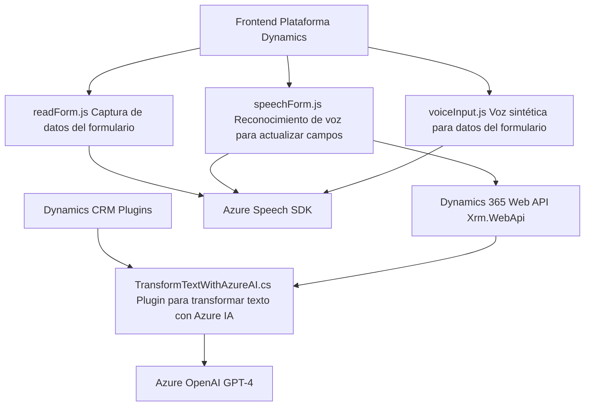

### Resumen técnico
El repositorio contiene archivos que implementan módulos independientes destinados a la interacción por voz, consumo de APIs externas (Azure Speech SDK y Dynamics 365), y transformación de datos mediante el servicio Azure OpenAI Service. Estas funcionalidades están enfocadas en mejorar la interacción con formularios de Dynamics CRM, aplicando inteligencia artificial y voz asistida en tiempo real.

---

### Descripción de arquitectura
La solución utiliza una arquitectura de integración basada en componentes independientes que interactúan con servicios externos (Azure SDK y Dynamics CRM). La lógica principal está dividida en tres capas:
1. **Frontend:** Implementado en JavaScript, para capturar datos o comandos de voz y sintetizarlos mediante Azure Speech SDK.
2. **Backend/Plugins:** Gestiona la interacción directa con Microsoft Dynamics 365 y transforma datos mediante Azure OpenAI.
3. **Servicios externos:** Azure Speech SDK y Azure OpenAI Service proveen capacidades avanzadas de IA y síntesis de voz.

La arquitectura parece acercarse a un modelo **n-capas** con integración muy fuerte entre frontend y backend, aunque también aprovecha **patrones centrados en microservicios externos** para delegar funcionalidades específicas (voz e IA).

---

### Tecnologías usadas
1. **Lenguajes:**
   - JavaScript (Frontend, manipulaciones de DOM y Azure Speech SDK).
   - C# (Plugins para Dynamics CRM usando Microsoft Xrm SDK).

2. **Frameworks:**
   - **Dynamics CRM:** Framework para la construcción de aplicaciones interconectadas al CRM de Microsoft.
   - **Azure Speech SDK:** Para generación y reconocimiento de voz.
   - **Azure OpenAI GPT-4:** Para transformaciones de texto mediante IA.

3. **Patrones:**
   - Modularización.
   - Callbacks para carga dinámica de SDKs.
   - API Gateway y Service Gateway para la interacción con servicios en la nube.

---

### Diagrama Mermaid

---

### Conclusión final
La solución integra componentes heterogéneos bajo un esquema de n-capas donde se delegan las operaciones complejas (voz y transformación con IA) a servicios externos (Azure Speech y OpenAI GPT-4, respectivamente). Esto asegura una alta modularidad y escalabilidad, minimizando el esfuerzo de desarrollo para tecnologías IA o voz mientras se optimiza la interacción en sistemas CRM. Sin embargo, tiene riesgo de **overdependencia de servicios de nube** y potenciales vulnerabilidades (exposición de API Keys).