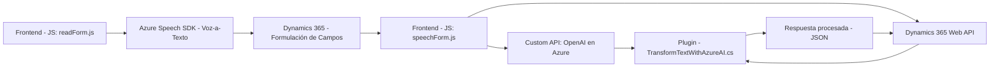

### Breve resumen técnico
El repositorio general está orientado a integrar servicios de Microsoft Azure con Dynamics 365, proporcionando herramientas para el manejo de formularios mediante reconocimiento y síntesis de voz, así como un plugin para transformar texto con Azure OpenAI. La solución combina frontend JavaScript para trabajar sobre la UI de Dynamics CRM y un plugin en .NET para realizar procesamiento en el backend. 

### Descripción de arquitectura
La solución utiliza una **arquitectura híbrida basada en componentes desacoplados**:
1. **Frontend web funcional**: El conjunto de scripts en JavaScript se integra como microfuncionalidad dentro del frontend de Dynamics 365. Ayuda tanto a leer formularios, como a interpretarlos mediante reconocimiento de voz (Microfrontend).
2. **Plugin para Dynamics CRM**: El funcionalidad backend en .NET integra procesamientos OpenAI con Dynamics a través de la API Azure OpenAI para transformar texto.
3. **Azure Dependencias**: Se basa fuertemente en servicios proporcionados por Microsoft Azure (Speech SDK, OpenAI), creando una arquitectura de interacción con APIs externas y complementando la funcionalidad local de Dynamics.

### Tecnologías y patrones usados
**Repositorios `FRONTEND/JS/readForm.js` y `FRONTEND/JS/speechForm.js`:**
- **Tecnologías**: JavaScript (ECMAScript), Azure Speech SDK.
- **Patrones**:
  - Modularidad: Cada función está encapsulada para realizar funcionalidades individuales.
  - Event-Driven: Las interacciones, como la carga del SDK o la acción del usuario, disparan procesos.
  - API Integration: Llama APIs de Azure para manejar texto y voz.

**Archivo `Plugins/TransformTextWithAzureAI.cs`:**
- **Tecnologías**: .NET Framework, Dynamics CRM SDK, Azure OpenAI Service.
- **Patrones**:
  - Plugin Pattern: Implementación mediante la interfaz estándar de `IPlugin`.
  - API Integration: Consume los endpoints de Azure OpenAI para transformar texto.
  - Single Responsibility Principle (SRP): Cada método y clase tienen una función específica.

### Dependencias y componentes externos
1. **Microsoft Azure Cloud Services**:
   - Azure Speech SDK para reconocimiento de voz y síntesis de texto.
   - Azure OpenAI API para procesamiento avanzado de texto.
2. **Dynamics 365 Framework**:
   - Custom APIs y Web API de Dynamics CRM.
   - `executionContext` utilizado en formularios.
3. **Librerías y frameworks adicionales**:
   - `Newtonsoft.Json` y `System.Text.Json` para manejar objetos JSON.
   - `.NET Libraries` como `System.Net.Http` para acceso HTTP.

### Diagrama Mermaid válido para GitHub Markdown
A continuación se presenta un diagrama que describe la interacción general de los componentes en este sistema:

### Conclusión final
Este repositorio implementa una **solución híbrida** que combina un diseño basado en microfrontend (para formularios en la interfaz de Dynamics) junto con un backend en forma de un plugin CRM. Utiliza servicios externos como Azure Speech SDK y OpenAI, integrando el ecosistema de Microsoft Azure con Dynamics CRM.

La solución está bien estructurada, sigue principios modernos como la modularidad y SRP para mantener cada componente independiente, y aprovecha las dependencias externas para extender las capacidades nativas de Dynamics.