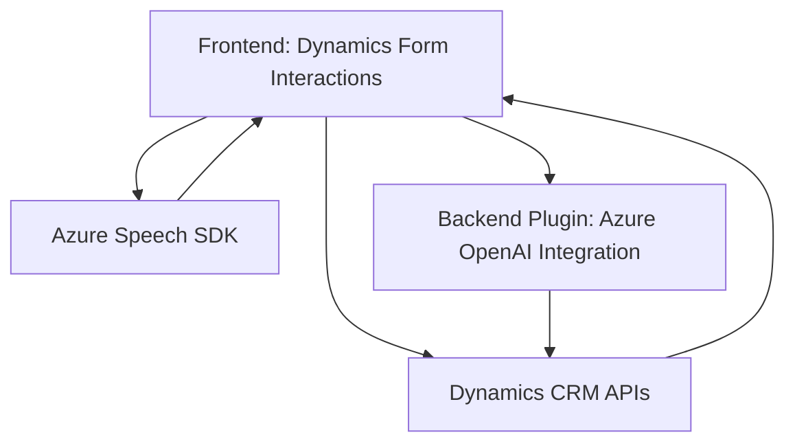

### Breve Resumen Técnico
El repositorio contiene archivos relacionados con una solución que integra funcionalidades avanzadas en un sistema Dynamics 365 CRM mediante Azure Speech SDK y Azure OpenAI. Se compone de un frontend Javascript que gestiona interacciones en formularios y un backend de .NET registrado como plugin de Dynamics.

---

### Descripción de Arquitectura
La solución representa una arquitectura **de integración modular** en el contexto de Dynamics 365. Se compone de:
1. **Frontend con lógica directa**, que interactúa dinámicamente con formularios de CRM y usa servicios como el SDK de Azure Speech para entrada y síntesis de voz.
2. **Backend basado en plugins**, que realiza transformaciones utilizando Azure OpenAI y API REST, encapsulado como objetos registrados en el pipeline de Dynamics CRM.
3. **Patrones utilizados**:
   - **Eventos Contextuales**: El frontend trabaja en un modelo event-driven usando el `executionContext`.
   - **SDK Wrapper**: Ambos componentes encapsulan la interacción con Azure Speech SDK y Azure OpenAI.
   - **Plugin Dynamics**: El backend sigue el patrón típico de un plugin de Dynamics 365.
   - **API-First**: Se delega transformación de datos a servicios externos (Azure Speech y OpenAI).

---

### Tecnologías y Frameworks Usados
1. **Frontend**:
   - **Microsoft Dynamics 365 Context API** para interacción con formularios.
   - **Azure Speech SDK** para entrada de voz y síntesis.
   - **JavaScript (ES6)** como lenguaje, con modularidad y carga dinámica de dependencias.
   - **Promesas y Asíncronía** para procesos de larga duración como reconocimiento o llamadas a API.

2. **Backend (Plugins)**:
   - **C# (.NET Framework)** como núcleo para el plugin registrado con Dynamics CRM.
   - **Azure OpenAI APIs** para transformaciones de texto complejas.
   - **Newtonsoft.Json y System.Net.Http** para manejo de datos JSON y solicitudes HTTP.

---

### Dependencias y Componentes Externos
1. **Exteriores**:
   - **Azure Speech SDK**: Importado dinámicamente para síntesis y análisis de voz.
   - **Azure OpenAI Service**: Utilizado en el backend para transformaciones.
   - **Microsoft Dynamics APIs**:
     - `WebApi.online` para integración con entidades CRM.
     - Plugins registrados mediante `IPluginExecutionContext`.

2. **Internos**:
   - Funciones auxiliares ECMAScript para procesamiento de transcripciones y datos de formulario.
   - Lógica de registro y validación dinámica en Dynamics SDK.

---

### Diagrama Mermaid

---

### Conclusión Final
La solución está desarrollada como un ecosistema basado en Dynamics 365, donde el **frontend** (JS) maneja la interacción en tiempo real con formularios utilizando tecnologías como Azure Speech SDK, mientras el **backend plugin** basado en C# utiliza Azure OpenAI para realizar transformaciones de texto avanzadas. Tiene una arquitectura **modular y efectiva para la integración con servicios de nube**, lo que la hace altamente extensible. Sin embargo, carece de mecanismos robustos para manejo de errores en contexto de APIs externas, algo que podría mejorarse para garantizar resiliencia.