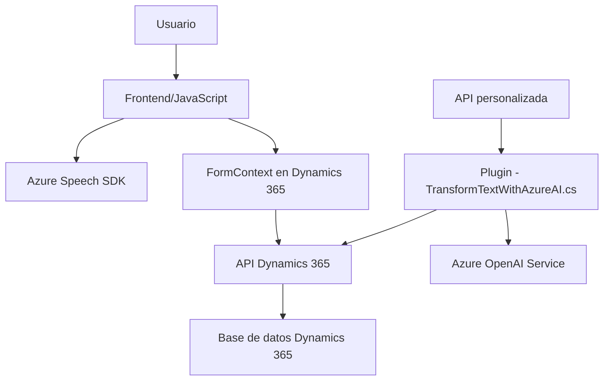

### Breve Resumen Técnico

Este repositorio contiene un conjunto de soluciones orientadas al desarrollo de funcionalidades específicas en **Dynamics 365** y servicios de **Azure**, principalmente relacionadas con la interacción de formularios mediante voz (Azure Speech SDK), entrada de datos por reconocimiento de voz, y transformación de contenido vía **Azure OpenAI**. La arquitectura del repositorio combina lógica de frontend para interfaces dinámicas y plugins backend alojados en Dynamics.

---

### Descripción de Arquitectura
La arquitectura basada en los archivos analizados es principalmente una **arquitectura N capas**, donde los diferentes componentes desempeñan roles relacionados con presentación, lógica de negocio, interacción con APIs externas y servicios en la nube. El frontend maneja la interacción directa con el usuario y los formularios. Los plugins en el backend, alojados en Dynamics CRM, administran la lógica de negocio y conectan con servicios externos (Azure OpenAI) para transformaciones avanzadas.

Además, la solución integra patrones asociados a microservicios y servicios externos a través de las APIs de Azure Speech y OpenAI, mostrando características híbridas entre las arquitecturas N capas y microservicios.

---

### Tecnologías Usadas
1. **Frontend (JavaScript):**
   - **Tecnologías:**
     - Vanilla JavaScript para funcionalidades frontend.
     - **Azure Speech SDK** para síntesis y reconocimiento de voz.
     - Navegadores modernos para la ejecución del frontend.
   - **Patrones:**
     - Modularización (funciones independientes con una única responsabilidad).
     - Integración con API externas y asincronía mediante Promesas y callbacks.

2. **Backend Plugins (C#):**
   - **Tecnologías:**
     - Framework .NET, específicamente herramientas SDK para Dynamics 365.
     - HTTP Client para peticiones API a **Azure OpenAI Service**.
     - Gestión de JSON con `System.Text.Json`.
   - **Patrones:**
     - Plugin design pattern en Dynamics CRM con división clara de responsabilidades.
     - External Service Integration para comunicación con Azure.

3. **Servicios Externos:**
   - **Azure Speech SDK**: Síntesis de voz, reconocimiento de voz.
   - **Azure OpenAI (GPT-4o)**: Transformación de contenido por medio de IA aplicada.

---

### Dependencias o Componentes Externos Posibles
1. **Azure Servicios:**
   - **Speech SDK:** Usado en el frontend; cargado dinámicamente.
   - **OpenAI Service:** Consumido en los plugins backend para transformación de texto y entrega de respuestas en formato JSON.
   
2. **Microsoft Dynamics API:**
   - APIs de Dynamics 365 para integrarse con formularios, realizar actualizaciones, y ejecutar lógica interna.
   
3. **Frontend APIs:**
   - APIs del navegador como `window` y `document`, necesarias para manejo de DOM.

---

### Diagrama Mermaid válido para GitHub

---

### Conclusión Final
El análisis concluye que el repositorio implementa una solución híbrida basada en frontend, backend y servicios externos, con una arquitectura **N capas** que interactúa con sistemas externos como **Microsoft Dynamics 365** y **Azure AI Services**. Es una integración sólida y modular que utiliza patrones modernos como asincronía, modularización y desacoplamiento de responsabilidades para cumplir objetivos específicos en un entorno corporativo.