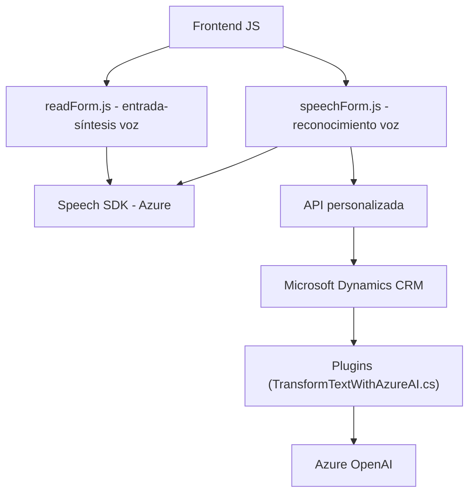

### Breve Resumen Técnico

El repositorio tiene tres archivos principales que claramente están enfocados en la integración de tecnologías avanzadas como **Microsoft Azure Speech SDK** y **Azure OpenAI**, con el propósito de mejorar la funcionalidad de entrada, síntesis de voz, y transformación de texto en aplicaciones CRM (específicamente, Microsoft Dynamics). Los archivos evidencian una arquitectura compuesto por algunos componentes clave, con una separación de responsabilidades.

---

### Descripción de Arquitectura

1. **Patrones de Arquitectura**:
   - **N-capas**: Cada elemento del repositorio forma parte de capas bien definidas:
     - **Frontend (JS)** para la interacción con el usuario y el manejo de formularios dinámicos.
     - **Backend con Plugins (C#)** que interactúan directamente con el servidor de Dynamics CRM y las APIs de Azure OpenAI.
   - **Modularidad**: Las funcionalidades están agrupadas en módulos (archivos con funciones específicas) que cumplen tareas concretas como entrada de voz, síntesis de texto, o transformaciones con IA.
   - **Carga dinámica de dependencias**: Se utiliza scripts descargados en tiempo de ejecución (Speech SDK).

2. **Tipo de arquitectura**: Aunque el sistema opera sobre un CRM, la implementación específica consiste en una arquitectura **Cliente-Servidor**, con procesamiento tanto en cliente (JavaScript usando Azure Speech SDK para reconocimiento de voz) como servidor (C# utilizando plugins dinámicos).

---

### Tecnologías Usadas

- **Frontend**:
  - JavaScript para manipulación del DOM y lógica de negocio orientada a formularios.
  - Azure Speech SDK: Reconocimiento y síntesis de voz.
  
- **Backend**:
  - C# para el desarrollo de plugins en Dynamics CRM (IPlugin interface).
  - Azure OpenAI para transformación textual y generación de JSON estructurado.

- **Dependencias**:
  - `Microsoft Dynamics 365 Web API`: Para interacción entre el CRM y los datos de formularios.
  - Frameworks asociados: `System.Net.Http`, `Newtonsoft.Json` para manejo de API y JSON.
  
- **Patrones principales**:
  - **Control basado en eventos**: Uso de callbacks para manejar carga de SDK.
  - **Input/output processing**: Manipulación de datos visuales del formulario y entrada de voz por contexto.
  - **External API consumption**: Integración con Azure Speech SDK y Azure OpenAI.

---

### Diagrama Mermaid Compatible con GitHub

---

### Conclusión Final

Este repositorio implementa una solución híbrida altamente funcional que conecta la interacción del usuario en un **frontend dinámico basado en formularios** con capacidades avanzadas de reconocimiento de voz y transformación textual, utilizando tecnologías de **Azure**. La arquitectura evidencia una separación clara de responsabilidades y patrones, como modularidad y n-capas, ideal para escenarios de automatización e interacción con sistemas CRM empresariales como Dynamics 365.

Sin embargo, la solución depende fuertemente de servicios de terceras partes (Azure). Aunque esto conlleva beneficios como facilidad de desarrollo y escalabilidad, la dependencia externa implica cuidar la configuración y costos de esos servicios en entornos productivos.