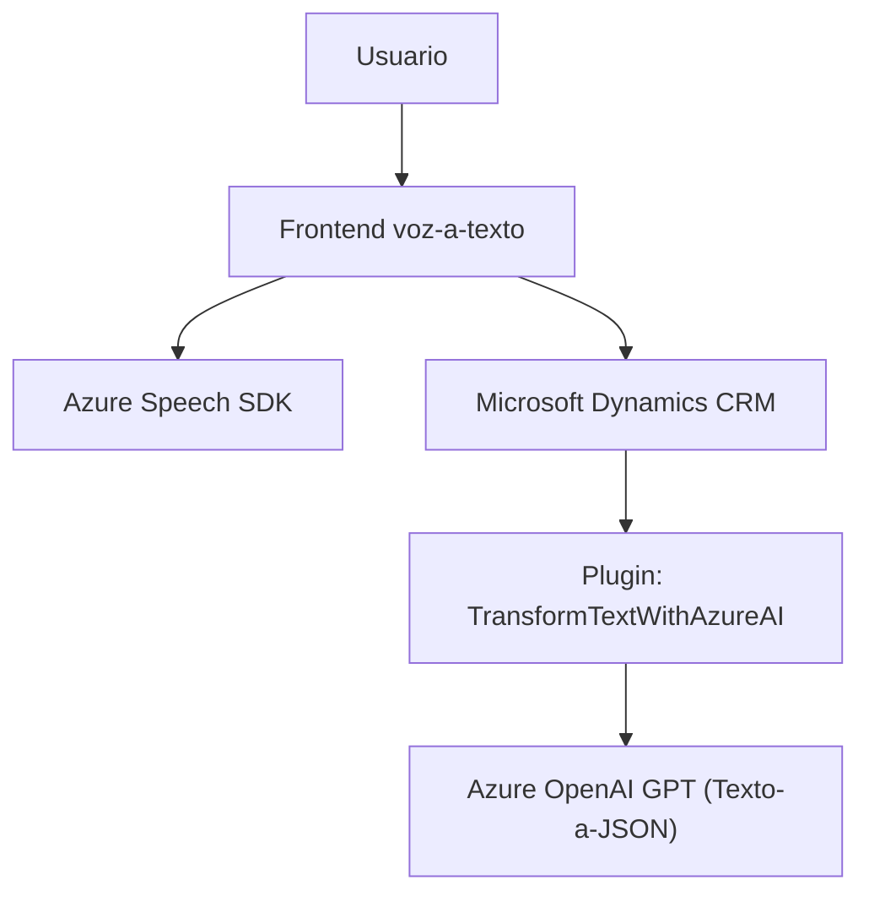

### Breve resumen técnico

El repositorio contiene archivos relacionados con dos componentes principales:

1. **Frontend:** Implementado principalmente en JavaScript, posee funcionalidades para reconocimiento y síntesis de voz integrando el **Azure Speech SDK**, con un enfoque en la interacción con formularios en una aplicación basada posiblemente en Microsoft Dynamics CRM.
2. **CRM Plugin (Backend):** Desarrollado en C#, define un complemento para Dynamics CRM que procesa textos utilizando el servicio **Azure OpenAI GPT**, transformando datos textuales en estructuras JSON específicas para integración en un flujo de datos del CRM.

---

### Descripción de arquitectura

La arquitectura del repositorio se alinea con una **Arquitectura de N Capas**, una aproximación tradicional adecuada debido a los componentes separados en:

- **Frontend:** Maneja directamente la interacción con el usuario usando reconocimiento de voz, síntesis de texto y manipulación de formularios.
- **Backend (Plugin Dynamics CRM):** Procesa y transforma datos entre Azure OpenAI y el ecosistema CRM. El flujo sigue un enfoque modular y desacoplado, con integración externa mediante servicios de Azure.

Algunos patrones identificados:
- **Lazy Loading:** En el frontend se carga dinámicamente el Azure Speech SDK solo cuando es necesario.
- **Modularización funcional:** Las funciones están organizadas por responsabilidades específicas, aumentando la legibilidad y mantenibilidad del código.
- **External Service Integration:** Ambas partes interactúan con servicios de terceros (Azure Speech SDK y Azure OpenAI).

---

### Tecnologías usadas

1. **Frontend:**
   - **JavaScript:** Para la lógica de procesamiento de datos, interacción con APIs externas y SDK.
   - **Azure Speech SDK:** Para reconocimiento y síntesis de voz.
   - **Browser APIs:** Manipulación del DOM y control de eventos.
  
2. **Plugin Backend:**
   - **C#:** Lenguaje para desarrollo del complemento.
   - **Microsoft Dynamics CRM SDK:** Integración directa con contexto de ejecución y manipulación de datos dentro de Dynamics CRM.
   - **Azure OpenAI GPT:** Servicio para generación y transformación de datos textuales.
   - **Newtonsoft.Json & System.Text.Json:** Herramientas para la manipulación y serialización de JSON.

3. **Dependencias externas:**
   - Azure Speech SDK (reconocimiento y síntesis).
   - Azure OpenAI (GPT para transformación textual).
   - Microsoft Dynamics API.

---

### Diagrama Mermaid válido para GitHub

---

### Conclusión final

El diseño del repositorio refleja una solución híbrida basada en un modelo **cliente-servidor**. El frontend proporciona interacción avanzada de voz mediante integración con Azure Speech SDK para mejorar la experiencia de usuario en la manipulación de formularios. Por el lado del backend, se potencia la funcionalidad de CRM con un plugin robusto, utilizando el modelo GPT de Azure para transformar texto en datos estructurados.

La arquitectura de N Capas, junto con un enfoque modular y desacoplado, garantiza flexibilidad, mantenibilidad y escalabilidad, mientras aprovecha las capacidades de Azure para ofrecer una solución eficiente con inteligencia artificial y reconocimiento de voz.