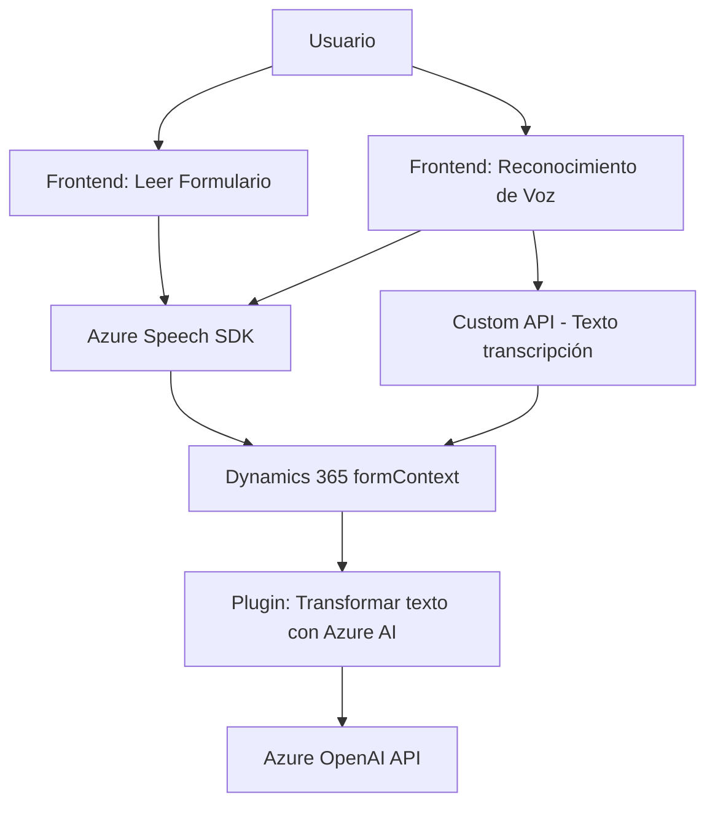

### Breve resumen técnico:
El repositorio muestra una solución compuesta principalmente por archivos frontend y un plugin backend diseñado para integrarse con Microsoft Dynamics CRM. La principal funcionalidad es realizar reconocimiento de voz, síntesis de voz y transformación de texto utilizando Azure Cognitive Services (Speech SDK y OpenAI). Los archivos están organizados en módulos y separados por su funcionalidad (frontend y backend), integrados en Dynamics 365.

---

### Descripción de arquitectura:
La arquitectura sigue un enfoque de **orientación a eventos y servicios**. Los módulos frontend actúan como intermediarios para la interacción del usuario, con tareas especializadas como lectura y reconocimiento de voz, además de comunicación directa con servicios de Azure. El plugin backend implementa una integración con **Azure OpenAI** para transformar datos, aprovechando el patrón de extensibilidad mediante el diseño de plugins en Dynamics CRM. 

Es posible identificar características de una arquitectura de **n capas**, donde se separan claramente las responsabilidades entre presentación (frontend) y lógica de negocio (backend/plugin).

---

### Tecnologías usadas:
1. **Frontend**:
   - **JavaScript**: Lenguaje principal para las funcionalidades de síntesis y reconocimiento de voz.
   - **Azure Cognitive Services Speech SDK**: Para tareas de reconocimiento y síntesis de voz.
   - **Dynamics 365 API (formContext/Xrm.WebApi)**: Para interacción con el sistema CRM.

2. **Backend**:
   - **C#**: Lenguaje para el desarrollo del plugin basado en la interfaz `IPlugin`.
   - **Azure OpenAI/GPT-4 API**: Transformación de texto mediante inteligencia artificial.
   - **Microsoft Dynamics CRM SDK**: Extensión de funcionalidades del sistema mediante un plugin.

3. **Patrones arquitectónicos**:
   - Modularización: Separación funcional en archivos específicos para una mayor mantenibilidad.
   - Uso de eventos y callbacks: Manejo de interacciones asíncronas con servicios externos.
   - DTO (Data Transfer Object): Estructuras JSON para comunicación con APIs externas.
   - Plugin Design Pattern: Extensiones independientes en Dynamics CRM.

---

### Diagrama Mermaid **válido para GitHub**:

---

### Conclusión final:
La solución implementada es un **entorno híbrido** que combina integración frontend (para síntesis, reconocimiento de voz y manipulación de formularios) con backend en forma de plugin extensible. Emplea tecnologías de Microsoft y Azure para garantizar una interoperabilidad fluida en entornos Dynamics 365. La arquitectura está orientada a servicios y basada en eventos, aprovechando la modularización y el diseño de componentes para garantizar escalabilidad y mantenimiento a largo plazo.