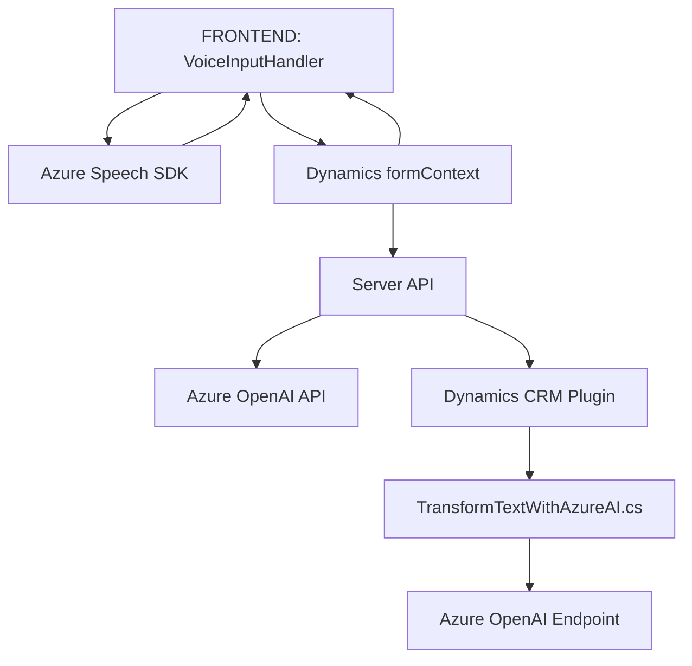

### Breve resumen técnico

El repositorio contiene tres archivos principales relacionados con la integración de reconocimiento de voz, procesamiento de texto, y transformación de datos en sistemas Microsoft Dynamics CRM, complementados por servicios de Azure Speech SDK y Azure OpenAI. Estas soluciones se enfocan en automatizar la captura, síntesis, procesamiento y mapeo de datos en un contexto CRM.

---

### Descripción de arquitectura

- **Tipo de solución:**  
  La solución es un ecosistema híbrido diseñado para manejar lógica de negocio en Microsoft Dynamics CRM. Consiste en tres capas principales: frontend (JavaScript) para formularios dinámicos, integración con servicios externos de Azure (Speech y OpenAI), y lógica backend a través de plugins (.NET). Es una solución de **n capas** en términos de arquitectura.

- **Arquitectura del sistema:**  
  - **Frontend:** Modular y altamente funcional, usando `event-driven programming` para procesos dinámicos en formularios CRM con soporte de SDK externo.
  - **Backend:** Plugins basados en la arquitectura extensible de Dynamics CRM (Plugin Pattern). Centralizan la lógica compleja mediante servicios y APIs externos (Azure OpenAI).
  - **Dependencias externas integradas:** SDKs como Azure Speech y Azure OpenAI, y APIs nativas de Dynamics CRM (`WebApi`).

- **Patrones aplicados:**  
  - Modularidad.
  - Responsabilidad única en funciones.
  - Carga dinámica de dependencias (lazy loading).
  - Plugin extensible para CRM (Plugin Pattern).

---

### Tecnologías usadas

1. **Frontend:**
   - Lenguaje: JavaScript.
   - SDK de Azure: Azure Speech SDK para síntesis y reconocimiento de voz.
   - Microsoft Dynamics CRM APIs (`Xrm.WebApi`) para manipulación directa de formularios y registros.
   - Promesas para el manejo de llamadas asíncronas.

2. **Backend:**
   - Lenguaje: C# (.NET Framework).
   - SDK de Dynamics CRM (`IPlugin`, `IOrganizationService` y relacionados).
   - Azure OpenAI para transformación de texto.
   - `System.Text.Json` y `Newtonsoft.Json.Linq` para trabajar con JSON.

3. **Patrones de diseño:**
   - Plugin extensible de Dynamics.
   - Carga dinámica para mejorar el rendimiento del sistema (Azure Speech SDK).
   - Modularización del código y separación de lógica por función.

---

### Diagrama Mermaid válido para GitHub Markdown

---

### Conclusión final

La solución presentada en el repositorio combina la capacidad de reconocimiento y síntesis de voz mediante Azure Speech SDK con la potencia de procesamiento de lenguaje natural de Azure OpenAI. Está diseñada para facilitar la interacción y automatización de tareas en Dynamics CRM, haciendo uso de una arquitectura **n capas** con un enfoque modular y dinámico.

El diseño combina frontend y backend en un ecosistema CRM eficiente, aplicando patrones de arquitectura clave (como el plugin extensible y la moderación por eventos), lo que refuerza la escalabilidad, robustez y mantenibilidad de la solución. Es compatible con integraciones futuras y puede ser fácilmente ampliado.