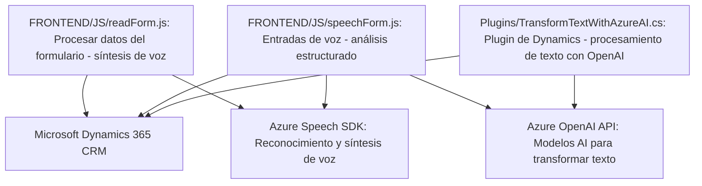

### Análisis técnico del repositorio

---

#### **1. Breve resumen técnico**
El repositorio integra varias funcionalidades esenciales en un entorno CRM de Dynamics 365. Los archivos convierten texto y entrada de voz en datos estructurados dentro del CRM mediante integración directa con servicios de Azure como Speech SDK y OpenAI. Los componentes destacan por modularidad, uso de APIs externas y manejo de eventos.

---

#### **2. Descripción de arquitectura**
La arquitectura sigue un modelo de **n capas orientado a servicios (SOA)**. 
- Los **archivos JS** actúan como capa de presentación y control para la integración directa de voz, procesamiento de texto, y gestión de datos en formularios. 
- El archivo **.cs** representa la capa backend, funcionando como un plugin para extender la funcionalidad del CRM con servicios avanzados de procesamiento de texto mediante Azure OpenAI.

El estilo general podría clasificarse como una arquitectura **modular con integración externa**:
- Modularidad entre componentes frontend (orientados al cliente), backend (funcionalidad de plugin) y servicios externos (Azure Speech y OpenAI).
- Desacoplamiento estricto asegura que cada módulo tenga responsabilidades específicas y sea fácilmente expandible sin afectar otros componentes.

---

#### **3. Tecnologías usadas**
1. **Frontend:**
   - Azure Speech SDK (para síntesis y reconocimiento de voz).
   - JavaScript puro para manipulación de formularios y flujos de trabajo dentro de Dynamics 365.
   - APIs asíncronas (`fetch`, `Promise`) para invocar servicios externos.

2. **Backend:**
   - **Microsoft.Xrm.Sdk:** Librería clave del desarrollo en Dynamics 365 para manejo de plugins y servicios.
   - **Azure OpenAI API:** Para transformación de texto usando inteligencia artificial.
   - **Newtonsoft.Json / System.Text.Json:** Manejo avanzado de JSON en el servidor.

3. **Patrones de diseño:**
   - Modularidad y separación de responsabilidades.
   - **Factory Pattern:** Utilizado en el plugin (`IOrganizationServiceFactory`).
   - **Event-driven architecture:** Los métodos son activados por eventos de usuario o del sistema.
   - **Service-Oriented Architecture (SOA)** debido a la dependencia de Microsoft Dynamics y servicios de Azure.

---

#### **4. Dependencias y componentes externos**
- **Azure Speech SDK:** Para realizar síntesis de voz y reconocimiento de voz en tiempo real.
- **Azure OpenAI API:** Para generación de texto basado en inputs del usuario, que se integra al CRM.
- **Microsoft Dynamics 365 CRM:** El entorno sobre el cual todo el flujo de trabajo está construido.
- **Newtonsoft.Json:** Para estructuración avanzada de datos JSON en el plugin.
- **Servicios dinámicos del entorno Dynamics 365:** Como `Xrm.WebApi`.

---

#### **5. Diagrama Mermaid**

---

#### **Conclusión final**
Este repositorio implementa una solución modular basada en servicios para optimizar los flujos de trabajo dentro de un sistema Dynamics 365 CRM utilizando tecnología avanzada de inteligencia artificial y reconocimiento de voz. Su arquitectura de **n capas** con integración de servicios externos refleja un diseño moderno, escalable y altamente extensible. 

La elección de Azure Speech SDK y OpenAI potencia la funcionalidad del sistema mediante capacidades de voz y procesamiento de texto estructurado. Al mismo tiempo, el manejo de eventos y APIs en el lado del cliente asegura que se adapte bien a escenarios dinámicos y reales. Sin embargo, sería recomendable documentar más específicamente los puntos de personalización y los límites de las dependencias externas, especialmente en entornos empresariales.